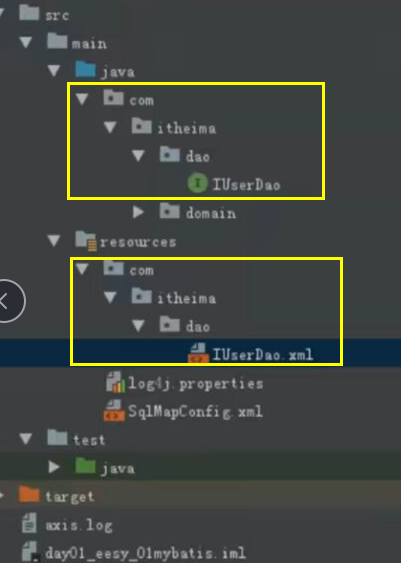
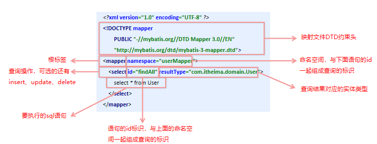
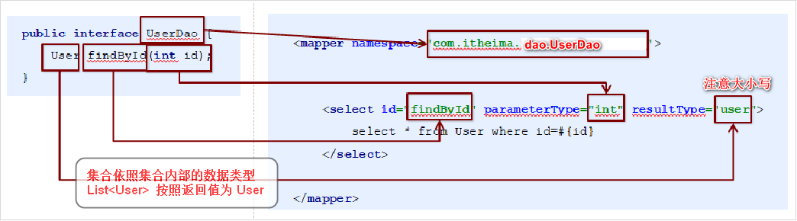

## 介绍

* 个优秀的基于java的持久层框架，它内部封装了jdbc，使开发者只需要关注sql语句本身，而不需要花费精力去处理加载驱动、创建连接、创建statement等繁杂的过程。
* 通过xml或注解的方式将要执行的各种 statement配置起来，并通过java对象和statement中sql的动态参数进行映射生成最终执行的sql语句。
* mybatis框架执行sql并将结果映射为java对象并返回。采用ORM思想解决了实体和数据库映射的问题，对jdbc 进行了封装，屏蔽了jdbc api 底层访问细节，使我们不用与jdbc api 打交道，就可以完成对数据库的持久化操作。


## ORM

* Object Relational Mapping 对象关系映射
* 把数据库表和实体类以及实体类的属性对应起来，操作实体类就实现操作数据库表

## 官网

```java
MyBatis官网地址：<http://www.mybatis.org/mybatis-3/> 
```

## xml 使用

### 快速入门

```java
添加MyBatis的坐标
创建user数据表
编写User实体类 
编写映射文件
    UserMapper.xml，  --> mapper,select
    mybatis的映射配置文件位置必须和dao接口的包结构相同
编写核心文件
    SqlMapConfig.xml，  --> 数据库配置文件
    
编写测试类

    
// 开发中不用写实现类
1.  
2.  映射配置文件的mapper标签name space属性的取值必须是dao接口的全限定类名
3. 映射配置文件的操作配置(select)，id属性的取值必须是dao接口的方法名

```




### 数据库配置

#### 配置坐标

```xml
<!--mybatis坐标-->
<dependency>
    <groupId>org.mybatis</groupId>
    <artifactId>mybatis</artifactId>
    <version>3.4.5</version>
</dependency>
<!--mysql驱动坐标-->
<dependency>
    <groupId>mysql</groupId>
    <artifactId>mysql-connector-java</artifactId>
    <version>5.1.6</version>
    <scope>runtime</scope>
</dependency>

```


#### 直接配置

```xml
<!DOCTYPE 
	configuration PUBLIC 
	"-//mybatis.org//DTD Config 3.0//EN“ 
	"http://mybatis.org/dtd/mybatis-3-config.dtd">
<configuration>
    <environments default="development">
        <environment id="development">            
            <transactionManager type="JDBC"/>            
            <dataSource type="POOLED">
                <property name="driver" value="com.mysql.jdbc.Driver"/>
                <property name="url" value="jdbc:mysql:///test"/>
                <property name="username" value="root"/>
                <property name="password" value="root"/>
            </dataSource>
        </environment>
    </environments>
    <mappers> 
        <mapper resource="com/itheima/mapper/UserMapper.xml"/> 
    </mappers>
</configuration>
```

#### 引入外部配置文件


### 数据表映射

```xml
<!--
	类路径：com.itheima.domain.User
	public class User
-->
<?xml version="1.0" encoding="UTF-8" ?>
<!DOCTYPE mapper 
	PUBLIC 
	"-//mybatis.org//DTD Mapper 3.0//EN"
	"http://mybatis.org/dtd/mybatis-3-mapper.dtd">

<!-- 执行 userMapper.findAll 中的语句
	resultType 结果集
-->
<mapper namespace="userMapper">
    <select id="findAll" resultType="com.itheima.domain.User">
        select * from User
    </select>
</mapper>

```



### 普通实现

```java
// 编写UserDao接口
public interface UserDaoMapper {
    List<User> findAll() throws IOException;
}

// 编写UserDaoImpl实现
public class UserDaoImpl implements UserDaoMapper {
    public List<User> findAll() throws IOException {
        //加载核心配置文件
        // 第一中方式： 使用类的加载器， 他只能读取类路径的配置文件
        // 第二种方式：使用 ServletContext 对象的 getRealPath()
        InputStream resourceAsStream = 
            Resources.getResourceAsStream("SqlMapConfig.xml");
        //获得sqlSession工厂对象 建造者模式
        SqlSessionFactory sqlSessionFactory = 
            new SqlSessionFactoryBuilder().build(resourceAsStream);
        //获得sqlSession对象 工厂模式
        SqlSession sqlSession = 
            sqlSessionFactory.openSession();
             
        //执行sql语句  
        //--方式一
            // 使用 selSession 创建 dao 接口的代理对象  代理模式
            IUserDao userDao = session.getMapper(IUserDao.class)  
            // 代理对象执行方法
            List<User> userList = userDao.findAll();
        //-----方式一结束 ----
        //--方式二
        	List<User> userList = 
                sqlSession.selectList("userMapper.findAll");
        //-----方式二结束 ----
        
        //打印结果
        System.out.println(userList);
        //释放资源
        sqlSession.close();
        resourceAsStream.close();
        return userList;
    }
}

// 测试
@Test
public void testTraditionDao() throws IOException {
    UserDao userDao = new UserDaoImpl();
    List<User> all = userDao.findAll();
    System.out.println(all);
}


//-------------------
// 插入更新
// （"命名空间.id", 实体对象）
sqlSession.insert("....",user);
sqlSession.commit();    

// 修改更新
// // （"命名空间.id", 实体对象）
sqlSession.update("....", user);
sqlSession.commit();  

// 删除
// // （"命名空间.id", Object）
sqlSession.delete("....", idInt);
sqlSession.commit();  
```


### 代理实现

#### 介绍

```java
介绍
    // 只用写接口，定义方法就行，不用实现
	采用 Mybatis 的代理开发方式实现 DAO 层的开发
    Mapper 接口开发方法只需要程序员编写Mapper 接口（相当于Dao 接口），
    由Mybatis 框架根据接口定义创建接口的动态代理对象，代理对象的方法体同上边Dao接口实现类方法。
    
规范
    1) Mapper.xml文件
    	namespace与mapper接口的全限定名相同
	2) Mapper接口
    	方法名： 和Mapper.xml中定义的每个statement的id相同
		方法的输入参数类型： 和mapper.xml中定义的每个sql的parameterType的类型相同
		输出参数类型： 和mapper.xml中定义的每个sql的resultType的类型相同
```




## 注解使用

### 数据库配置

```java
指定映射配置文件的位置，映射配置文件指的是每个dao独立的配置文件
如果是用注解来配置的话，此处应该使用class属性指定被注解的dao全限定类名
< mappers>
    <mapper class=" com . itheima . dao. IUserDao"/>
< /mappers>        
```


### 数据表映射

```java
删除
```

### 源码

```java
public interface IUserDao {
    @Select("select * from user")
    List<User> findAll();
}

// 写实现类
需要 namespace.id
```

