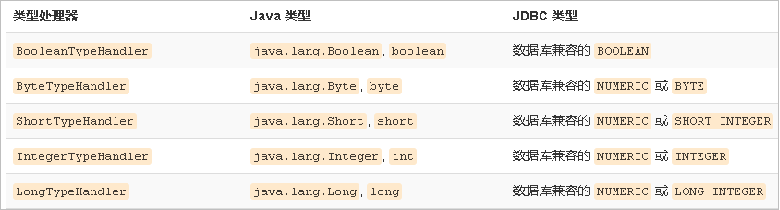

# 动态 sql

## 介绍

```java
// 看 mapper 标签
业务逻辑复杂时，我们的 SQL是动态变化的
```

## if

```xml
<select id="findByCondition" parameterType="user" resultType="user">
    select * from User
    <where>
        <if test="id!=0">
            and id=#{id}
        </if>
        <if test="username!=null">
            and username=#{username}
        </if>
    </where>
</select>


 //获得MyBatis框架生成的UserMapper接口的实现类
UserMapper userMapper = sqlSession.getMapper(UserMapper.class);
User condition = new User();
condition.setId(1);
User user = userMapper.findByCondition(condition);
```

## foreach

```xml
<select id="findByIds" parameterType="list" resultType="user">
    select * from User
    <where>
        <foreach collection="array" open="id in(" close=")" item="id" separator=",">
            #{id}
        </foreach>
    </where>
</select>

//-----------------------
UserMapper userMapper = sqlSession.getMapper(UserMapper.class);
int[] ids = new int[]{2,5};
List<User> userList = userMapper.findByIds(ids);
System.out.println(userList);
```

## sql语句抽取

```xml
介绍
	Sql 中可将重复的 sql 提取出来，
	使用时用 include 引用即可，最终达到 sql 重用的目的

<!--抽取sql片段简化编写-->
<sql id="selectUser" select * from User</sql>

// 复用
<select id="findById" parameterType="int" resultType="user">
    <include refid="selectUser"></include> where id=#{id}
</select>

// 复用
<select id="findByIds" parameterType="list" resultType="user">
    <include refid="selectUser"></include>
    <where>
        <foreach collection="array" open="id in(" close=")" item="id" separator=",">
            #{id}
        </foreach>
    </where>
</select>
```

## choose

```xml
choose(when, otherwise)
```

## trim

```xml
trim(where, set)
```


# 核心配置文件

## typeHandler

```java

```


