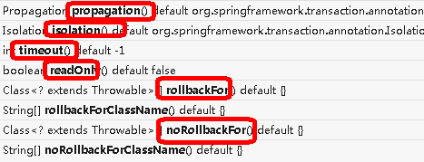

## springDAO

### 概述

```java
介绍
    Spring DAO 使得 JDBC，Hibernate 或 JDO 这样的数据访问技术更容易以一种统一的方式工作。
    这使得用户容易在持久性技术之间切换。
    它还允许您在编写代码时，无需考虑捕获每种技术不同的异常
```

### 抛出的异常


## spring JDBC

### api

```java
JdbcTemplate
SimpleJdbcTemplate
NamedParameterJdbcTemplate
SimpleJdbcInsert
SimpleJdbcCall    
```

### 使用

#### 访问 Hibernate

```java
1、 使用 Hibernate 模板和回调进行控制反转
2、 扩展 HibernateDAOSupport 并应用 AOP 拦截器节点
```

### 支持的 orm 框架

```java
Hibernate
 iBatis
 JPA
 JDO
 OJB
```


## spring 事务


```java
// 详情见 数据库， 关系型数据库 ===> mysql5.5 

介绍
    一块执行的代码
spring 支持的事务管理类型
	编程式事务管理
    	// 	程序化事务管理，通过复杂的编程编写要给事务
    声明式事务管理（使用）
    	// 告诉 Spring 哪个方法是事务即可，spring 自动进行事务控制
    	基于注解 、 xml 配置进行事务管理

    
4、在 Spring 进行声明式事务管理，
    底层使用 AOP 原理
```


## 编程式事务

### PlatformTransactionManager

```java
相关对象
    PlatformTransactionManager 
    	是 spring 的事务管理器，它里面提供了我们常用的操作事务的方法。
    	是接口类型，不同的 Dao 层技术则有不同的实现类
    	jdbc 或 mybatis 时：org.springframework.jdbc.datasource.DataSourceTransactionManager 
		hibernate时：org.springframework.orm.hibernate5.HibernateTransactionManager
```


### TransactionDefinition

```java
 是事务的定义信息对象
```


### TransactionStatus

```java
接口提供的是事务具体的运行状态，方法介绍如下
```


## 声明式操作

### 基础

```java
介绍
    采用声明的方式来处理事务。
    声明： 指在配置文件中声明，用在 Spring 配置文件中声明式的处理事务来代替代码式的处理事务。
作用
    // Spring 声明式事务控制底层就是AOP
    事务管理不侵入开发的组件。具体来说，业务逻辑对象就不会意识到正在事务管理之中
    在不需要事务管理的时候，只要在设定文件上修改一下，即可移去事务管理服务，无需改变代码重新编译
    
```

### 配置

#### bean.xml

```xml
<!--1 创建事务管理器--> 
<bean id="transactionManager" 
    class="org.springframework.jdbc.datasource.DataSourceTransactionManager">
     <!-- 控制数据源 -->
     <property name="dataSource" ref="dataSource"></property>
</bean>
----------------------------------------------------------
<!-----------------基于配置需要添加-->
<!--2 配置通知, 事务增强， --> 
<tx:advice id="txadvice">
     <!--配置事务参数-->
     <tx:attributes>
         <!--指定哪种规则的方法上面添加事务-->
         <tx:method name="accountMoney" propagation="REQUIRED"/>
         <!--<tx:method name="account*"/>-->
     </tx:attributes>
</tx:advice>

<!--3 配置实现切入点和切面--> 
<aop:config>
     <!--配置实现切入点-->
     <aop:pointcut id="pt" expression="execution(* 
    		com.atguigu.spring5.service.UserService.*(..))"/>
     <!--配置切面-->
     <aop:advisor advice-ref="txadvice" pointcut-ref="pt"/>
</aop:config>
<!-----------------基于配置需要添加-->
----------------------------------------------------------------------
<!-----------------基于注解需要添加-->
<!--开启事务注解--> 
<tx:annotation-driven transaction-manager="transactionManager">
</tx:annotation-driven>

<!—之前省略datsSource、jdbcTemplate、平台事务管理器的配置-->
<!--组件扫描-->
<context:component-scan base-package="com.itheima"/>
<!--事务的注解驱动-->
<tx:annotation-driven/>
<!------------------------基于注解结束-->

```


### 注解开发

#### 普通

```java
介绍
    @Transactional 
    在需要进行事务控制的类或是方法上修饰，注解可用的属性同 xml 配置方式
		类上
    		那么该类下的所有方法都使用同一套注解参数配置
    	方法上，
    		 同的方法可以采用不同的事务参数配置。
注意
    以内层的 transaction 为主
    
语法例子    
    
@Service("accountService")
@Transactional
public class AccountServiceImpl implements AccountService {
    @Autowired
    private AccountDao accountDao;
    
     // 方法中的语句有一个执行错误，方法中所有的语句都会返回到函数执行前的状态
    @Transactional(isolation = Isolation.READ_COMMITTED,propagation = Propagation.REQUIRED)
    public void transfer(String outMan, String inMan, double money) {
        accountDao.out(outMan,money);
        int i = 1/0;
        accountDao.in(inMan,money);
    }
}
```

#### 完全注解

```java
// 1、创建配置类，使用配置类替代 xml 配置文件
    @Configuration //配置类
    @ComponentScan(basePackages = "com.atguigu") //组件扫描
    @EnableTransactionManagement //开启事务
public class TxConfig {
     //创建数据库连接池
     @Bean
     public DruidDataSource getDruidDataSource() {
         DruidDataSource dataSource = new DruidDataSource();
         dataSource.setDriverClassName("com.mysql.jdbc.Driver");
         dataSource.setUrl("jdbc:mysql:///user_db");
         dataSource.setUsername("root");
         dataSource.setPassword("root");
         return dataSource;
     }
     //创建 JdbcTemplate 对象
     @Bean
     public JdbcTemplate getJdbcTemplate(DataSource dataSource) {
         //到 ioc 容器中根据类型找到 dataSource
         JdbcTemplate jdbcTemplate = new JdbcTemplate();
         //注入 dataSource
         jdbcTemplate.setDataSource(dataSource);
         return jdbcTemplate;
     }
     //创建事务管理器
     @Bean
     public DataSourceTransactionManager 
         getDataSourceTransactionManager(DataSource dataSource) {
         DataSourceTransactionManager transactionManager = new DataSourceTransactionManager();
         transactionManager.setDataSource(dataSource);
         return transactionManager;
     } 
}

```


### Transactional 参数




#### propagation

```java
    事务传播行为
   // 看事务传播级别 
```


#### ioslation

```java
3、ioslation：事务隔离级别
```


#### 其他

```java
4、timeout：超时时间    （1）事务需要在一定时间内进行提交，如果不提交进行回滚    （2）默认值是 -1 ，设置时间以秒单位进行计算5、readOnly：是否只读    （1）读：查询操作，写：添加修改删除操作    （2）readOnly 默认值 false，表示可以查询，可以添加修改删除操作    （3）设置 readOnly 值是 true，设置成 true 之后，只能查询6、rollbackFor：回滚    （1）设置出现哪些异常进行事务回滚7、noRollbackFor：不回滚    （1）设置出现哪些异常不进行事务回滚
```


