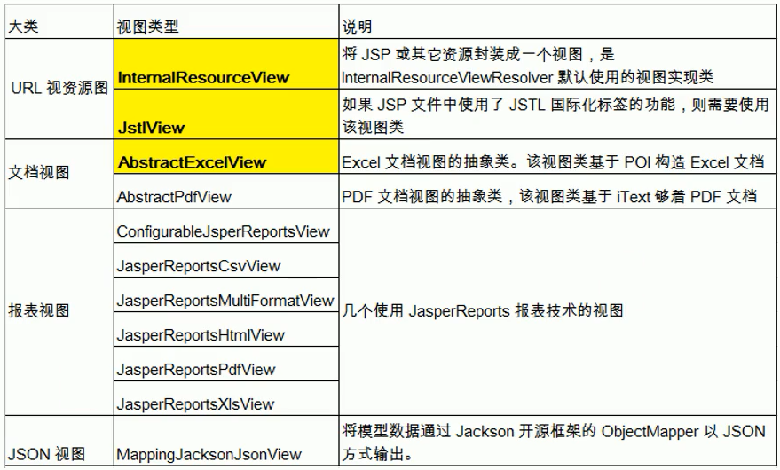
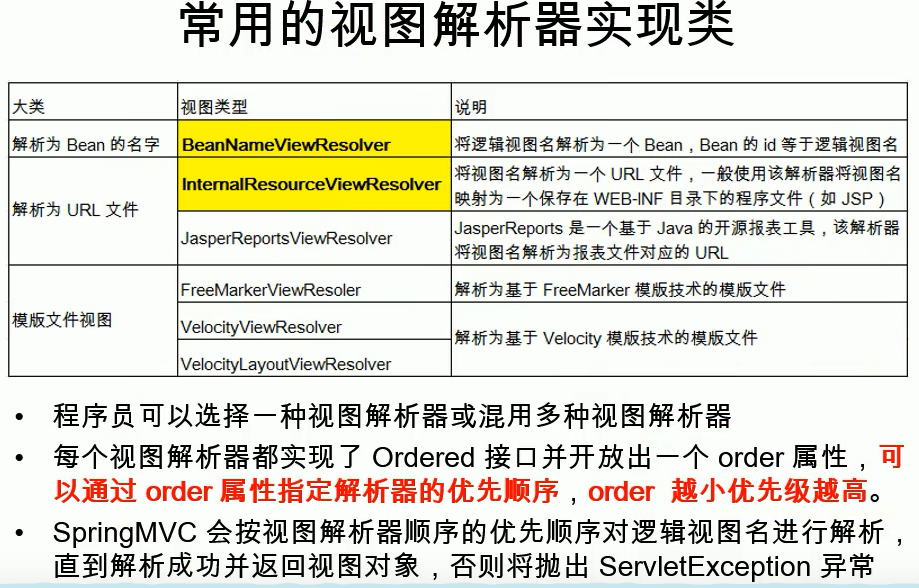
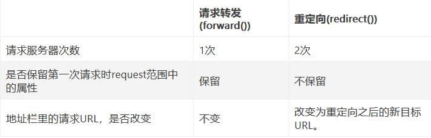

## 视图

```java
概述
    视图
        html jsp等静态文件
        html 文件： html 视图
        jsp	文件： jsp 视图
    
    视图渲染
        // 浏览器将HTML变成人眼看到的图像的全过程
        将数据域中的数据在页面上展示
        页面就是渲染模型数据
    
作用
	渲染模型数据,将模型里的数据以某种形式呈现给客户
    
    
    
    视图解析器
        根据方法的返回值得到视图对象;
    多个视图解析器
        都会尝试能否得到视图对象;

    视图对象不同就可以具有不同功能; 
    

    
    
    
解耦使用    
	为了实现视图模型和具体实现技术的解耦,
	Spring在org.springframework.web.servlet包中定义了一个高度抽象的 View 接口，
    
特点
    视图对象由视图解析器负责实例化。
    由于视图是无状态的，所以他们不会有线程安全的问题

```




## 视图解析器 -- 框架自带

### 介绍

```java
介绍
    视图解析器是框架带的，并不是我们写的
    
视图解析器
    // 将逻辑视图（html模板等）解析为一个具体的视图对象。

    根据 把控制器返回的逻辑视图名，确定 渲染模型的视图文件的物理位置。
    
    
     http://localhost:8080/book/success.jsp

    // 控制器： 即 controller/handler 类中 处理请求 的方法
    // 逻辑视图名： controller/handler 类中方法返回的 字符串（html文件名字）
    //             success , 返回值
    // 前缀	http://localhost:8080/book/
	// 后缀 .jsp
    // 物理位置：http://localhost:8080/book/success.jsp    
```

### springMVC视图解析器

```java
当用户对SpringMVC应用程序发起请求时，
    
springMVC 视图解析
    1、方法执行后的返回值会作为页面地址参考,转发或者重定向到页面
    	任何方法的返回值,最终都会被包装成ModelAndView对象
	2、视图解析器可能会进行页面地址的拼串;

视图对象
    视图对象由视图解析器负责实例化。由于视图是无状态的,所以他们不会有线程安全的问题
    
    
springMVC 
    | 所有请求
DispatcherServlet
    |
    | 通过处理器找到最为合适的HandlerMapping定义的请求映射中最为合适的映射
    |		  
HandlerMapping  | 含有映射： requestMapping(url) -- controller 方法
    |           
    |
Handler(controller 中对应的方法， )
    |
    |	HandlerAdapter处理
    |
返回结果
    数据
    视图
  
// 视图处理： 结果是一个ModelAndView对象
ModelAndView
    包含视图
    	...
    不包含视图 :逻辑视图路径
        	|
        	|
    	ViewResolver  | 逻辑视图路径解析为真正的View视图(物理视图)
    		|
           View	| 进行渲染，调用其render()方法将物理视图进行渲染
        	|
           结果返回用户
        
        
注意
	对于SpringMVC控制器中的方法，
        String 、 view 、ModelAndView  ==> 回结果封装成ModelAndView对象， 返回给用户

```

### 视图解析器配置

#### xml

```java
<!-- 对转向页面的路径解析。prefix：前缀， suffix：后缀 -->
// 视图控制器返回的值会和前后缀进行拼接：     
  <bean id="viewResolver"
    class="org.springframework.web.servlet.view.InternalResourceViewResolver">
    <property name="prefix" value="/page"></property>
    <property name="suffix" value=".jsp"></property>
  </bean>
```

### 实现

#### 常见实现



#### 自定义

```java
// 自定义视图 / 视图解析器

// ==== 控制器达到的效果 ===============
@Controller
public class MyViewResovlerController {
    
    @RequestMapping( "/handleplus")
    public String handleplus(Model model){
        // 自定义前缀
        // forward:/gaoqing
        // meinv:/gaoqing
   		return "meinv:/gaoqing";
	}    
}
// ========== 自定义过程 ==================

public class MyMeiNVViewResolver implements ViewResolver{
    @Override
    public View resolveViewName (String viewName， Locale locale)
    	throws Exception {
    // TODO Auto-generated method stub
    // 根据视图名返回视图对象
        // forward:/gaoqing
        // meinv:/gaoqing
        if (viewName . startsWith( "meinv:")){
            return new MyView();
         } else {
            // 如果不能处理返回nu11即可
            return nu11 ;
        }
    }
}

public class MyView implements View {
    /**
    *
      返回的数据的内容类型
    */
    @Override
    public String getContentType() {
   		 // TODO Auto- generated method stub
   		 return "text/htm1";
    }
    
    @Override
    public void
    render(Map<String, ?> model, HttpServletRequest, ...

    }
   
```

## 视图控制器 

```java
介绍
    就是你写的 controller/handler
    
作用
    实现对请求的响应， 请求返回视图或者数据
```

### 视图 -- 转发


#### forward 直接转发

```java
forward	
    前缀的转发，不会由视图解析器进行拼串

语法例子
    
// 转发到 hello.jsp
    return "forward:hello.jsp"
// 多层转发
    @RequestMapping(" /hand1e01" )
    public String hand1e01(){
        System.out.println( "hand1e01");
        return "forward:/hello.jsp";
    }
    @RequestMapping("/hand1e02" )
    public String hand1e02(){
        System.out .print1n( "handle02");
        return "forward: /hand1e01";
    }

// 同一个请求转发
    @RequestMapping("/index" )
    public String hand1e02(){
       // 转发到一个请求方法（同一个控制器类可以省略/index/）
        return "forward: /index/hand1e01";
    }
```


#### forward 拼串转发

```java
介绍	
	直接返回字符串：
    	此种方式会将返回的字符串与视图解析器的前后缀拼接后跳转。
    	默认实现：转发，不过是转发到 视图
    注意
    	前端解析器有 前后缀的 xml 配置
    
@Controller
@RequestMapping('/book')
public class UserController {
    // http://localhost:8080/book/quick
    //  @RequestMapping(value="/quick", method=RequestMethod.GET, params = {"accountName"})
    @RequestMapping("/quick")
    public String save() {
        return "success.jsp";
			相对当前资源所在地址，即 http://localhost:8080/book
        	 默认形式是： forward: success.jsp
		return "/success.jsp";
        	从 web 引用下找这个资源
             默认形式是： forward: /success.jsp
}        
    
 
```


#### modelAndView

```java
概述
    1. 设置一个 ModelView , 然后直接返回
    2. 传递一个     	
    	model		参数： 拼接
    	ModelAndView 参数: 返回改参数
	3. 直接使用   HttpServeltRequest          

语法例子
// 方式一 
    //  在Controller中方法返回ModelAndView对象，并且设置视图名称
	@RequestMapping(value="/quick2")
    public ModelAndView save2(){
        /*
            Model:模型 作用封装数据， 数据在请求域中
            View：视图 作用展示数据
            之前的返回值我们就叫视图名:视图名视图解析器是会帮我们最终拼串得到页面的真实地址:

         */
        // ModelAndView modelAndView = new ModelAndView("success");
    	// 无参构造
	    ModelAndView modelAndView = new ModelAndView();
        //设置模型数据
        modelAndView.addObject("username","itcast");
        //设置视图名称，即返回的地址
        modelAndView.setViewName("success");

        return modelAndView;
    }

// 方拾二
	// 在Controller中方法形参上直接声明ModelAndView，
	// 无需在方法中自己创建，在方法中直接使用该对象设置视图，同样可以跳转页面
     	@RequestMapping(value="/quick3")
		public String save2(Model model) {
            model.addAttribute("username","张三");
            return "success";
        }
		
        public ModelAndView save3(ModelAndView modelAndView){
            modelAndView.addObject("username","张三");
            modelAndView.setViewName("success");
            return modelAndView;
        }


// 方式三
 	// 在Controller方法的形参上可以直接使用原生的HttpServeltRequest对象，只需声明即可
	@RequestMapping(value="/quick5")
    public String save5(HttpServletRequest request){
        request.setAttribute("username","酷丁鱼");
        return "success";
    }

// ssession 域中

```


### 视图 -- 重定向

#### redirect -- 直接转发

```java
介绍
    直接返回字符串
	通过ModelAndView对象返回

redirect
    重定向的路径， 有这个前缀，视图解析器就不会进行拼接字符串操作
    重定向不能访问 webinf 以及清求参数无法携带
语法例子
    // hello.JSP 代表从当前项目下开始，springMVC 会自动拼接上项目名
    return "redirect:/hello.jsp"

```

### xml 简化

```java
	<!-- 配置view-controller，直接把请求地址和视图名称关联起来，不必写handler方法了 -->
	<!-- 
		@RequestMapping("/admin/to/login/page.html")
		public String toLoginPage(){
			return "admin-login";
		}
	 -->
	<mvc:view-controller path="/admin/to/login/page.html" view-name="admin-login"/>
        
含义
	此时，请求 http://localhost:8080/项目名//admin/to/login/page.html，
	就可以直接访问到 /WEB-INF/views/admin-login.jsp        
        
注意：
    配置了<mvc:view-controller>会导致其他请求路径失效，解决        
	<!-- 在实际开发过程中都需要配置 mvc:annotation-driven 标签，后面讲，这里先配置上 --> 
	<mvc:annotation-driven/>        
```


## 重定向 & 转发

### 重定向

```java
 介绍
	// 服务器行为，
    将用户从当前处理请求定向到另一个视图(例如 JSP)或处理请求，
    以前的请求（request）中存放的信息全部失效，并进入一个新的 request 作用域；
过程
     客户浏览器
     	发送 http 请求
     Web 服务器
     	接受后发送 302 状态码响应及对应新的 location 给客户浏览器
     客户浏览器
     	发现是 302 响应，则自动再发送一个新的 http 请求，
     	请求 URL 是新的 location 地址
     Web 服务器
     	依据新请求寻找资源并发送给客户
location
    1. 可以重定向到任意 URL
	2. 浏览器重新发出了请求，那么就没有什么 request 传递的概念了
    3. 浏览器的地址栏中显示的是其重定向的路径，客户可以观察到地址的变化
     // 重定向行为是浏览器做了至少两次的访问请求。
```


### 转发

```java
 介绍
	// 客户端行为。
    将用户对当前处理的请求转发给另一个视图或处理请求，
    以前的 request 中存放的信息不会失效。
     
 过程
     客户浏览器
     	发送 http 请求
     Web 服务器
     	接受此请求，调用内部的一个方法在容器内部完成请求处理和转发动作，将目标资源发送给客户
     	转发的路径必须是同一个 Web 容器下的 URL，其不能转向到其他的 Web 路径上，
     	中间传递的是自己的容器内的 request
     客户浏览器
     	地址栏中显示的仍然是其第一次访问的路径，
     	客户是感觉不到服务器做了转发的。
     	// 转发行为是浏览器只做了一次访问请求。
```

### 总结

```java
请求转发：张三去银行的A窗口办理业务，A窗口的业务员发现该业务自己办不了，就将张三的业务请求转发给其他同事办理，最后将办理完的业务返回给张三。也就是说，张三只是给银行的A窗口发送了一次请求，而该业务办理人员之间的换人工作，是银行内部处理的。即张三只发出了一次请求，更换窗口业务员(跳转)是银行的行为。

重定向：张三去银行的A窗口办理业务，A窗口的业务员发现该业务自己办不了，然后告诉张三应该重新去窗口B办理，张三收到该消息后，又重新向银行的窗口B再次请求办理业务，最终银行的窗口B处理完张三的请求，并将办理完的业务返回给张三。也就是说，张三分别向银行的窗口A、窗口B各发送了一次请求（共2次请求），更换窗口业务员(跳转)是张三的行为。

作者：yi只特立独行地zhu
链接：https://www.jianshu.com/p/527ec7d28ed4
来源：简书
著作权归作者所有。商业转载请联系作者获得授权，非商业转载请注明出处。
```



## 参考

```java
https://www.jianshu.com/p/527ec7d28ed4
```

