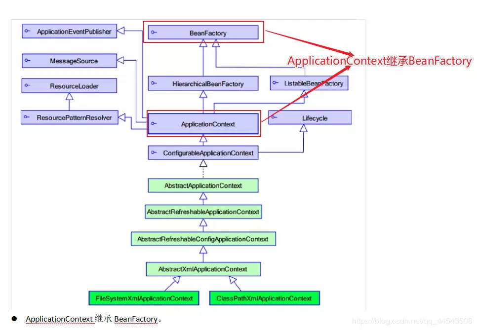

## classPath

### IDEA

#### 介绍

```java
项目结构
	Source Folders：
        // 表示的都是代码源文件目录，
        生成的class文件会输出到 target/classess 文件夹中，
        但是里面的源文件不会复制到 target/classes 文件夹中
    Test Source Folders: 
        // 表示的都是测试代码源文件目录，
        生成的class文件同样会输出到 target/classes 文件夹中，
        但是里面的源文件不会复制到 target/classes 文件夹中
    Resource Folders: 
        // 表示的都是资源文件目录，
        这些目录里面的文件会在代码编译运行被直接复制到 target/classes 文件夹中
    Excluded Folders:
        // 表示的是target文件夹生成的位置，
        target是IDEA编译后的一些class信息存放地，里面有子目录t target/classes 来存储编译后的字节码。
        //  target/classes 即为classpath路径位置
        // idea项目中只有被标记为Resource Folders的文件夹下的文件才会被添加至 target/classes        
        任何我们需要在classpath：前缀中获取的资源都必须在 target/classes 文件夹中找到，
        否则将出现java.io.FileNotFoundException的错误信息。
注意
    Tomcat下的Web应用有两个预置的classpath :

        WEB-INF/classes
        WEB-INF/lib

```

#### 资源路径

```java
路径前缀
    classpath: 
		可写可不写，默认就是指项目的 classpath 路径下面。
	file	:
		表示这是绝对路径。                 
```


### 待证实  esclipse

```java
介绍
    注意
    // IDEA 中 src/main/java/com/ss/Dao
    src 
    	源码包开始的路径， 成为类路径的开始，
    	所有的源码包里的东西都会被放在类路径里面
    java 项目
    	类路径： /bin/
    web 项目
    	类路径： /WEB-INF/classes
    源码包的路径： java
    类路径		： com/ss/Dao

    
src 不是 classpath, 
WEB-INF/classes,lib 才是classpath
    
IDE编译器
    编译时会把src下的文件（是文件，不是.java）移到WEB-INF/classes下。
spring配置文件
    // classpath是指 WEB-INF文件夹下的classes目录
    这个locations是uri表示，即jdbc.properties是当前相对路径，
    要访问 classpath 记得要这样写：<value>classpath:jdbc.properties</value>

含义
	// 这是一个定位资源的入口,惯例大于配置       
    1.存放各种资源配置文件 eg.init.properties log4j.properties struts.xml
    2.存放模板文件 eg.actionerror.ftl
    3.存放class文件对应的是项目开发时的src目录编译文件
        
```

​			

##  ApplicationContext

###  继承体系

```java
applicationContext：接口类型，代表应用上下文，
可以通过其实例获得 Spring 容器中的 Bean 对象
```




### 实现类


#### WebXmlApplicationContext

```java
	
该容器会在一个 web 应用程序的范围内加载在 XML 文件中已被定义的 bean
```


#### ClassPathXmlApplicationContext 

```java
介绍
    // 容器从 CLASSPATH 环境变量路径中搜索配置文件， 
    // idea esclipse 中的 classpath 不同
	该容器从 XML 文件中加载已被定义的 bean。
    	不需要提供 XML 文件的完整路径，
        只需正确配置 CLASSPATH 环境变量即可
    推荐使用
    	// 类加载根路径  resources
    	从类的根路径下加载配置文件
语法例子
// 单个    
ApplicationContext applicationContext = 
    new ClassPathXmlApplicationContext("classpath:applicationContext.xml");

// 多个
ApplicationContext context = 
    new ClassPathXmlApplicationContext(new String[]{"applicationContext.xml","SpringTest.xml"});
// 通配符
ApplicationContext context = 
    new ClassPathXmlApplicationContext("classpath:/*.xml");

      
```

#### FileSystemXmlApplicationContext 

```java
介绍
    // 你需要提供给构造器 XML 文件的完整磁盘路径。
     它是从磁盘路径上加载配置文件，配置文件可以在磁盘的任意位置。
     该容器从 XML 文件中加载已被定义的 bean。
语法实例
    
ApplicationContext context = new FileSystemXmlApplicationContext
            ("C:/Users/ZARA/workspace/HelloSpring/src/Beans.xml");
```


​     

#### AnnotationConfigApplicationContext

```java
当使用注解配置容器对象时，需要使用此类来创建 spring 容器。它用来读取注解。
```


​      

### getBean()方法

```java
// 参数的数据类型是字符串时
// 表示根据Bean的id从容器中获得Bean实例，返回是Object，需要强转。
public Object getBean(String name) throws BeansException {  
	assertBeanFactoryActive();   
	return getBeanFactory().getBean(name);
}

// 参数的数据类型是Class类型时，(一)
// 表示根据类型从容器中匹配Bean实例，当容器中相同类型的Bean有多个时，则此方法会报错
public <T> T getBean(Class<T> requiredType) throws BeansException {   			    	
     assertBeanFactoryActive();
	return getBeanFactory().getBean(requiredType);
}

// 使用
ApplicationContext applicationContext = new 
            ClassPathXmlApplicationContext("applicationContext.xml");
  UserService userService1 = (UserService) applicationContext.getBean("userService");
  UserService userService2 = applicationContext.getBean(UserService.class);
```


