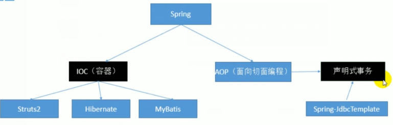

## 核心



## IOC &DI- 核心模块

### 介绍

```java
介绍
    inversion of control
    （1）控制反转，
	（2）使用 IOC 目的：为了耦合度降低
控制
    介绍
    	控制资源获取的获取方式
    方式
    主动式
    	// 所有的资源都要自己创建
    被动式
    	// 资源的获取不是我们自己创建，是交给一个容器来创建
容器
    介绍
    	// 像一个婚介所，
    	管理所有的组件， 是一个有功能的类
    	// 把对象创建和对象之间的调用过程，交给 Spring 进行管理
    	容器可以自动的探查出那些组（类）要用到另一写组件（类），主动创建对象，然后赋值过去
    特点
    	主动的new资源变为被动的接受资源;
		只要容器管理的组件,都能使用容器提供的强大功能;


DI
    介绍
    	dependency Injection 依赖注入，就是注入属性
    	容器知道那个组件（类）运行需要什么类，通过反射，将自己创建的对象注入（赋值）给对应的类
    注入 
    	利用反射给属性赋值
区别
	//  DI 是 IOC 的具体实现， 需要在创建对象的基础上实现

    	
原理
    xml 解析、工厂模式、反射
```

## AOP - 切面编程

## spring标签

```java
spring中有4种默认标签：
    import，
    alias，
    bean，
    beans
```


## 快速入门

```java
导包
    lib
    pom.xml
写配置
    实例 xml bean.xml
    
测试    
```

