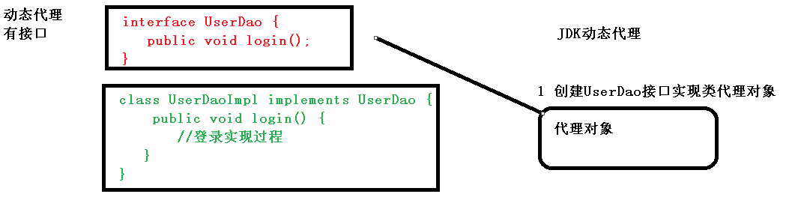
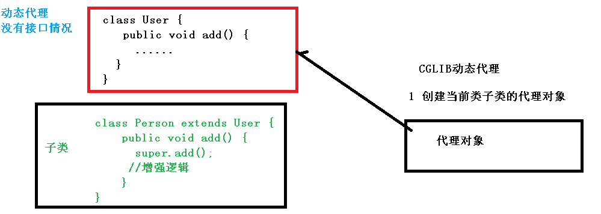
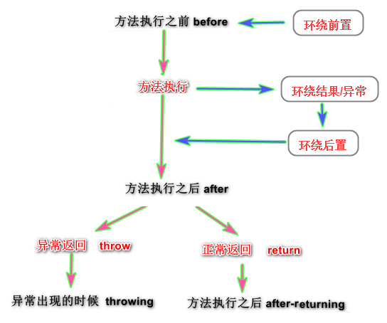
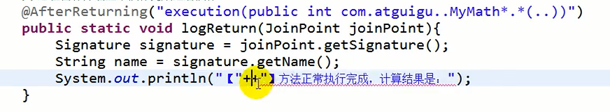
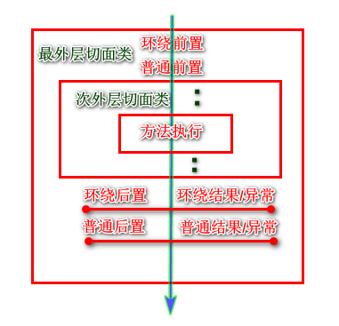

## 介绍

```java
基础
     Aspect Oriented Programming 的缩写
（1）面向切面编程（方面），
    通过预编译方式和运行期动态代理实现程序功能的统一维护的一种技术。     
	AOP 是 OOP 的延续
（2）通俗描述：不通过修改源代码方式，在主干功能里面添加新功能
特点 
    // 对方法的增强 
    是函数式编程的一种衍生范型。
    利用AOP可以对业务逻辑的各个部分进行隔离，
优势
    在程序运行期间，在不修改源码的情况下, 将某段代码动态切入到指定方法的指定位置记性运行
    减少重复代码，提高开发效率，并且便于维护
```

## 底层原理

### 介绍

```java
原理
    动态代理

类型
    JDK 代理 :  
		基于接口的动态代理技术
         创建接口实现类代理对象，增强类的方法
	cglib 代理：
        基于父类的动态代理技术
    	创建子类的代理对象，增强类的方法
```

### jdk 代理



### CGLIB 动态代理




## 术语

### 基础

```java
连接点
    类中那些方法可以增强，这些方法可以称为连接点
切入点
    // 可以增强的，但是并不需要全部增强
    实际被真正增强的方法
通知（增强）    
    概念
    	// 方法中增加的代码
    	实际增强的部分
切面
	是一个动作， 把通知应用到切入点过程            
```

### 切入点表达式

```java
作用
    // 表达式中是： 需要被增强的类的方法
位置
    对切面类中的方法进行标注，
    表明切面类中的方法要增强的方法
语法结构
    execution([权限修饰符] [返回类型] [类全路径] [方法名称]([参数列表]) )
        权限修饰符： 
    		可以省略
        返回类型
            * 表示任何，一个或者多个
        类全路径
            包名.类名.方法名:  * 表示任何
            包名、类名之间： 
                一个点：表示当前包下的类
                两个点：表示当前包及其子包下的类
        参数类型
		   两边的括号是不能省略的                
            两个点： 表示任意个数，任意类型的参数列表
连接符
	&&
		要切入位置满足两边的表达式                
	||
		要切入位置满足其中一边               
	|                
		只要不是这个位置就都切入                
例子
    // 对 com.atguigu.dao.BookDao 类里面的 add 进行增强
    execution(* com.atguigu.dao.BookDao.add(..))
    // 对 com.atguigu.dao.BookDao 类里面的所有的方法进行增强
    execution(* com.atguigu.dao.BookDao.* (..))
    
execution(public void com.itheima.aop.Target.method())	
execution(void com.itheima.aop.Target.*(..))
execution(* com.itheima.aop.*.*(..))
execution(* com.itheima.aop..*.*(..))
execution(* *..*.*(..))
```

### 通知

```java
概念
    // 方法中增加的代码
    实际增强的部分
分类	
		     xml 标签        			   注解				含义
前置通知 	<aop:before>			     @Before			方法执行前执行
后置通知 	<aop:after-returning>		 @AfterReturning	  方法执行后执行
异常通知	<aop:throwing>				@Throwing			方法有异常执行
环绕通知	<aop:around>				@Around				方法执行前后都会执行
最终通知	<aop:after>					@After			    方法无论怎样，执行后都会执行
       
```



## 使用

```java
介绍
    一般都是基于 AspectJ 实现 AOP 操作
    AspectJ 不是 Spring 组成部分，独立 AOP 框架，
    一般把 AspectJ 和 Spirng 框架一起使用，进行 AOP 操作
使用方式
    （1）基于 xml 配置文件实现
	（2）基于注解方式实现（使用）
步骤
    编写核心业务代码（目标类的目标方法）
	编写切面类，切面类中有通知(增强功能方法)
	在配置文件中，配置织入关系，即将哪些通知与哪些连接点进行结合
    
```

## xml开发

### 介绍

```java

引用依赖
    aspects --> springsource(net.sf.cglib; org.aopalliance; aspectj.weaver)
    aop
    
使用
    Spring 框架监控切入点方法的执行。
    一旦监控到切入点方法被运行，使用代理机制，动态创建目标对象的代理对象，
    根据通知类别，在代理对象的对应位置，将通知对应的功能织入，完成完整的代码逻辑运行。
    
代理方式使用
    框架会根据目标类是否实现了接口来决定采用哪种动态代理的方式。
    
步骤
	导包    
		导入 AOP 相关坐标
    java 代码
    	1. 目标接口、目标类（内部有切点）
		2. 切面类（内部有增强方法）
	bean.xml 
		目标类和切面类的对象创建权交给 spring , 配置织入关系
	测试代码   
    	测试要从 xml 中找到 bean 实例
语法
	<aop:通知类型 method=“切面类中方法名” pointcut=“切点表达式"></aop:通知类型>    
```

### 配置

#### 导包

```xml
<!--导入spring的context坐标，context依赖aop-->
<dependency>
  <groupId>org.springframework</groupId>
  <artifactId>spring-context</artifactId>
  <version>5.0.5.RELEASE</version>
</dependency>
<!-- aspectj的织入 -->
<dependency>
  <groupId>org.aspectj</groupId>
  <artifactId>aspectjweaver</artifactId>
  <version>1.8.13</version>
</dependency>
```


#### xml 文件

```xml
<!--配置目标类-->
<bean id="target" class="com.itheima.aop.Target"></bean>
<!--配置切面类-->
<bean id="myAspect" class="com.itheima.aop.MyAspect"></bean>
<!--织入-->
<aop:config>
    <!--指定切面类：引用myAspect的Bean为切面对象-->
    <aop:aspect ref="myAspect">
        <!--配置Target的method方法执行时要进行myAspect的before方法前置增强-->
        <aop:before method="before" pointcut="execution(public void com.itheima.aop.Target.method())"></aop:before>
  
    </aop:aspect>
</aop:config>
```

#### 切点表达式提取

```xml
介绍
    当多个增强的切点表达式相同时，
    可以将切点表达式进行抽取，在增强中使用 pointcut-ref 属性代替 pointcut 属性来引用抽取后的切点表达式。
<aop:config>
    <!--引用myAspect的Bean为切面对象-->
    <aop:aspect ref="myAspect">
        <aop:pointcut id="myPointcut" expression="execution(* com.itheima.aop.*.*(..))"/>
        <!--表示使用到的切点表达式和前面相同-->
        <aop:before method="before" pointcut-ref="myPointcut"></aop:before>
    </aop:aspect>
</aop:config>
```


### java 代码

```java
正常的代码，不需要进行注解什么的， 跟平时的 java 项目代码一样
```


## 注解开发

### 介绍

```java
步骤
	导包    
		导入 AOP 相关坐标
    java 代码
    	1. 目标接口、目标类（内部有切点）
		2. 切面类（内部有增强方法）
    	// 重要 ： 切面类中使用注解配置织入关系
    	3. 
	bean.xml 
		开启组件扫描和 AOP 的自动代理
	测试代码   
```


### 快速入门

#### 导包

#### xml配置

```java
xml 配置
 xmlns:context="http://www.springframework.org/schema/context" 
 xmlns:aop="http://www.springframework.org/schema/aop" 
  xsi:schemaLocation="http://www.springframework.org/schema/beans 
        http://www.springframework.org/schema/beans/spring-beans.xsd 
         http://www.springframework.org/schema/context 
        http://www.springframework.org/schema/context/spring-context.xsd 
         http://www.springframework.org/schema/aop 
        http://www.springframework.org/schema/aop/spring-aop.xsd" 

<!--组件扫描-->
<context:component-scan base-package="com.itheima.aop"/>

<!--aop的自动代理-->
<aop:aspectj-autoproxy></aop:aspectj-autoproxy>
 
```

#### java 代码

##### 目标类

```java
@Component
public class User {
    public void add(){
        System.out.println("user");
    }
}
```

##### 切面类

```java
@Component("userProxy")
@Aspect  //生成代理对象，增强的类，来增强其他类的方法
public class UserProxy {
     //前置通知
     //@Before 注解表示作为前置通知
     @Before(value = "execution(* com.atguigu.spring5.aopanno.User.add(..))")
     public void before() {
    	 System.out.println("before.........");
     }
     //后置通知（返回通知）， 返回值之后执行
     @AfterReturning(value = "execution(* com.atguigu.spring5.aopanno.User.add(..))")
     public void afterReturning() {
     	System.out.println("afterReturning.........");
     }
     //最终通知		方法之后执行
     @After(value = "execution(* com.atguigu.spring5.aopanno.User.add(..))")
     public void after() {
     	System.out.println("after.........");
     }
     //异常通知
     @AfterThrowing(value = "execution(* com.atguigu.spring5.aopanno.User.add(..))")
     public void afterThrowing() {
     	System.out.println("afterThrowing.........");
     }
     //环绕通知
     @Around(value = "execution(* com.atguigu.spring5.aopanno.User.add(..))")
     public void around(ProceedingJoinPoint proceedingJoinPoint) throws Throwable {
     	System.out.println("环绕之前.........");
         //被增强的方法执行
         proceedingJoinPoint.proceed();
         System.out.println("环绕之后.........");
     }
}  
```


### 被增强方法信息

```java
介绍
    获取被增强的类（连接点）的方法的信息： 参数、名称
    使用 JoinPoint
    // 参数不能乱写，需要提前告诉 spring 每个参数的含义是什么
    // 类型不固定，尽量往大了写
返回值
    标签属性 returnning
    @AfterReturning(value="execurion(...)", returnning="result")
    public static void logReturn(JointPoint jointPoint, Object result){
    	return result
	}
异常返回
    标签属性 throwing
    @Throwing(value="execurion(...)", throwing="exception")
        public static void logReturn(JointPoint jointPoint, Exception exception){
    	return result
	}
```



### 完全注解

```java
// 创建配置类，不需要创建 xml 配置文件 
@Configuration
@ComponentScan(basePackages = {"com.atguigu"})
@EnableAspectJAutoProxy(proxyTargetClass = true)
public class ConfigAop {
}
```


### 相同切入点提取

```java
介绍
    公共方法
    是在切面内定义方法，在该方法上使用@Pointcut注解定义切点表达式，然后在在增强注解中进行引用
    
@@Component("myAspect")
@Aspect
public class MyAspect {
    // 方式一：@Before("MyAspect.myPoint()")
    // 方拾二：@Before("Pointcut()")
    @Before("MyAspect.myPoint()")
    public void before(){
        System.out.println("前置代码增强.....");
    }
    @Pointcut("execution(* com.itheima.aop.*.*(..))")
    public void myPoint(){}
}    
    
    
    
    
//相同切入点抽取
// User 类的 add 方法    
@Pointcut(value = "execution(* com.atguigu.spring5.aopanno.User.add(..))")
public void pointdemo() {
}
//前置通知
//@Before 注解表示作为前置通知
@Before(value = "pointdemo()")
public void before() {
 	System.out.println("before.........");
}
```


### 多切面类

```java
介绍
    有多个增强类多同一个方法进行增强
    设置增强类优先级
语法例子
// 在增强类上面添加注解 @Order(数字类型值)，数字类型值越小优先级越高    
@Component
@Aspect
@Order(1)
public class PersonProxy
    
// 执行顺序： 需要验证    
```

