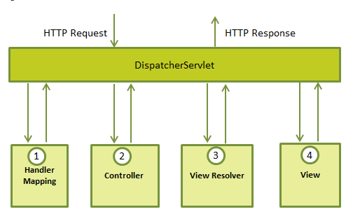
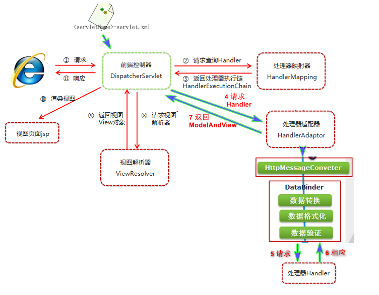
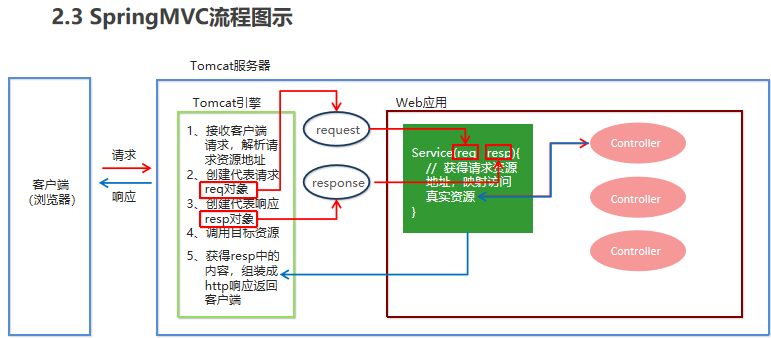

## 注意

```java
https://www.jianshu.com/p/03ef27950d73
```

## mvc模式

```java
  MVC 框架提供了模型-视图-控制的体系结构和可以用来开发灵活


模型
      封装了应用程序数据，并且通常它们由 POJO 组成。
视图
      主要用于呈现模型数据，并且通常它生成客户端的浏览器可以解释的 HTML 输出。
控制器
      主要用于处理用户请求，并且构建合适的模型并将其传递到视图呈现
```

## 特点

```java
   
1）Spring 基于 Java 的实现 MVC 设计模型的请求驱动类型的轻量级 Web 框架，
2）Spring3.0 后全面超越 Struts2，成为最优秀的 MVC 框架。
3）Spring MVC 通过一套 MVC 注解，让 POJO 成为处理请求的控制器，而无须实现任何接口。
4）支持 REST 风格的 URL 请求。   Restful
5）采用了松散耦合可插拔组件结构，比其他 MVC 框架更具扩展性和灵活性
    
```

## 配置

### pom.xml

```xml
// 坐标
<!--Spring坐标-->
 <dependency>
     <groupId>org.springframework</groupId>
     <artifactId>spring-context</artifactId>
     <version>5.0.5.RELEASE</version>
 </dependency>
 <!--SpringMVC坐标-->
 <dependency>
     <groupId>org.springframework</groupId>
     <artifactId>spring-webmvc</artifactId>
     <version>5.0.5.RELEASE</version>
 </dependency>
<!--Servlet坐标-->
<dependency>
    <groupId>javax.servlet</groupId>
    <artifactId>servlet-api</artifactId>
    <version>2.5</version>
</dependency>
<!--Jsp坐标-->
<dependency>
    <groupId>javax.servlet.jsp</groupId>
    <artifactId>jsp-api</artifactId>
    <version>2.0</version>
</dependency>

组件扫描
介绍
    spring 和 springMVC 是各自扫描各自的，各自管各自的

命名空间 & 约束地址： context mvc

组件扫描
    // SpringMVC基于Spring容器，
    //所以在进行SpringMVC操作时，需要将Controller存储到Spring容器中，
    // 如果使用@Controller注解标注的话，就需要使用
    <context:component-scan base-package=“com.itheima.controller"/>
    </context:component-scan>
        
注意
    可以设置哪些文件可以扫描或者不扫描， 不过只用设置 controller

```

### web.xml 

```java
文件目录
    webapp
    	|- WEB-INF
			|- web.xml
    		 |- HelloWeb-servlet.xml 
    	|- 
介绍
    位于 webapp/ 下
作用
    在初始化 HelloWeb DispatcherServlet 时，
    框架将尝试加载位于该应用程序此目录中文件名为 [servlet-name]-servlet.xml 的应用程序内容


    
    
servlet 监听器
   servlet 监听器 ContextLoaderListener 自定义该文件的名称和位置
   不再使用默认文件名 [servlet-name]-servlet.xml 和默认位置 WebContent/WEB-INF
    // 注意 IDEA 中的是 spring 配置文件
    <context-param>
       <param-name>contextConfigLocation</param-name>
       <param-value>/WEB-INF/HelloWeb-servlet.xml</param-value>
    </context-param>
    <listener>
       <listener-class>
          org.springframework.web.context.ContextLoaderListener
       </listener-class>
    </listener>
```

### xxxservlet.xml

```java
文件目录
    webapp
    	|- WEB-INF
			|- web.xml
    		 |- HelloWeb-servlet.xml 

    
标签解读
    

[servlet-name]-servlet.xml 
    文件将用于创建 bean 定义，重新定义在全局范围内具有相同名称的任何已定义的 bean。

<context:component-scan>
    标签将用于激活 Spring MVC 注释扫描功能，
    该功能允许使用注释，如 @Controller 和 @RequestMapping 等等。
InternalResourceViewResolver 
    将使用定义的规则来解决视图名称。
    按照上述定义的规则，一个名称为 hello 的逻辑视图将发送给位于 /WEB-INF/jsp/hello.jsp 中实现的视图。

    
实例
<beans>    
  // 注意 IDEA 中的是 spring 配置文件
   <context:component-scan base-package="com.tutorialspoint" />

   <bean class="org.springframework.web.servlet.view.InternalResourceViewResolver">
      <property name="prefix" value="/WEB-INF/jsp/" />
      <property name="suffix" value=".jsp" />
   </bean>
</beans>
       
```

## 执行流程

```java
收到一个 HTTP 请求后，
    DispatcherServlet 根据 HandlerMapping 来选择并且调用适当的控制器。

    控制器接受请求，并基于使用的 GET 或 POST 方法来调用适当的 service 方法。
    Service 方法将设置基于定义的业务逻辑的模型数据，并返回视图名称到 DispatcherServlet 中。

    DispatcherServlet 会从 ViewResolver 获取帮助，为请求检取定义视图。
    一旦确定视图，DispatcherServlet 将把模型数据传递给视图，最后呈现在浏览器中。
```







## 使用步骤

### 流程

```java
导入SpringMVC相关坐标
配置SpringMVC核心控制器DispathcerServlet
创建Controller类和视图页面
使用注解配置Controller类中业务方法的映射地址
配置SpringMVC核心文件 spring-mvc.xml
客户端发起请求测试

```


### 流程视图




## 核心组件

```java
前端控制器：DispatcherServlet
    
处理器/页面控制器   Controller  
    
处理器：		  Handler  
处理器映射器：		HandlerMapping
处理器适配器：		HandlerAdapter

视图：View    
视图解析器：	   View Resolver
本地化			LocalResolver
文件上传解析器	  MultipartResolver
异常处理器	   HandlerExceptionResolver
    
    
DispatcherServlet：
    前端控制器
Controller：
    处理器/页面控制器，
    做的是MVC中的C的事情，但控制逻辑转移到前端控制器了，用于对请求进行处理
HandlerMapping ：
    请求映射到处理器，
    找谁来处理，如果映射成功返回一个HandlerExecutionChain对象（包含一个Handler处理器(页面控制器)对象、多个HandlerInterceptor拦截器对象） 
View Resolver : 
	视图解析器，
    找谁来处理返回的页面。把逻辑视图解析为具体的View,进行这种策略模式，很容易更换其他视图技术；
        InternalResourceViewResolver 将逻辑视图名映射为JSP视图
LocalResolver：
        本地化、国际化
MultipartResolver：
        文件上传解析器
HandlerExceptionResolver：
        异常处理器
```

