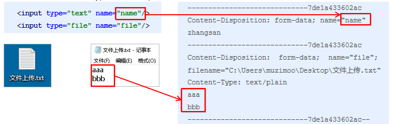

## 文件处理

### 介绍

```java
springMVC 文件下载支持的并不好
```


## 文件上传

介绍

```java
介绍
三要素
    表单项type=“file”
    表单的提交方式是post
    表单的enctype属性是多部分表单形式，及enctype=“multipart/form-data”
    
上传原理
// enctype
   application/x-www-form-urlencoded
  		form表单的正文内容格式是：key=value&key=value&key=value	 		
   Mutilpart/form-data
    	request.getParameter()将失效
    	请求正文内容就变成多部分形式
```



### 单文件上传

```java
介绍
    导入fileupload和io坐标
	配置文件上传解析器
	编写文件上传代码
    
// 表单
<form 
    action="${pageContext.request.contextPath}/quick20"
    method="post" 
    enctype="multipart/form-data"
>
    名称：<input type="text" name="name"><br>
    文件：<input type="file" name="uploadFile"><br>
    <input type="submit" value="提交"><br>
</form>
    
// 导包 pom.xml
// 坐标配置 fileupload io
	<dependency>
      <groupId>commons-fileupload</groupId>
      <artifactId>commons-fileupload</artifactId>
      <version>1.3.1</version>
    </dependency>
    <dependency>
      <groupId>commons-io</groupId>
      <artifactId>commons-io</artifactId>
      <version>2.3</version>
    </dependency>
    
    
// 配置多媒体解析器
<!--配置文件上传解析器
    id 的值是固定的
-->
<bean 
    id="multipartResolver" 
    class="org.springframework.web.multipart.commons.CommonsMultipartResolver"
>
    	<!--上传文件总大小-->
        <property name="maxUploadSize" value="5242800"/>
        <!--上传单个文件的大小-->
        <property name="maxUploadSizePerFile" value="5242800"/>
        <!--上传文件的编码类型-->
        <property name="defaultEncoding" value="UTF-8"/>
 </bean>    

// 后台程序
@RequestMapping(value="/quick22")
@ResponseBody
// uploadFile  是表中的 文件名称，不是随便乱起的       
public void save22(
        @RequestParam(value="username", required=false)String name,  // 普通参数
         @RequestParam(value="uploadFile", required=false)MultipartFile uploadFile  // 当前文件信息
	) throws IOException {
    System.out.println(name);
    System.out.println(uploadFile);
	// file.getname() 文件项的名字
    // 获得上传文件的名称
    String originalFilename = uploadFile.getOriginalFilename();
        // 文件保存的地方
    uploadFile.transferTo(new File("C:\\upload\\"+originalFilename));
}        
```


### 多文件上传

```java
介绍
    多文件上传，只需要将页面修改为多个文件上传项，
    将方法参数MultipartFile类型修改为MultipartFile[]即可
// jsp 表单
<form 
    action="${pageContext.request.contextPath}/user/quick23" 
    method="post" 
    enctype="multipart/form-data"
>
        名称<input type="text" name="username"><br/>
        文件1<input type="file" name="uploadFile"><br/>
        文件2<input type="file" name="uploadFile"><br/>
        <input type="submit" value="提交">
    </form>
    
// 后端
	@RequestMapping(value="/quick23")
    @ResponseBody
    public void save23(String username, MultipartFile[] uploadFile) throws IOException {
        System.out.println(username);
        for (MultipartFile multipartFile : uploadFile) {
            String originalFilename = multipartFile.getOriginalFilename();
            multipartFile.transferTo(new File("C:\\upload\\"+originalFilename));
        }
    }    
```


## 文件下载

```java
直接使用 java 的文件下载即可
```


