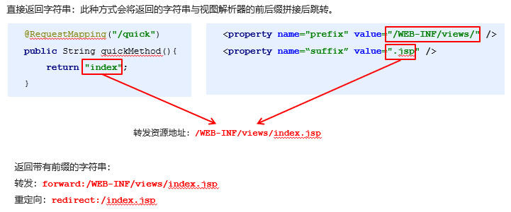
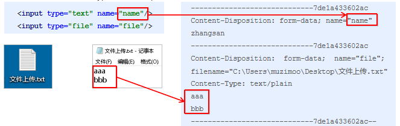
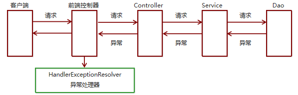

## 响应

### 页面跳转

```java
介绍
    直接返回字符串
	通过ModelAndView对象返回
```

#### 返回字符串

```java
介绍	
	直接返回字符串：此种方式会将返回的字符串与视图解析器的前后缀拼接后跳转。
    
@Controller
@RequestMapping('/book')
public class UserController {
    // http://localhost:8080/book/quick
    //  @RequestMapping(value="/quick", method=RequestMethod.GET, params = {"accountName"})
    @RequestMapping("/quick")
    public String save() {
        return "success.jsp";
			相对当前资源所在地址，即 http://localhost:8080/book
        	 默认形式是： forward: success.jsp
		return "/success.jsp";
        	从 web 引用下找这个资源
             默认形式是： forward: /success.jsp
}        
    
```



#### 返回 modelandview

```java
介绍
   

语法例子
// 方式一 
    //  在Controller中方法返回ModelAndView对象，并且设置视图名称
	@RequestMapping(value="/quick2")
    public ModelAndView save2(){
        /*
            Model:模型 作用封装数据
            View：视图 作用展示数据
         */
        ModelAndView modelAndView = new ModelAndView();
        //设置模型数据
        modelAndView.addObject("username","itcast");
        //设置视图名称
        modelAndView.setViewName("success");

        return modelAndView;
    }

// 方拾二
	// 在Controller中方法形参上直接声明ModelAndView，
	// 无需在方法中自己创建，在方法中直接使用该对象设置视图，同样可以跳转页面
     @RequestMapping(value="/quick3")
		public String save2(Model model) {
            model.addAttribute("username","123");
            return "success";
        }
        public ModelAndView save3(ModelAndView modelAndView){
            modelAndView.addObject("username","itheima");
            modelAndView.setViewName("success");
            return modelAndView;
        }
    @RequestMapping(value="/quick4")
        public String save4(Model model){
            model.addAttribute("username","博学谷");
            return "success";
        }

// 方式三
 	// 在Controller方法的形参上可以直接使用原生的HttpServeltRequest对象，只需声明即可
	@RequestMapping(value="/quick5")
    public String save5(HttpServletRequest request){
        request.setAttribute("username","酷丁鱼");
        return "success";
    }
```


### 回写数据

```java
 介绍
	直接返回字符串
    返回对象或集合  
```

#### 返回字符串

```java
介绍
    将需要回写的字符串直接返回，
运行  
    通过SpringMVC框架注入的response对象，
    使用response.getWriter().print(“hello world”) 回写数据，此时不需要视图跳转，业务方法返回值为void
语法例子    
	@RequestMapping(value="/quick7")
    @ResponseBody  //告知SpringMVC框架 不进行视图跳转 直接进行数据响应
    public String save7() throws IOException {
        return "hello itheima";
    }

    @RequestMapping(value="/quick6")
    public void save6(HttpServletResponse response) throws IOException {
        response.getWriter().print("hello itcast");
    } 

 	// 返回 json 字符串
	@RequestMapping(value="/quick8")
     @ResponseBody
     public String save8() throws IOException {
        User user = new User();
        //使用json的转换工具将对象转换成json格式字符串在返回
        // json转换工具jackson进行转换
        ObjectMapper objectMapper = new ObjectMapper();
        String json = objectMapper.writeValueAsString(user);
        return json;
     }
```


#### 返回对象或集合

* xml 配置

    ```java
    <!--SpringMVC帮助我们对对象或集合进行json字符串的转换并回写，为处理器适配器配置消息转换参数-->
    <!--指定使用jackson进行对象或集合的转换-->
    <!--处置处理器映射器-->
    <bean class="org.springframework.web.servlet.mvc.method.annotation.RequestMappingHandlerAdapter">
            <property name="messageConverters">
                <list>
                    <bean class="org.springframework.http.converter.json.MappingJackson2HttpMessageConverter"/>
                </list>
            </property>
        </bean>
    
    	@RequestMapping(value="/quick10")
        @ResponseBody
        //期望SpringMVC自动将User转换成json格式的字符串
    	// springMVC 自动进行转换                    
        public User save10() throws IOException {
            User user = new User();
            user.setUsername("lisi2");
            user.setAge(32);
            return user;
        }
    ```
* 注解

    ```xml
    <mvc:annotation-driven/>
    作用
    	<!-- 自动加载, 替代注解处理器和适配器的配置 -->
    	RequestMappingHandlerMapping（处理映射器）
    	RequestMappingHandlerAdapter（ 处 理 适 配 器 ）
    返回值
    	集成jackson进行对象或集合的json格式字符串的转换
    介绍
    	SpringMVC 的三大组件： 处理器映射器、处理器适配器、视图解析器
    
    ```

    


## 请求参数

### 介绍

```java
springMVC 可以接受的
数据结构
    name=value&name=value……
    
数据类型
    基本类型参数
    POJO类型参数
    数组类型参数
    集合类型参数
    
处理
    Controller中的业务方法的参数的属性名与请求参数的name一致，参数值会自动映射匹配
```

### 参数类型

#### 基础类型

```JAVA
介绍
    Controller中的业务方法的参数名称要与请求参数的name一致，参数值会自动映射匹配。并且能自动做类型转换
    自动的类型转换是指从String向其他类型的转换
语法例子
    
    // 请求
    http://localhost:8080/itheima_springmvc1/quick9?username=zhangsan&age=12

	// 代码
	@RequestMapping(value="/quick11")
    @ResponseBody
    public void save11(String username,int age) throws IOException {
        System.out.println(username);
        System.out.println(age);
    }
	//控制台输出
	zhangsan  12
```

#### POJO 类型

```java
介绍
    Controller中的业务方法的POJO参数的属性名与请求参数的name一致，参数值会自动映射匹配。
语法例子

    // POJO
    public class User {
        private String username;
        public String getUsername() {
            return username;
        }
        public void setUsername(String username) {
            this.username = username;
        }
    }
	
    // 请求
    	http://localhost:8080/itheima_springmvc1/quick12?username=zhangsan
	// 处理代码
	   @RequestMapping(value="/quick12")
        @ResponseBody
        public void save12(User user) throws IOException {
            System.out.println(user);
        }
	// 结果
		springMVC 自动将参数封装到 User 中，直接打印 user 可以得到请求参数
```

#### 数组类型

```java
介绍
    Controller中的业务方法数组名称与请求参数的name一致，参数值会自动映射匹配。
语法例子
    
    // 处理代码
    @RequestMapping(value="/quick13")
    @ResponseBody
    public void save13(String[] strs) throws IOException {
        System.out.println(Arrays.asList(strs));
    }

	// 请求中的参数自动封装
	http://localhost:8080/itheima_springmvc1/quick13?strs=aaa&strs=bbb
	
	// 客户端
	[aaa,bbb]
```

#### 集合类型

##### jsp

```java
介绍
    获得集合参数时，要将集合参数包装到一个POJO中才可以。
    
    // 表单
    <form action="${pageContext.request.contextPath}/user/quick14" method="post">
        <%--表明是第一个User对象的username age--%>
        <input type="text" name="userList[0].username"><br/>
        <input type="text" name="userList[0].age"><br/>
        <input type="text" name="userList[1].username"><br/>
        <input type="text" name="userList[1].age"><br/>
        <input type="submit" value="提交">
    </form>

    // 原型
    public class VO {
	   // 集合类型
        private List<User> userList;

        public List<User> getUserList() {
            return userList;
        }

        public void setUserList(List<User> userList) {
            this.userList = userList;
        }
    }
    // 操作
	@RequestMapping(value="/quick14")
    @ResponseBody
    public void save14(VO vo) throws IOException {
        System.out.println(vo);
    }
```

##### ajax

```java
介绍
    当使用ajax提交时，可以指定contentType为json形式，
    那么在方法参数位置使用@RequestBody可以直接接收集合数据而无需使用POJO进行包装
    
// 代码    
<script src="${pageContext.request.contextPath}/js/jquery-3.3.1.js"></script>
    <script>
        var userList = new Array();
        userList.push({username:"zhangsan",age:18});
        userList.push({username:"lisi",age:28});

        $.ajax({
            type:"POST",
            url:"${pageContext.request.contextPath}/user/quick15",
            data:JSON.stringify(userList),
            contentType:"application/json;charset=utf-8"
        });

    </script>
// 配置
   <mvc:resoutces mapping:>
        
// 处理代码
	@RequestMapping(value="/quick15")
    @ResponseBody
    public void save15(@RequestBody List<User> userList) throws IOException {
        System.out.println(userList);
    }      
// 请求

```


### 自定义转换器

```java
介绍
开发步骤
	1. 定义转换器类实现Converter接口
    2. 在配置文件 xml 中声明转换器
    3. 在<annotation-driven>中引用转换器

语法例子
	public class DateConverter implements Converter<String, Date> {
        public Date convert(String dateStr) {
            //将日期字符串转换成日期对象 返回
            SimpleDateFormat format = new SimpleDateFormat("yyyy-MM-dd");
            Date date = null;
            try {
                date = format.parse(dateStr);
            } catch (ParseException e) {
                e.printStackTrace();
            }
            return date;
        }
    }   

	// xml 配置
    <bean id="converterService"  
       class="org.springframework.context.support.ConversionServiceFactoryBean">
           <property name="converters">
               <list>
                 <bean class="com.itheima.converter.DateConverter"/>
               </list>
              </property>
    </bean>
    <mvc:annotation-driven conversion-service="converterService"/>

```


### 注解开发

#### @RequestParam

```java
介绍
	请求的参数名称与Controller的业务方法参数名称不一致时，
    就需要通过@RequestParam注解显示的绑定
    
参数
    value：与请求参数名称
	required：此在指定的请求参数是否必须包括，默认是true，提交时如果没有此参数则报错
	defaultValue：当没有指定请求参数时，则使用指定的默认值赋值

语法例子

<form action="${pageContext.request.contextPath}/quick16" method="post">
    <input type="text" name="name"><br>
    <input type="submit" value="提交"><br>
</form>
// 处理代码      
	@RequestMapping(value="/quick16")
    @ResponseBody
    public void save16(
    	@RequestParam(value="name",required = false,defaultValue = "itcast") String username
		) throws IOException {
        System.out.println(username);
    }        
```

#### @PathVariable

```java
介绍
    // Restful风格的参数
    url地址/user/1中的1就是要获得的请求参数
    SpringMVC中可以使用占位符: /user/{id}
使用
    进占位符的匹配获取工作
    
语法例子
    // 请求
    http://localhost:8080/itheima_springmvc1/quick19/zhangsan

	// 语法实例
	@RequestMapping("/quick19/{name}")
	@ResponseBody
	public void quickMethod19(
        @PathVariable(value = "name",required = true) String name)
    {
        System.out.println(name)；
    }

```

#### @RequestHeader

```java
介绍
	获得请求头信息，相当于web阶段学习的request.getHeader(name)
属性
    value：请求头的名称
	required：是否必须携带此请求头
语法例子
    @RequestMapping("/quick17")
    @ResponseBody
    public void quickMethod17(
    	@RequestHeader(value = "User-Agent",required = false) String headerValue
	){
    	System.out.println(headerValue);
	}

```


#### @CookieValue

```java
介绍
    获得指定Cookie的值
属性
    value：指定cookie的名称
	required：是否必须携带此cookie
语法例子
	@RequestMapping("/quick18")
    @ResponseBody
    public void quickMethod18(
    	@CookieValue(value = "JSESSIONID",required = false) String jsessionid
	){
    	System.out.println(jsessionid);
	}
    
```


### 其他操作

#### 静态资源开启

```xml
介绍
	有静态资源需要加载时，比如jquery文件，通过谷歌开发者工具抓包发现，没有加载到jquery文件，
原因
	SpringMVC的前端控制器DispatcherServlet的url-pattern配置的是/,代表对所有的资源都进行过滤操作，
解决方法
	方式一
	<!--springMVC.xml 中设置-->
	 <mvc:resources mapping="/js/**"location="/js/"/> 
	
	方式二
	 <mvc:default-servlet-handler/>
```

#### 请求数据乱码

```xml
介绍
	配置全局乱码过滤器(应用)
	当post请求时，数据会出现乱码，我们可以设置一个过滤器来进行编码的过滤。

语法例子
<!--配置全局过滤的filter-->
    <filter>
        <filter-name>CharacterEncodingFilter</filter-name>
        <filter-class>org.springframework.web.filter.CharacterEncodingFilter</filter-class>
        <init-param>
            <param-name>encoding</param-name>
            <param-value>UTF-8</param-value>
        </init-param>
    </filter>
    <filter-mapping>
        <filter-name>CharacterEncodingFilter</filter-name>
        <url-pattern>/*</url-pattern>
    </filter-mapping>	
```

## 文件处理

### 文件上传

```java
介绍
三要素
    表单项type=“file”
    表单的提交方式是post
    表单的enctype属性是多部分表单形式，及enctype=“multipart/form-data”
    
上传原理
// enctype
   application/x-www-form-urlencoded
  		form表单的正文内容格式是：key=value&key=value&key=value	 		
   Mutilpart/form-data
    	request.getParameter()将失效
    	请求正文内容就变成多部分形式

语法实例


    
```



### 单文件上传

```java
介绍
    导入fileupload和io坐标
	配置文件上传解析器
	编写文件上传代码
    
// 表单
<form 
    action="${pageContext.request.contextPath}/quick20"
    method="post" 
    enctype="multipart/form-data"
>
    名称：<input type="text" name="name"><br>
    文件：<input type="file" name="uploadFile"><br>
    <input type="submit" value="提交"><br>
</form>
    
// xml 配置
// 坐标配置 fileupload io
	<dependency>
      <groupId>commons-fileupload</groupId>
      <artifactId>commons-fileupload</artifactId>
      <version>1.3.1</version>
    </dependency>
    <dependency>
      <groupId>commons-io</groupId>
      <artifactId>commons-io</artifactId>
      <version>2.3</version>
    </dependency>
// 配置多媒体解析器
<!--配置文件上传解析器-->
<bean 
    id="multipartResolver" 
    class="org.springframework.web.multipart.commons.CommonsMultipartResolver"
>
    	<!--上传文件总大小-->
        <property name="maxUploadSize" value="5242800"/>
        <!--上传单个文件的大小-->
        <property name="maxUploadSizePerFile" value="5242800"/>
        <!--上传文件的编码类型-->
        <property name="defaultEncoding" value="UTF-8"/>
 </bean>    

// 后台程序
@RequestMapping(value="/quick22")
@ResponseBody
// uploadFile  是表中的 文件名称，不是随便乱起的       
public void save22(String name, MultipartFile uploadFile) throws IOException {
    System.out.println(name);
    System.out.println(uploadFile);
        
           //获得上传文件的名称
    String originalFilename = uploadFile.getOriginalFilename();
    uploadFile.transferTo(new File("C:\\upload\\"+originalFilename));
}        
```


### 多文件上传

```java
介绍
    多文件上传，只需要将页面修改为多个文件上传项，
    将方法参数MultipartFile类型修改为MultipartFile[]即可
// jsp 表单
<form 
    action="${pageContext.request.contextPath}/user/quick23" 
    method="post" 
    enctype="multipart/form-data"
>
        名称<input type="text" name="username"><br/>
        文件1<input type="file" name="uploadFile"><br/>
        文件2<input type="file" name="uploadFile"><br/>
        <input type="submit" value="提交">
    </form>
    
// 后端
	@RequestMapping(value="/quick23")
    @ResponseBody
    public void save23(String username, MultipartFile[] uploadFile) throws IOException {
        System.out.println(username);
        for (MultipartFile multipartFile : uploadFile) {
            String originalFilename = multipartFile.getOriginalFilename();
            multipartFile.transferTo(new File("C:\\upload\\"+originalFilename));
        }
    }    
```


## 拦截器

### 介绍

```java
1. Spring MVC 的拦截器类似于 Servlet  开发中的过滤器 Filter，用于对处理器进行预处理和后处理
拦截器链（InterceptorChain） 
    将拦截器按一定的顺序联结成一条链，
	在访问被拦截的方法或字段时，拦截器链中的拦截器就会按其之前定义的顺序被调用。
    拦截器也是AOP思想的具体实现。    
```

### 与过滤器区别

| **区别** | **过滤器**                                                | **拦截器**                                                   |
| -------- | --------------------------------------------------------- | ------------------------------------------------------------ |
| 使用范围 | 是 servlet 规范中的一部分，任何 Java Web 工程都可以使用   | 是 SpringMVC 框架自己的，只有使用了 SpringMVC 框架的工程才能用 |
| 拦截范围 | 在 url-pattern 中配置了/*之后，可以对所有要访问的资源拦截 | 只会拦截访问的控制器方法，如果访问的是 jsp，html,css,image 或者 js 是不会进行拦截的 |

### 实现

```java
步骤
    创建拦截器类实现HandlerInterceptor接口
    配置拦截器
    测试拦截器的拦截效果
    
执行顺序
    拦截器中的方法执行顺序是：preHandler-------目标资源----postHandle---- afterCompletion
    
// 实现 HandlerIntercepter
public class MyHandlerInterceptor1 implements HandlerInterceptor {
    //在目标方法执行之前 执行
    public boolean preHandle(
        HttpServletRequest request, 
        HttpServletResponse response, 
        Object handler
    ) {
        System.out.println("preHandle running...");
        String param = request.getParameter("params");
        if ("yes".equals(param)) {
			return true
        } else {
            request.getRequestDispatcher("/error.jsp").forward(request,response);
            return false;        // return false  表示不放行
        }
    }
    
    //在目标方法执行之后 视图对象返回之前执行
    public void postHandle(
        HttpServletRequest request, 
         HttpServletResponse response, 
         Object handler, 
         ModelAndView modelAndView
    ) {
        System.out.println("postHandle running...");    
    }
    
     //在流程都执行完毕后 执行
    public void afterCompletion(
        HttpServletRequest request,
        HttpServletResponse response, 
        Object handler, Exception ex
    ) {       
        System.out.println("afterCompletion running...");
    } 
    
// 配置
<!--springMVC 配置拦截器-->
    <mvc:interceptors>
        <mvc:interceptor>
            <!--对哪些资源执行拦截操作-->
            <mvc:mapping path="/**"/>
            <bean class="com.itheima.interceptor.MyInterceptor1"/>
        </mvc:interceptor>
    </mvc:interceptors>
   
// 测试
@Controller
public class TargetController {

    @RequestMapping("/target")
    public ModelAndView show(){
        System.out.println("目标资源执行......");
        ModelAndView modelAndView = new ModelAndView();
        modelAndView.addObject("name","itcast");
        modelAndView.setViewName("index");
        return modelAndView;
    }

}        
```

### 相关方法

| **方法名**        | **说明**                                                     |
| ----------------- | ------------------------------------------------------------ |
| preHandle()       | 方法将在请求处理之前进行调用，该方法的返回值是布尔值Boolean类型的，当它返回为false 时，表示请求结束，后续的Interceptor 和Controller 都不会再执行；当返回值为true 时就会继续调用下一个Interceptor 的preHandle 方法 |
| postHandle()      | 该方法是在当前请求进行处理之后被调用，前提是preHandle 方法的返回值为true 时才能被调用，且它会在DispatcherServlet 进行视图返回渲染之前被调用，所以我们可以在这个方法中对Controller 处理之后的ModelAndView 对象进行操作 |
| afterCompletion() | 该方法将在整个请求结束之后，也就是在DispatcherServlet 渲染了对应的视图之后执行，前提是preHandle 方法的返回值为true 时才能被调用 |

## 错误处理

### 基础

```java
介绍
	预期异常
    	通过捕获异常从而获取异常信息
    运行时异常RuntimeException
    	通过规范代码开发、测试等手段减少运行时异常的发生
处理
    Spring MVC提供
    	简单异常处理器SimpleMappingExceptionResolver
    Spring的异常处理接口
    	HandlerExceptionResolver 自定义自己的异常处理器
概述
    系统的Dao、Service、Controller出现都通过throws Exception向上抛出，
    最后由SpringMVC前端控制器交由异常处理器进行异常处理，如下图：
```



### 简单异常处理

```xml
介绍
	<!--SimpleMappingExceptionResolver-->
	SpringMVC已经定义好了该类型转换器，
	在使用时可以根据项目情况进行相应异常与视图的映射配置
配置
	<!--配置简单映射异常处理器-->
<bean class=“org.springframework.web.servlet.handler.SimpleMappingExceptionResolver”>    
    <property name=“defaultErrorView” value=“error”/>   默认错误视图
    <property name=“exceptionMappings”>
        <map>		异常类型		                       错误视图  error.jsp
            <entry key="com.itheima.exception.MyException" value="error"/>
            <entry key="java.lang.ClassCastException" value="error"/>
        </map>
    </property>
</bean>
```

### 自定义异常处理

```java
步骤
	创建异常处理器类实现HandlerExceptionResolver
	配置异常处理器
	编写异常页面
	测试异常跳转
代码实现
public class MyExceptionResolver implements HandlerExceptionResolver {
    @Override
    // exception	异常对象
    // modelAndView	 跳转到错误视图信息
    public ModelAndView resolveException(
        HttpServletRequest request, 
        HttpServletResponse response, 
        Object handler, 
        Exception ex
    ) {
        //处理异常的代码实现
        //创建ModelAndView对象
        ModelAndView modelAndView = new ModelAndView(); 
        modelAndView.setViewName("exceptionPage");
        return modelAndView;
    }
}

// xml 配置
<bean id="exceptionResolver"        
      class="com.itheima.exception.MyExceptionResolver"/>
// 编写异常界面          
```

