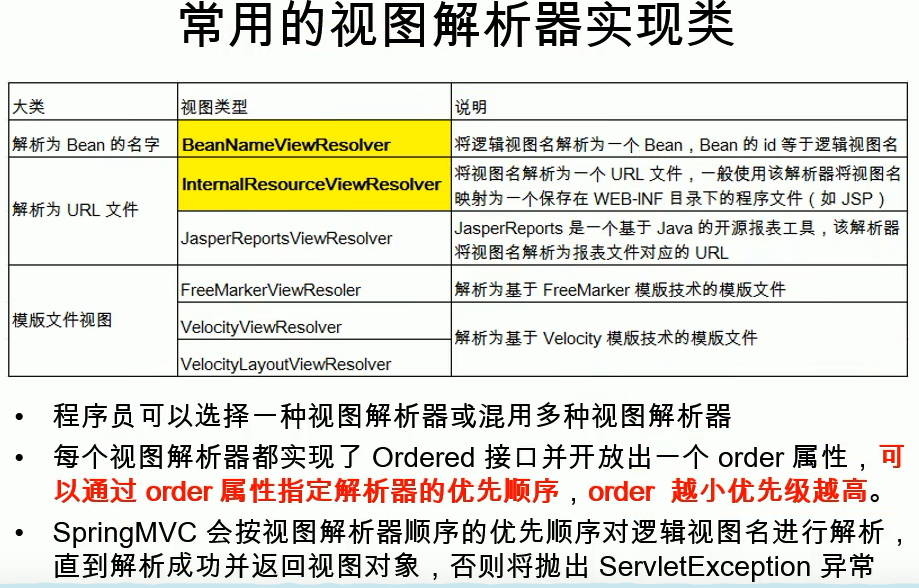

##  响应

### 配置

```dad

```


### 转发

```java
forward	
    前缀的转发，不会由视图解析器进行拼串
    例子

语法例子
    
    // 转发到 hello.jsp
    return "forward:hello.jsp"
// 多层转发
    @RequestMapping(" /hand1e01" )
    public String hand1e01(){
        System.out.println( "hand1e01");
        return "forward:/hello.jsp";
    }
    @RequestMapping("/hand1e02" )
    public String hand1e02(){
        System.out .print1n( "handle02");
        return "forward: /hand1e01";
    }
```


###  重定向

```java
介绍
    直接返回字符串
	通过ModelAndView对象返回

redirect
    重定向的路径， 有这个前缀，视图解析器就不会进行拼接字符串操作
    重定向不能访问 webinf 以及清求参数无法携带
语法例子
    // hello.JSP 代表从当前项目下开始，springMVC 会自动拼接上项目名
    return "redirect:/hello.jsp"

```

### 返回字符串

```java
介绍	
	直接返回字符串：此种方式会将返回的字符串与视图解析器的前后缀拼接后跳转。
    
@Controller
@RequestMapping('/book')
public class UserController {
    // http://localhost:8080/book/quick
    //  @RequestMapping(value="/quick", method=RequestMethod.GET, params = {"accountName"})
    @RequestMapping("/quick")
    public String save() {
        return "success.jsp";
			相对当前资源所在地址，即 http://localhost:8080/book
        	 默认形式是： forward: success.jsp
		return "/success.jsp";
        	从 web 引用下找这个资源
             默认形式是： forward: /success.jsp
}        
    
```


#### 返回 modelandview

```java

语法例子
// 方式一 
    //  在Controller中方法返回ModelAndView对象，并且设置视图名称
	@RequestMapping(value="/quick2")
    public ModelAndView save2(){
        /*
            Model:模型 作用封装数据， 数据在请求域中
            View：视图 作用展示数据
            之前的返回值我们就叫视图名:视图名视图解析器是会帮我们最终拼串得到页面的真实地址:

         */
        // ModelAndView modelAndView = new ModelAndView("success");
    	// 无参构造
	    ModelAndView modelAndView = new ModelAndView();
        //设置模型数据
        modelAndView.addObject("username","itcast");
        //设置视图名称，即返回的地址
        modelAndView.setViewName("success");

        return modelAndView;
    }

// 方拾二
	// 在Controller中方法形参上直接声明ModelAndView，
	// 无需在方法中自己创建，在方法中直接使用该对象设置视图，同样可以跳转页面
     	@RequestMapping(value="/quick3")
		public String save2(Model model) {
            model.addAttribute("username","123");
            return "success";
        }
        public ModelAndView save3(ModelAndView modelAndView){
            modelAndView.addObject("username","itheima");
            modelAndView.setViewName("success");
            return modelAndView;
        }
    @RequestMapping(value="/quick4")
        public String save4(Model model){
            model.addAttribute("username","博学谷");
            return "success";
        }

// 方式三
 	// 在Controller方法的形参上可以直接使用原生的HttpServeltRequest对象，只需声明即可
	@RequestMapping(value="/quick5")
    public String save5(HttpServletRequest request){
        request.setAttribute("username","酷丁鱼");
        return "success";
    }

// ssession 域中

```

##### session 域中保存数据

```java
介绍
	@SessionAttributes
	只能标注在类上	
语法
@SessionAttributes
含义（
	给BindingAwareModelMap modelandview 中保存的数据，同时给session中放一份
）    
属性（
	value="msg"	只要保存的是这种key的数据，给Session中放- -份
	type={String.class}	只要保存的是这种类型的数据，给Session中也放一-份


）    
```


### 回写数据

####   参数中传递返回

```java
介绍
    请求方法中的对象等， 可以直接在请求域中获取
参数中传入返回
    可以在方法处传入Map、Model、ModelMap.
	给这些参数里面保存的所有数据都会放在域(请求域： requestScope.msg )中。可以在页面获取
map model modelMap
    // 类型
    map的类型: class org. springframework. validation. support . BindingAwareModelMap
    mode1的类型: class org. springframework. validation. support . BindingAwareModelMap
    modelmap的类型: class org. springframework . validation. support .BindingAwareModelMap

     
语法例子
    @ResponseBody  //告知SpringMVC框架 不进行视图跳转 直接进行数据响应
    public String save7(map<String int> msg) throws IOException {
     	// map 会保存在域中，在页面获取
        return "success";
    }     
```


#### 返回字符串

```java
介绍
    将需要回写的字符串直接返回，
运行  
    通过SpringMVC框架注入的response对象，
    使用response.getWriter().print(“hello world”) 回写数据，此时不需要视图跳转，业务方法返回值为void
语法例子    
	@RequestMapping(value="/quick7")
    @ResponseBody  //告知SpringMVC框架 不进行视图跳转 直接进行数据响应
    public String save7() throws IOException {
        return "hello itheima";
    }

    @RequestMapping(value="/quick6")
    public void save6(HttpServletResponse response) throws IOException {
        response.getWriter().print("hello itcast");
    } 

 	// 返回 json 字符串
	@RequestMapping(value="/quick8")
     @ResponseBody
     public String save8() throws IOException {
        User user = new User();
        //使用json的转换工具将对象转换成json格式字符串在返回
        // json转换工具jackson进行转换
        ObjectMapper objectMapper = new ObjectMapper();
        String json = objectMapper.writeValueAsString(user);
        return json;
     }
```


#### 返回对象或集合

* xml 配置

    ```java
    <!--SpringMVC帮助我们对对象或集合进行json字符串的转换并回写，为处理器适配器配置消息转换参数-->
    <!--指定使用jackson进行对象或集合的转换-->
    <!--处置处理器映射器-->
    <bean class="org.springframework.web.servlet.mvc.method.annotation.RequestMappingHandlerAdapter">
            <property name="messageConverters">
                <list>
                    <bean class="org.springframework.http.converter.json.MappingJackson2HttpMessageConverter"/>
                </list>
            </property>
    </bean>
    
    	@RequestMapping(value="/quick10")
        @ResponseBody
        //期望SpringMVC自动将User转换成json格式的字符串
    	// springMVC 自动进行转换                    
        public User save10() throws IOException {
            User user = new User();
            user.setUsername("lisi2");
            user.setAge(32);
            return user;
        }
    
    ```
* 注解

    ```xml
    <mvc:annotation-driven/>
    作用
    	<!-- 自动加载, 替代注解处理器和适配器的配置 -->
    	RequestMappingHandlerMapping（处理映射器）
    	RequestMappingHandlerAdapter（ 处 理 适 配 器 ）
    返回值
    	集成jackson进行对象或集合的json格式字符串的转换
    介绍
    	SpringMVC 的三大组件： 处理器映射器、处理器适配器、视图解析器
    
    ```

    

## 请求参数

### 介绍

```java
springMVC 可以接受的
数据结构
    name=value&name=value……
    
数据类型
    基本类型参数
    POJO类型参数
    数组类型参数
    集合类型参数
    
处理
    Controller中的业务方法的参数的属性名与请求参数的name一致，参数值会自动映射匹配
```

### 参数类型

#### 基础类型

```java

介绍
    Controller中的业务方法的参数名称要与请求参数的name一致，参数值会自动映射匹配。
    可以进行自动做类型转换，自动的类型转换是指从String向其他类型的转换
语法例子
    
    // 请求
    http://localhost:8080/itheima_springmvc1/quick9?username=zhangsan&age=12

	// 代码
	@RequestMapping(value="/quick11")
    @ResponseBody
    public void save11(String username,int age) throws IOException {
        System.out.println(username);
        System.out.println(age);
    }
	//控制台输出
	zhangsan  12
```

#### POJO 类型

```java
介绍
    Controller中的业务方法的POJO参数的属性名与请求参数的name一致，参数值会自动映射匹配。
语法例子

    // POJO
    public class User {
        private String username;
        public String getUsername() {
            return username;
        }
        public void setUsername(String username) {
            this.username = username;
        }
    }
	//===========================================================================
	如果我们的请求参数是一-个POJO;
	SpringMVC会 自动的为这个POJO进行赋值?
	1)、将POJO中的每一个属性，从request参数中尝试获取出来，并封装即可;
	2)、还可以级联封装
		@RequestMapping(value="/quick12")
        public void save12(User user) throws IOException {
            System.out.println(user);
        }


	//===========================================================================
    // 请求
    	http://localhost:8080/itheima_springmvc1/quick12?username=zhangsan
	// 处理代码
	   @RequestMapping(value="/quick12")
       @ResponseBody
        public void save12(User user) throws IOException {
            System.out.println(user);
        }
	// 结果
		springMVC 自动将参数封装到 User 中，直接打印 user 可以得到请求参数
```

#### 数组类型

```java
介绍
    Controller中的业务方法数组名称与请求参数的name一致，参数值会自动映射匹配。
语法例子
    
    // 处理代码
    @RequestMapping(value="/quick13")
    @ResponseBody
    public void save13(String[] strs) throws IOException {
        System.out.println(Arrays.asList(strs));
    }

	// 请求中的参数自动封装
	http://localhost:8080/itheima_springmvc1/quick13?strs=aaa&strs=bbb
	
	// 客户端
	[aaa,bbb]
```

#### 集合类型

##### jsp

```java
介绍
    获得集合参数时，要将集合参数包装到一个POJO中才可以。
    
    // 表单
    <form action="${pageContext.request.contextPath}/user/quick14" method="post">
        <%--表明是第一个User对象的username age--%>
        <input type="text" name="userList[0].username"><br/>
        <input type="text" name="userList[0].age"><br/>
        <input type="text" name="userList[1].username"><br/>
        <input type="text" name="userList[1].age"><br/>
        <input type="submit" value="提交">
    </form>

    // 原型
    public class VO {
	   // 集合类型
        private List<User> userList;

        public List<User> getUserList() {
            return userList;
        }

        public void setUserList(List<User> userList) {
            this.userList = userList;
        }
    }
    // 操作
	@RequestMapping(value="/quick14")
    @ResponseBody
    public void save14(VO vo) throws IOException {
        System.out.println(vo);
    }
```

##### ajax

```java
介绍
    当使用ajax提交时，可以指定contentType为json形式，
    那么在方法参数位置使用@RequestBody可以直接接收集合数据而无需使用POJO进行包装
    
// 代码    
<script src="${pageContext.request.contextPath}/js/jquery-3.3.1.js"></script>
    <script>
        var userList = new Array();
        userList.push({username:"zhangsan",age:18});
        userList.push({username:"lisi",age:28});

        $.ajax({
            type:"POST",
            url:"${pageContext.request.contextPath}/user/quick15",
            data:JSON.stringify(userList),
            contentType:"application/json;charset=utf-8"
        });

    </script>
// 配置
   <mvc:resoutces mapping:>
        
// 处理代码
	@RequestMapping(value="/quick15")
    @ResponseBody
    public void save15(@RequestBody List<User> userList) throws IOException {
        System.out.println(userList);
    }      
// 请求

```


### 注解开发

#### @RequestParam

```java
介绍
    // 获取 url 中获取请求参数
    /book/[{user}pathVariable]?[{user=admin}requestParam]
    获取请求参数，即获取 ？ 后面的参数，但是不能获取请求参数，
	请求的参数名称与Controller的业务方法参数名称不一致时，就需要通过@RequestParam注解显示的绑定
    
参数
    value：请求参数名称
	required：此在指定的请求参数是否必须包括，默认是true，提交时如果没有此参数则报错
	defaultValue：当没有指定请求参数时，则使用指定的默认值赋值

语法例子

<form action="${pageContext.request.contextPath}/quick16" method="post">
    <input type="text" name="name"><br>
    <input type="submit" value="提交"><br>
</form>
// 处理代码      
	@RequestMapping(value="/quick16")
    @ResponseBody
    public void save16(
    	// 从 url 中获取参数名为 name 的参数，并赋值给 username
    	// username = request.getParameter("name")
    	@RequestParam(value="name",required = false,defaultValue = "itcast") String username
		) throws IOException {
        System.out.println(username);
    }        
```

#### @PathVariable

```java
介绍
    参数注解
    // Restful风格的参数
    /book/[{user}pathVariable]?[{user=admin}requestParam]
    获取路径参数，但是不能获取请求参数，即不能获取 ？ 后面的参数

参数
    value：请求路径参数
	required：此在指定的路径参数是否必须包括，默认是true，提交时如果没有此参数则报错
	defaultValue：当没有指定路径参数时，则使用指定的默认值赋值
    
作用    
    通过@PathVariable可以将URL中占位符参数绑定到控制器处理方法的入参中: 
语法例子
	// 语法实例
	@RequestMapping(" /delete/{id}")
        // 可以获取 URL 中的占位符
        public String delete (@PathVariable("id") Integer id){
        UserDao . delete(id);
        return "redirect: /user/list. action";
    }
```

#### @RequestHeader

```java
介绍
	获得请求头信息，相当于web阶段学习的request.getHeader(name)
属性
    参数
    value：请求头的名称
	required：是否必须携带此请求头，提交时如果没有此参数则报错
	defaultValue：当没有指定请求头，则使用指定的默认值赋值
    
    
语法例子
    @RequestMapping("/quick17")
    @ResponseBody
    public void quickMethod17(
    	@RequestHeader(value = "User-Agent",required = false) String headerValue
	){
    	System.out.println(headerValue);
	}

```


#### @CookieValue

```java
介绍
    获得指定Cookie的值
属性
    // 
    value：指定cookie的名称
	required：是否必须携带此cookie
语法例子
	@RequestMapping("/quick18")
    @ResponseBody
    public void quickMethod18(
    	@CookieValue(value = "JSESSIONID",required = false) String jsessionid
	){
    	System.out.println(jsessionid);
	}
    
```


### 其他操作

#### 静态资源开启

```xml
介绍
	有静态资源需要加载时，比如jquery文件，通过谷歌开发者工具抓包发现，没有加载到jquery文件，
原因
	SpringMVC的前端控制器DispatcherServlet的url-pattern配置的是/,代表对所有的资源都进行过滤操作，
解决方法
	方式一
	<!--springMVC.xml 中设置-->
	 <mvc:resources mapping="/js/**"location="/js/"/> 
	
	方式二
	 <mvc:default-servlet-handler/>
```

#### 请求数据乱码

```xml
介绍
	配置全局乱码过滤器(应用)
	当post请求时，数据会出现乱码，我们可以设置一个过滤器来进行编码的过滤。

语法例子
<!--配置全局过滤的filter-->
    <filter>
        <filter-name>CharacterEncodingFilter</filter-name>
        <filter-class>org.springframework.web.filter.CharacterEncodingFilter</filter-class>
        <init-param>
            <param-name>encoding</param-name>
            <param-value>UTF-8</param-value>
        </init-param>
    </filter>
    <filter-mapping>
        <filter-name>CharacterEncodingFilter</filter-name>
        <url-pattern>/*</url-pattern>
    </filter-mapping>	
```

## 数据处理

### 介绍

```java
介绍
    数据转换、数据格式化、数据校验
	javaBean 要和页面提交的数据进行一一转化
    数据绑定期间：
    	数据类型转换： String -- integer
    		conversionService
    	数据格式化问题: 2020:02:01 2020-01-02
            conversionService
    	数据校验是否正确: 前端校验 + 后端校验
            validators 数据校验
            bindingResult 负责保存及解析数据绑定期间产生的异常
```

### 数据转换

#### 自定义类型转换器

```java
介绍
    Spring 定义了 3 种类型的转换器接口， 实现任意一个就注册到ConversionServiceFactroyBean 中
    Converter<S,T>：
    	将 S 类型对象转为 T 类型对象（基本只用这个）
	ConverterFactory：
    	将相同系列多个 “同质” Converter 封装在一起。
         如果希望将一种类型的对象转换为另一种类型及其子类的对象可使用该转换器工厂类
        （例如将 String 转换为 Number 及 Number 子类 （Integer、Long、Double 等）对象）
	GenericConverter：
    	会根据源类对象及目标类对象所在的宿主类中的上下文信息进行类型转换
    
    
    
开发步骤
	1. 定义转换器类实现Converter接口
    2. 在配置文件 xml 中声明转换器
    3. 在<annotation-driven>中引用转换器

语法例子
	public class DateConverter implements Converter<String, Date> {
        public Date convert(String dateStr) {
            //将日期字符串转换成日期对象 返回
            SimpleDateFormat format = new SimpleDateFormat("yyyy-MM-dd");
            Date date = null;
            try {
                date = format.parse(dateStr);
            } catch (ParseException e) {
                e.printStackTrace();
            }
            return date;
        }
    }   

	// bean.xml 配置
    <bean id="converterService"  
       class="org.springframework.context.support.ConversionServiceFactoryBean">
		 // 自定义类型转换器
           <property name="converters">
               <set>
                 <bean class="com.itheima.converter.DateConverter"/>
               </set>
          </property>
    </bean>
	// 告诉 springMVC 使用自定义转换器                     
    <mvc:annotation-driven conversion-service="converterService"/>

```

### 数据校验

#### JSR303 校验

```java
介绍
    JSR 303 是 Java 为 Bean 数据合法性校验提供的标准框架，它已经包含在 JavaEE 6.0 中
使用
    JSR 303 通过在 Bean 属性上标注类似于 @NotNull、@Max 等标准的注解指定校验规则，
    并通过标准的验证接口对 Bean 进行验证
扩展
    Hibernate Validator 是 JSR 303 的一个参考实现，除支持所有标准的校验注解外，它还支持其他的扩展注解
    
语法例子
    // 1.java Bean 的属性桑添加校验规则
    @NotNull
    private String name
    
    // 2. springMVC 封住对象的时候，需要被告知需要校验
      告知 springMVC 该 javaBean 需要校验
      并返回校验的结果，返回的是该参数之前的 javaBean 的校验结果，中间什么都别跟
      public String addEmp(@Valid Employee employee, BindingResult result){ ... }

	// 3. 校验结果处理，查询是否有错误
	result.hasErrors();
	result.getFieldErrors();  // 获取所有的 Errors, 返回值为 list 类型
```


#### spring校验

```java
介绍
	Spring 4.0 拥有自己独立的数据校验框架，同时支持 JSR 303 标准的校验框架
源码
    Spring 的 LocalValidatorFactroyBean 既实现了 Spring 的 Validator 接口，也实现了 JSR 303 的 Validator 接口。只要
	在 Spring 容器中定义了一个 LocalValidatorFactoryBean，即可将其注入到需要数据校验的 Bean 中
注意
    Spring 本身并没有提供 JSR303 的实现，所以必须将 JSR303 的实现者的 jar 包放到类路径下
```

#### springMVC校验

```java
介绍
    <mvc:annotation-driven/> 会默认装配好一个 LocalValidatorFactoryBean
    在处理方法的入参上标注 @valid 注解即可让 Spring MVC 在完成数据绑定后执行数据校验的工作    
        
使用
	标注了 JSR303 注解的表单/命令对象前标注
	Spring MVC 框架在将请求参数绑定到该入参对象后，就会调用校验框架根据注解声明的校验规则实施校验        
处理结果
    概述
        Spring MVC 将校验结果保存到
        	对应的 BindingResult 或 Errors 对象中外，
        	还会将所有校验 结果保存到 “隐含模型”
	方式一： 显式保存        
        // bean 对象和	保存结果的对象那个，必须相邻且中间不能有其他参数        
        校验结果保存到随后的入参中，保存结果的参数类型必须是 BindingResult 或Errors 类型，        
        同时 两者都位于 org.springframework.validation 包  
	方式二： 隐式保存（页面展示）
        // 入参中没有 BindingResult Errors
        会将所有校验 结果保存到 “隐含模型”， 
        最终将通过 HttpServletRequest 的属性列表暴露给 JSP 视图对象
        在 JSP 页面上可通过 <form:errors path=“字段名”> 显示错误消息
        
语法例子
      // 告知 springMVC 该 javaBean 需要校验
      // 并返回校验的结果，返回的是该参数之前的 javaBean 的校验结果，中间什么都不能要
      public String addEmp(@Valid Employee employee, BindingResult result){ ... }
相关 api
	BindingResult/ Errors	
    	// BindingResult 扩展了 Errors 接口
        FieldError getFieldError(String field) 
        List<FieldError> getFieldErrors() 
        Object getFieldValue(String field) 
        Int getErrorCount()
```


### 错误消息处理

#### 原生表单

```java
将错误放在请求域中即可
```

#### 数据校验国际化

##### properties文件

```java
介绍
	每个属性在数据绑定和数据校验发生错误时，都会生成一个对应的 FieldError 对象
国际化文件	
格式
    key=value
	每一个字段发生错误以后，都会有自己的错误代码，国际化文件中错误消息的 key 必须对应一个错误代码
错误代码
    一个属性校验失败后，校验框架会为该属性生成 4 个消息代码，
    注解类名为前缀，结合modleAttribute、属性名及属性类型名生成多个对应的消息代码
错误代码格式 -- key 
    // 优先顺序：越精确越优先
    User 类中的 password 属性标准了一个 @Pattern 注解，出错则
        Pattern.user.password	校验规则.隐含模型中这个对象的 key.对象的属性
        Pattern.password		校验规则.属性名，任何 email 属性出错都会出错
        Pattern.java.lang.String 校验规则.属性类型， 只要是 String 类型发生email校验类型错误
        Pattern		只要是 @Pattern  校验错误
    
动态出入消息参数
    语法例子    
        @Length(min=5, max=15)
        // errors_en_US.properties
        // {1} 被替换成 5 {2} 被替换成 15
        Pattern.password = email incorrect! {1} {2}
	语法
        {0} 当前属性的属性名
        {1} {2}... 按照属性名的大小写进行排序
	其他
        每一个注解上都有一个 message 属性， 这个属性就是错先错误的时候，会显示的信息

语法例子
    // errors_en_US.properties
    Pattern.password = email incorrect!
	// errors_zh_CN.properties
    Pattern.password = email incorrect! 的 utf8 编码
备注
    java 文件就是正常的代码   
```

##### springMVC 管理

```xml
就是 国际化中的 springMVC 管理
管理国际化资源文件
<!-- id 必须是 messageSource -->
<bean 
    id= "messageSource" 
    class="org.springframework.context.support.ResourceBundLeMessageSource"
>
    <!-- basename指定基础名
		name = 
		value = 要引入的文件的名字的前缀： 
			errors_en_US.properties  errors_zh_CN.properties
	-->
	<property name="basename" value="errors"></ property>       
</bean>    


.jsp 文件
<form:form action= "hello/handle19.action" modelAttribute= "user">
<form:errors path= *> </form:errors>
	name: <input type= "text" name= "userName" />
	<form:errors path= "userName"> </form:errors>
    
	email: <input type= "text" name = "email"/>
	<form:errors path= "email"> < /form:errors>
        
	<input type= "submit "value= "Submit"/>
</form:form>

```


## 提交数据乱码

### 相应乱码

```java
response. setContentType("text/ html ; charset=utf-8")
```


### 请求乱码

```java
get请求
	// web 服务器 tomcat 的 config/server.xml 中找到相应标签，添加
    <Connectorl URIEncoding="UTF-8">
post请求 
    // 在第一次获取之前获取设置
    request.setCharacterEncoding("UTF-8")
	// 自己写一个 filter, 其实 springMVC 中有这个 filter 
    <!-- 配置一个字符编码的Filter -->
    <filter>
        <filter-name>CharacterEncodingFilter</ filter-name>
        <filter-class>org. springframework.web.filter.CharacterEncodingFilter</filter-class>
            <init-param>
                <param-name>encoding</param-name>
                <param-value>utf-8</param-value>
             </init-param>
   
            <init-param>
                <!-- forceEncoding :顺手解诀响应乱码; response.setCharacterEncoding
                <param-name>forceEncoding</param-name>
                <param-value>true</param-va1ue>
            </init-param>
    </filter>
    <filter-mapping>
        <filter- name>CharacterEncodingF ilter</filter-name>
        <ur1 -pattern>/ *</ur1-pattern>
    </fi1ter-mapping>

```


## 原生 api

```java
介绍
    springMVC 中可以使用原生 api
	HttpServletRequest
    HttpServletResponse
    HttpSession

    java. security. Principal
    Locale
    InputStream
    OutputStream
    Reader
    Writer
    
```


## 视图解析

### 综述

```java
视图解析器根据方法的返回值得到视图对象;
多个视图解析器都会尝试能否得到视图对象;
视图对象不同就可以具有不同功能; 

```


### 视图

```java
视图
    html jsp等静态文件
    html 文件： html 视图
    jsp	文件： jsp 视图
作用
	渲染模型数据,将模型里的数据以某种形式呈现给客户
解耦使用    
	为了实现视图模型和具体实现技术的解耦,
	Spring在org.springframework.web.servlet包中定义了一个高度抽象的 View 接口，
    
特点
    视图对象由视图解析器负责实例化。
    由于视图是无状态的，所以他们不会有线程安全的问题

```


### 视图解析器

```java
视图解析器
    // 将逻辑视图解析为一个具体的视图对象。
    根据 把控制器返回的逻辑视图名，确定 渲染模型的视图文件的物理位置。
     http://localhost:8080/book/success.jsp
    // 逻辑视图名：success , 返回值
    // 前缀	http://localhost:8080/book/
	// 后缀 .jsp
    // 物理位置：http://localhost:8080/book/success.jsp
视图渲染
    // 浏览器将HTML变成人眼看到的图像的全过程
    将数据域中的数据在页面上展示
    页面就是渲染模型数据
springMVC 视图解析
    1、方法执行后的返回值会作为页面地址参考,转发或者重定向到页面
    	任何方法的返回值,最终都会被包装成ModelAndView对象
	2、视图解析器可能会进行页面地址的拼串;
视图对象
    视图对象由视图解析器负责实例化。由于视图是无状态的,所以他们不会有线程安全的问题

视图解析器得到View对象
    所有配置的视图解析器都来尝试根据视图名（返回值）得到View（视图）对象，得到就返回，得不到换下一个视图解析器;
	调用 view  的 render


```



### 自定义视图 / 视图解析器

```java
@Controller
public class MyViewResovlerController {
    @RequestMapping( "/handleplus")
    public String handleplus(Model model){
        // 自定义前缀
        // forward:/gaoqing
        // meinv:/gaoqing
   		return "meinv:/gaoqing";
	}    
}


public class MyMeiNVViewResolver implements ViewResolver{
    @Override
    public View resolveViewName (String viewName， Locale locale)
    	throws Exception {
    // TODO Auto-generated method stub
    // 根据视图名返回视图对象
        // forward:/gaoqing
        // meinv:/gaoqing
        if (viewName . startsWith( "meinv:")){
            return new MyView();
         } else {
    	        // 如果不能处理返回nu11即可
        	    return nu11 ;
        }
    }
}

public class MyView implements View {
    /**
    *
      返回的数据的内容类型
    */
    @Override
    public String getContentType() {
   		 // TODO Auto- generated method stub
   		 return "text/htm1";
    }
    
    @Override
    public void
    render(Map<String, ?> model, HttpServletRequest, ...

    }

    
```


