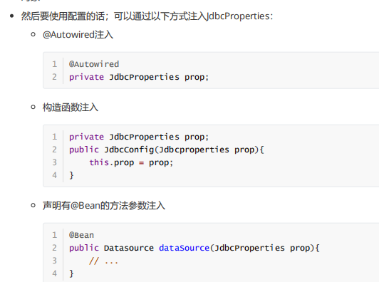

## 注解

### SpringBootApplication

```java
介绍
    告诉 spring 这是一个 springBoot 应用，这个类是程序入口类，是启动引导类
    springBoot 工程都有一个启动引导类，工程的入口类
    
```

### ConfigurationProperties

```java
例子
    @ConfigurationProperties(prefix = "jdbc")
    public class JdbcProperties {
        private String url;
        ......
    }        
解释
    // application.properties，这是Spring Boot默认读取的属性文件名：
    prefix="jdbc" 读取属性文件中，前缀为jdbc的值。
    在类上定义各个属性，名称必须与属性文件中 jdbc. 后面部分一致
```

### EnableConfigurationProperties

```java
@EnableConfigurationProperties(JdbcProperties.class) 
	来声明要使用 JdbcProperties 这个类的对象
        
```

### @SpringBootConfifiguration

### @ComponentScan

```java
指定扫描哪些类
```

### @EnableAutoConfiguration

```java
@EnableAutoConfifiguration（
含义：{
    是 compo
}  
```


## 其他



