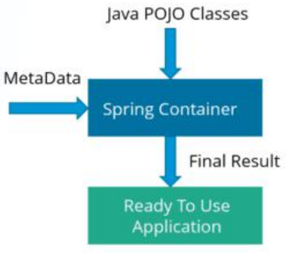
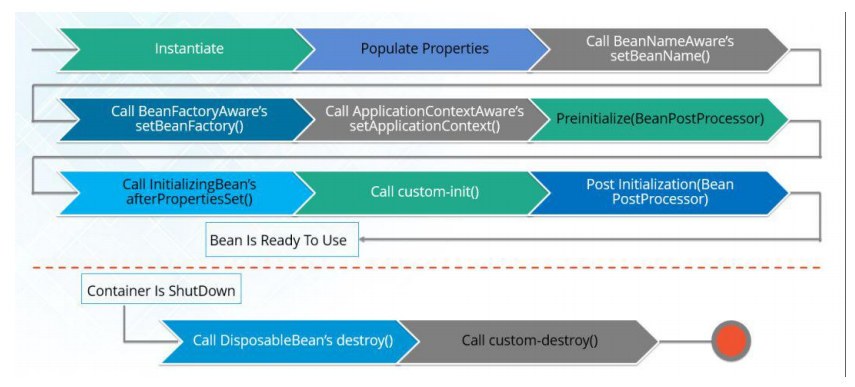

## springIOC 容器

### 介绍

```java
介绍
    spring IOC 就是一个 map , 
	它的运行机制进行：对象创建、管理(依赖注入（DI）)、配置， 并管理创建对象的生命周期
        
特点
	是 spring 框架的核心        
	支持加载服务时的饿汉式初始化和懒加载。
	把应用的代码量降到最低。它使应用容易测试， 最小的代价和最小的侵入性使松散耦合得以实现        

依赖注入
	不用创建对象，而只需要描述它如何被创建，
    要在配置文件里描述哪些组件需要哪些服务，之后一个容器（IOC 容器）负责把他们组装起来        
        
    Spring 容器使用依赖注入来管理组成应用程序的组件。
    容器通过读取提供的配置元数据来接收对象进行实例化，配置和组装的指令。
    该元数据可以通过 XML，Java 注解或 Java 代码提供。
    
种类
    
```



### 种类

```java
BeanFactory - 
    BeanFactory 就像一个包含 bean 集合的工厂类。它会在客户端要求时实例化 bean。
ApplicationContext - 
    ApplicationContext 接口扩展了 BeanFactory 接口。
    它在 BeanFactory 基础上提供了一些额外的功能。
```

| BeanFactory          | ApplicationContext     |
| -------------------- | ---------------------- |
| 懒加载               | 使用即时加载           |
| 语法显式提供资源对象 | 自己创建和管理资源对象 |
| 不支持国际化         | 支持国际化             |
| 不支持基于依赖的注解 | 支持基于依赖的注解     |
|                      |                        |

### 实现机制

```java
介绍
    IoC 的实现原理就是工厂模式加反射机制。
    bean 就是动态代理
    
例子
    interface Fruit {
    	public abstract void eat();
    }
    class Apple implements Fruit {
        public void eat(){
        	System.out.println("Apple");
        }
    }
    class Orange implements Fruit {
        public void eat(){
        	System.out.println("Orange");
		} 
    }
    class Factory {
    	public static Fruit getInstance(String ClassName) {
    		Fruit f=null;
    		try {
    			f=(Fruit)Class.forName(ClassName).newInstance();
    		} catch (Exception e) {
    			e.printStackTrace();
    		}
    		return f;
    	} 
    }            

class Client {
	public static void main(String[] a) {
        Fruit f=Factory.getInstance("io.github.dunwu.spring.Apple");
        if(f!=null){
            f.eat();
        } } }        
```


### 优势

```java
1. 它将最小化应用程序中的代码量。
2. 它将使您的应用程序易于测试，因为它不需要单元测试用例中的任何单例或 JNDI 查找机制。
3. 它以最小的影响和最少的侵入机制促进松耦合。
4. 它支持即时的实例化和延迟加载服务
```


### 依赖注入

```java
1. 不必创建对象，但是需要描述如何创建他们
2. 在配置文件中描述那些组件需要那些服务
3. 由 IOC 容器将他们装配到一起
    
总结
    就是：通过配置描述如何创建对象
    如何使用：
		用构造器参数实现强制依赖，setter 方法实现可选依赖。
方式
    // 就是如何创建对象
    构造函数注入  -- spring
    setter 注入  -- spring
    接口注入      -- mabtis
```

## spring配置

### xml 配置

```java
   
介绍
// 基于 xml
    bean 所需的依赖项和服务在 XML 格式的配置文件中指定。
    这些配置文件通常包含许多 bean 定义和特定于应用程序的配置选项。
    它们通常以 bean 标签开头。    
    
    <bean id="studentbean" class="org.edureka.firstSpring.StudentBean">
   		<property name="name" value="Edureka"></property>
    </bean>
        

            
```

### 基于注解

```java
介绍
    
// 基于注解的容器配置
	在相关的类，方法或字段声明上使用注解，
    将 bean 配置为组件类本身，而不是使用 XML 来描述 bean 装配        
	// 默认情况下，Spring 容器中未打开注解装配。  

    
打开方式：        
    <beans>
        <context:annotation-config/>
        <!-- bean definitions go here -->
    </beans>
            
// 基于 Java API 配置 
            
            
@Bean 注解扮演与 元素相同的角色。 
@Configuration 类允许通过简单地调用同一个类中的其他 @Bean 方法来定义 bean 间依赖关系。  
            
@Configuration
public class StudentConfig {
    @Bean
    public StudentBean myStudent() {
    	return new StudentBean();
    } 
}         
            
```


## springbean

### 概述

```java
概述
    // Spring beans 是那些形成 Spring 应用的主干的 java 对象。
    // 必知的所有配置元数据，包括如何创建一个 bean，它的生命周期详情及它的依赖
    用于配置对象交由Spring 来创建。
	默认情况下它调用的是类中的无参构造函数，如果没有无参构造函数则不能创建成功。
    
    Bean 由 Spring IoC 容器管理
    由 Spring IoC 容器实例化，配置，装配和管理
    
介绍
    （1）Spring 创建对象
	（2）Spirng 注入属性
Bean 管理操作有两种方式
    （1）基于 xml 配置文件方式实现
	（2）基于注解方式实现
    
对象创建
	 在 spring 配置文件中，
     使用 bean 标签，标签里面添加对应属性，进行对象创建

特点
    Spring 框架中的单例 bean 不是线程安全的


```


### 生命周期

#### 概述

```java
1、Spring 容器根据配置中的 bean 定义中实例化 bean。
2、Spring 使用依赖注入填充所有属性，如 bean 中所定义的配置。
    3、如果 bean 实现BeanNameAware 接口，则工厂通过传递 bean 的 ID 来调用setBeanName()。
    4、如果 bean 实现 BeanFactoryAware 接口，工厂通过传递自身的实例来调用 setBeanFactory()。
    5、如果存在与 bean 关联的任何BeanPostProcessors，则调用 preProcessBeforeInitialization() 方法。
    6、如果为 bean 指定了 init 方法（ <bean> 的 init-method 属性），那么将调用它。
7、最后，如果存在与 bean 关联的任何 BeanPostProcessors，则将调用 postProcessAfterInitialization() 方法。
    8、如果 bean 实现DisposableBean 接口，当 spring 容器关闭时，会调用 destory()。
    9、如果为bean 指定了 destroy 方法（ <bean> 的 destroy-method 属性），那么将调用它。

实例化 bean -- bean 属性 -- 然后看其他的方法    

    
    
//===============================================================
    // 单例        
    // bean 生命周期     
    // 容器启动的时候创建实例    
    对象创建：当应用加载，创建容器时，对象就被创建了	
    对象运行：只要容器在，对象一直活着	
    对象销毁：当应用卸载，销毁容器时，对象就被销毁了prototype：    
    // 多实例    
    	调用 getBean 方法的时候进行创建对象， 只要重新获取该bean，都将返回一个不同的对象。   
    // bean 生命周期   
    // 容器启动的时候不创建实例    
    对象创建：当使用对象时，创建新的对象实例	
    对象运行：只要对象在使用中，就一直活着	对象销毁：当对象长时间不用时，被 Java 的垃圾回收器回收了

```



#### 重要的周期方法

```java
// 两个重要的方法
第一个是 setup ， 它是在容器加载 bean的时候被调用。
第二个方法是 teardown 它是在容器卸载类的时候被调用
    
// 两个重要的属性（init-method 和 destroy-method）。
用它们你可以自己定制初始化和注销方法。
它们也有相应的注解（@PostConstruct 和 @PreDestroy）。    
```


### Bean 作用域

```java
介绍
    在 Spring 里面，设置创建 bean 实例是单实例还是多实例， 默认是单例
设置
    通过 bean 的 scope 属性进行设置
```

### 内部 bean

```java
介绍
    只有将 bean 用作另一个 bean 的属性时，才能将 bean 声明为内部 bean
    
```

### bean 装配

#### 介绍

```java
// 就是 bean 对象实例化，并初始化其属性字段
当 bean 在 Spring 容器中组合在一起时，它被称为装配或 bean 装配
即
   Spring 容器需要知道需要什么 bean 以及容器应该如何使用依赖注入来将 bean 绑定在一起，同时装配 bean
```

#### 自动装配

```java
介绍
    Spring 容器能够自动装配相互合作的 bean
    也就是说，可以通过检查 BeanFactory 的内容让 Spring 自动解析 bean 的协作者
参看
    属性注入 autowired

缺点
    覆盖的可能性 
    	您始终可以使用 <constructor-arg> 和 <property> 设指定依赖项，这将覆盖自动装配。
    基本元数据类型  // ????????
     简单属性（如原数据类型，字符串和类）无法自动装配。
    令人困惑的性质 - 总是喜欢使用明确的装配，因为自动装配不太精确。
```

#### 自动装配方式

```java
// 五种
no：
    默认的方式是不进行自动装配，通过显式设置 ref 属性来进行装配。
byName：
    通过参数名 自动装配，Spring 容器在配置文件中发现 bean 的 autowire 属性被设置成 byname，
    之后容器试图匹配、装配和该 bean 的属性具有相同名字的 bean。

byType:：
    通过参数类型自动装配，Spring 容器在配置文件中发现 bean 的 autowire 属性被设置成 byType，
    之后容器试图匹配、装配和该 bean 的属性具有相同类型的 bean。
    如果有多个 bean 符合条件，则抛出错误。
constructor：
    这个方式类似于 byType， 但是要提供给构造器参数，
    如果没有确定的带参数的构造器参数类型，将会抛出异常。
autodetect：
    首先尝试使用 constructor 来自动装配，
    如果无法工作，则使用 byType 方式。
```

#### 自动装配缺点

```java
重写：
    你仍需用 和 配置来定义依赖，意味着总要重写自动装配。
基本数据类型：
    你不能自动装配简单的属性，如基本数据类型，String字符串，和类。
模糊特性：
    自动装配不如显式装配精确，如果有可能，建议使用显式装配。
```


## 相关概念

