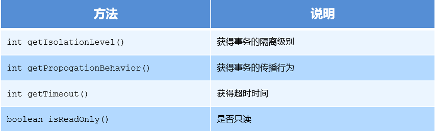
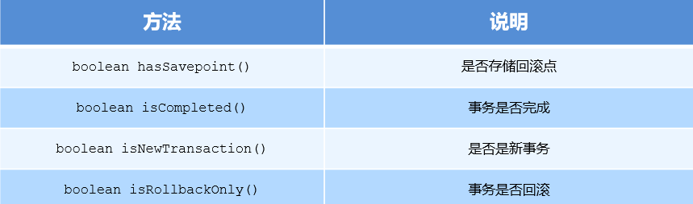
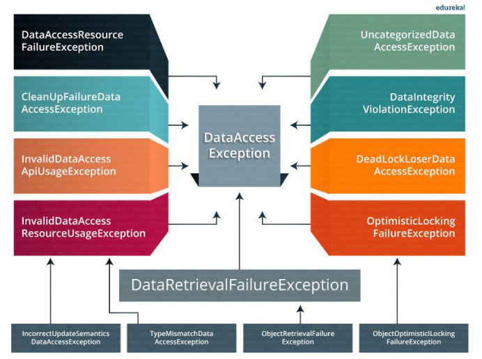
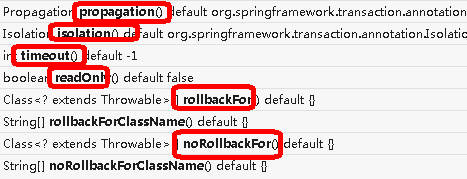

## spring 事务

```java
介绍
    一块执行的代码
2、在 Spring 进行事务管理操作
	编程式事务管理
    	// 通过复杂的编程编写要给事务
    	// 在此过程中，在编程的帮助下管理事务。它为您提供极大的灵活性，但维护起来非常困难
    声明式事务管理（使用）
    	// 告诉 Spring 哪个方法是事务即可，spring 自动进行事务控制
    	// 事务管理与业务代码分离。仅使用注解或基于 XML 的配置来管理事务。
    	基于注解 、 xml 配置

    
4、在 Spring 进行声明式事务管理，
    底层使用 AOP 原理
```


## sql 事务

### 特点

```java'
介绍
	事务是数据库操作最基本单元，逻辑上一组操作，要么都成功，如果有一个失败所有操作都失败
特点
	（1）原子性
    （2）一致性
    （3）隔离性
    （4）持久性
```

### 事务隔离级别

```java
// 设置隔离级别，可以解决事务并发产生的问题，如脏读、不可重复读和虚读

    事务有特性成为隔离性，多事务操作之间不会产生影响。不考虑隔离性产生很多问题
    有三个读问题：脏读、不可重复读、虚（幻）读
    脏读：
        // 不允许发生
        一个未提交事务读取到另一个未提交事务的数据
        
    不可重复读：
        一个未提交事务读取到另一提交事务修改数据
    虚读：
        一个未提交事务读取到另一提交事务添加数据
        
        
ISOLATION_DEFAULT			isolation_default
ISOLATION_READ_UNCOMMITTED	 isolation_read_uncommitted
ISOLATION_READ_COMMITTED	 isolation_read_committed
ISOLATION_REPEATABLE_READ	 isolation_repeatable_read
ISOLATION_SERIALIZABLE		 isolation_serializable			
```


* 数据库支持

    

### 传播级别

```java
传播行为
     多事务方法直接进行调用，这个过程中事务 是如何进行管理的

required：如果当前没有事务，就新建一个事务，如果已经存在一个事务中，加入到这个事务中。一般的选择（默认值）
supports：支持当前事务，如果当前没有事务，就以非事务方式执行（没有事务）
mandatory：使用当前的事务，如果当前没有事务，就抛出异常
requires_new：新建事务，如果当前在事务中，把当前事务挂起。
not_supported：以非事务方式执行操作，如果当前存在事务，就把当前事务挂起

NEVER：以非事务方式运行，如果当前存在事务，抛出异常

NESTED：如果当前存在事务，则在嵌套事务内执行。如果当前没有事务，则执行 REQUIRED 类似的操作

超时时间：默认值是-1，没有超时限制。如果有，以秒为单位进行设置

是否只读：建议查询时设置为只读
```


### 事务状态

```java
 
    
```


## 编程式事务

### PlatformTransactionManager

```java
相关对象
    PlatformTransactionManager 
    	是 spring 的事务管理器，它里面提供了我们常用的操作事务的方法。
    	是接口类型，不同的 Dao 层技术则有不同的实现类
    	jdbc 或 mybatis 时：org.springframework.jdbc.datasource.DataSourceTransactionManager 
		hibernate时：org.springframework.orm.hibernate5.HibernateTransactionManager
```


### TransactionDefinition

```java
 是事务的定义信息对象
```



### TransactionStatus

```java
接口提供的是事务具体的运行状态，方法介绍如下
```



## 声明式操作

### 基础

```java
介绍
    采用声明的方式来处理事务。
    声明： 指在配置文件中声明，用在 Spring 配置文件中声明式的处理事务来代替代码式的处理事务。
作用
    // Spring 声明式事务控制底层就是AOP
    事务管理不侵入开发的组件。具体来说，业务逻辑对象就不会意识到正在事务管理之中
    在不需要事务管理的时候，只要在设定文件上修改一下，即可移去事务管理服务，无需改变代码重新编译
    
```

### xml 开发

#### bean.xml

```xml

<!--1 创建事务管理器--> 
<bean id="transactionManager" 
    class="org.springframework.jdbc.datasource.DataSourceTransactionManager">
     <!-- 控制数据源 -->
     <property name="dataSource" ref="dataSource"></property>
</bean>


// 配置占位符参数的类    
<bean id="jdbcTemplate" class="org.springframework.jdbc.core.Jdbc.Template" >
    <constructor-arg name="dataSource" ref="dataSource"></constructor-arg>
</bean>

// 配置具名参数的类
<bean id="paramJdbcTemplatel" class="org.springframework.jdbc.core.namedparam.NamedParameterJdbcTemplatel"> 
	// 构造器的方式注入一个数据源
    <constructor-arg name="dataSource" ref="dataSource"></constructor-arg>
</bean>  
   


<!--2 配置通知, 事务增强，
	配置事务管理器
-->
<tx:advice id="txadvice" transaction-manager="transactionManager">
     <!--配置事务参数-->
     <tx:attributes>
         <!--指出哪种方法上面添加事务， 跟切入点不同-->
         <tx:method name="accountMoney" propagation="REQUIRED"/>
         <tx:method name="accountMoney" propagation="REQUIRED"/>
         
         <!--<tx:method name="account*"/>-->
     </tx:attributes>
</tx:advice>

<!--3 配置实现切入点和切面--> 
<aop:config>
     <!--配置实现切入点
	-->
     <aop:pointcut 
         id="pt" 
		expression="execution(*com.atguigu.spring5.service.UserService.*(..))"
      />
     <!--配置切面，事务建议，事务增强
		 advice-ref	事务处理器， aop:advice
		 pointcut-ref 需要被怎强的方法
	-->
     <aop:advisor advice-ref="txadvice" pointcut-ref="pt"/>
</aop:config>

----------------------------------------------------------------------
<!-----------------基于注解需要添加-->
<!--开启事务注解--> 
<tx:annotation-driven transaction-manager="transactionManager">
</tx:annotation-driven>

<!—之前省略datsSource、jdbcTemplate、平台事务管理器的配置-->
<!--组件扫描-->
<context:component-scan base-package="com.itheima"/>
<!--事务的注解驱动-->
<tx:annotation-driven/>
<!------------------------基于注解结束-->
```


### 注解开发

#### 配置 xml

```xml
<!--1 创建事务管理器--> 
<bean id="transactionManager" 
    class="org.springframework.jdbc.datasource.DataSourceTransactionManager">
     <!-- 控制数据源 -->
     <property name="dataSource" ref="dataSource"></property>
</bean>

<!--开启事务注解--> 
<tx:annotation-driven transaction-manager="transactionManager">
</tx:annotation-driven>


// 配置占位符参数的类    
<bean id="jdbcTemplate" class="org.springframework.jdbc.core.Jdbc.Template" >
    <constructor-arg name="dataSource" ref="dataSource"></constructor-arg>
</bean>


// 配置具名参数的类
<bean id="paramJdbcTemplatel" class="org.springframework.jdbc.core.namedparam.NamedParameterJdbcTemplatel"> 
	// 构造器的方式注入一个数据源
    <constructor-arg name="dataSource" ref="dataSource"></constructor-arg>
</bean>  
   

<!—之前省略datsSource、jdbcTemplate、平台事务管理器的配置-->
<!--组件扫描-->
<context:component-scan base-package="com.itheima"/>
<!--事务的注解驱动-->
<tx:annotation-driven/>

<!-- 组件扫描 --> 
<context:component-scan base-package="com.atguigu"></context:component-scan>

```


#### 普通

```java
介绍
    @Transactional 
    在需要进行事务控制的类或是方法上修饰，注解可用的属性同 xml 配置方式
		类上
    		那么该类下的所有方法都使用同一套注解参数配置
    	方法上，
    		 同的方法可以采用不同的事务参数配置。
注意
    以内层的 transaction 为主
    
语法例子    
    
@Service("accountService")
@Transactional
public class AccountServiceImpl implements AccountService {
    @Autowired
    private AccountDao accountDao;
    
     // 方法中的语句有一个执行错误，方法中所有的语句都会返回到函数执行前的状态
    @Transactional(isolation = Isolation.READ_COMMITTED,propagation = Propagation.REQUIRED)
    public void transfer(String outMan, String inMan, double money) {
        accountDao.out(outMan,money);
        int i = 1/0;
        accountDao.in(inMan,money);
    }
}
```

#### 完全注解

```java
// 1、创建配置类，使用配置类替代 xml 配置文件
    @Configuration //配置类
    @ComponentScan(basePackages = "com.atguigu") //组件扫描
    @EnableTransactionManagement //开启事务
public class TxConfig {
     //创建数据库连接池
     @Bean
     public DruidDataSource getDruidDataSource() {
         DruidDataSource dataSource = new DruidDataSource();
         dataSource.setDriverClassName("com.mysql.jdbc.Driver");
         dataSource.setUrl("jdbc:mysql:///user_db");
         dataSource.setUsername("root");
         dataSource.setPassword("root");
         return dataSource;
     }
     //创建 JdbcTemplate 对象
     @Bean
     public JdbcTemplate getJdbcTemplate(DataSource dataSource) {
         //到 ioc 容器中根据类型找到 dataSource
         JdbcTemplate jdbcTemplate = new JdbcTemplate();
         //注入 dataSource
         jdbcTemplate.setDataSource(dataSource);
         return jdbcTemplate;
     }
     //创建事务管理器
     @Bean
     public DataSourceTransactionManager 
         getDataSourceTransactionManager(DataSource dataSource) {
         DataSourceTransactionManager transactionManager = new DataSourceTransactionManager();
         transactionManager.setDataSource(dataSource);
         return transactionManager;
     } 
}

```

### 使用

```java
重要的使用配置
不重要的使用注解    
```


## // =============


### 抛出的异常



### Transactional 参数




#### propagation

```java
    事务传播行为
   // 看事务传播级别 
```


#### ioslation

```java
3、ioslation：事务隔离级别
```


#### 其他

```java
4、timeout：超时时间    （1）事务需要在一定时间内进行提交，如果不提交进行回滚    （2）默认值是 -1 ，设置时间以秒单位进行计算5、readOnly：是否只读    （1）读：查询操作，写：添加修改删除操作    （2）readOnly 默认值 false，表示可以查询，可以添加修改删除操作    （3）设置 readOnly 值是 true，设置成 true 之后，只能查询6、rollbackFor：回滚    （1）设置出现哪些异常进行事务回滚7、noRollbackFor：不回滚    （1）设置出现哪些异常不进行事务回滚
```


