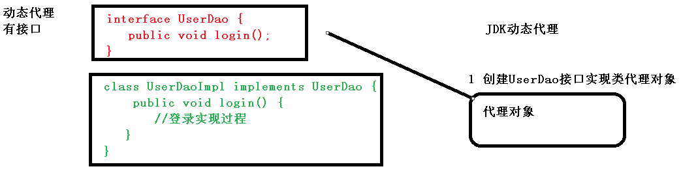
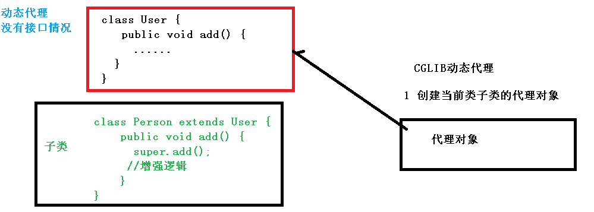
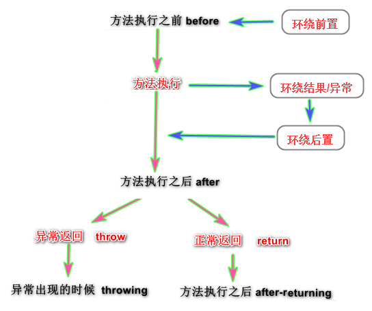

## 介绍

```java
基础
     AOP(Aspect-Oriented Programming) 面向切面编程
（1）面向切面编程（方面），
    通过预编译方式和运行期动态代理实现程序功能的统一维护的一种技术。     
	AOP 是 OOP 的延续
（2）通俗描述：
    不通过修改源代码方式，在主干功能里面添加新功能
特点 
    // 对方法的增强 
    是函数式编程的一种衍生范型。
    利用AOP可以对业务逻辑的各个部分进行隔离，
优势
    在程序运行期间，在不修改源码的情况下, 将某段代码动态切入到指定方法的指定位置记性运行
    减少重复代码，提高开发效率，并且便于维护
    
特点
    AOP 模块很多支持由 AOP 联盟提供，这样就确保了 Spring 和其他 AOP 框架的共通性
```

## 底层实现原理

### 实现方法

```java
分类
    静态代理
    动态代理
介绍
// 静态代理
指使用 AOP 框架提供的命令进行编译，从而在编译阶段就可生成 AOP 代理类，
因此也称为编译时增强；
    编译时编织（特殊编译器实现）
    类加载时编织（特殊的类加载器实现）  
    
// 动态代理
在运行时在内存中“临时”生成 AOP 动态代理类，因此也被称为运行时增强
    JDK 动态代理
	CGLIB
    
Spring 中的代理
   	将 Advice 应用于目标对象后创建的对象称为代理。
    在客户端对象的情况下，目标对象和代理对象是相同的
    Advice + Target Object = Proxy
```


### 动态代理

```java
原理
    动态代理

类型
    JDK 代理 :  
		基于接口的动态代理技术
         创建接口实现类代理对象，增强类的方法
	cglib 代理：
        基于父类的动态代理技术
    	创建子类的代理对象，增强类的方法
```

### jdk 代理



### CGLIB 动态代理




## 术语

### 基础

```java
// 术语概述介绍

@Aspect
public class B {   				  // 切面类

    @execution（xxx/A.test_A())   // 用 test_B 来增强 test_A 
    public void test_B () {...}    
    

}


public class A {   				 

    public void test_A () {...}    // 被增强的方法：切入点
    
    public void test2_A() {。。。 }  // A 的所有方法都叫：连接点
}
// ==============================================

需求:
	目标类
		需要被增强的方法所属的类
	连接点
    	目标类中的所有方法
    	理论上可以被被增强的方法
        
	切入点   --  被增强的方法
        // 程序运行中的一些时间点, 例如一个方法的执行, 或者是一个异常的处理
        // 在 Spring AOP 中, join point 总是方法的执行点。
		实际被增强的方法： 
    	类 A 的方法 test_A (该方法需要附加其他的功能)
            
	切面类 
		附加的方法所属的类, 
		该类中的方法地用来增强其他的方法
            
	切面： 个人理解
		切面类的一个 xml 形式表达： 切面类中切入点标注在附加方法的上面
		切面： 切入点、附加位置结合
		切入点 和 附加的方法相结合进行进行执行
    	
	附加的方法 -- 增强的方法
			类 B 的 test_B 方法（该方法需要 附加到 A 中）
            
	附加的位置 -- 通知
		
    	test_B 可以在什么时候执行： 
    		在 test_A 方法
    				执行前 执行
    	、		   执行后 执行（在 return 之后执行，有异常不会执行）
    				执行异常 执行
    				执行前后 都执行
    				执行后执行（即使有异常也要执行）
          
```

### 切入点表达式 --被增强的方法

```java
作用
    // 表达式中是： 需要被增强的类的方法
位置
    对切面类中的方法进行标注，
    表明切面类中的方法要增强的方法
例子
    // 对 com.atguigu.dao.BookDao 类里面的 add 进行增强
    execution(* com.atguigu.dao.BookDao.add(..))
    
语法结构
    execution([权限修饰符] [返回类型] [类全路径] [方法名称]([参数列表]) )
        权限修饰符： 
    		可以省略
        返回类型
            * 表示任何，一个或者多个
        类全路径
            包名.类名.方法名:  * 表示任何
            包名、类名之间： 
                一个点：表示当前包下的类
                两个点：表示当前包及其子包下的类
        参数类型
		   两边的括号是不能省略的                
            两个点： 表示任意个数，任意类型的参数列表
连接符
	&&
		要切入位置满足两边的表达式                
	||
		要切入位置满足其中一边               
	|                
		只要不是这个位置就都切入                
例子
    // 对 com.atguigu.dao.BookDao 类里面的 add 进行增强
    execution(* com.atguigu.dao.BookDao.add(..))
    // 对 com.atguigu.dao.BookDao 类里面的所有的方法进行增强
    execution(* com.atguigu.dao.BookDao.* (..))
    
execution(public void com.itheima.aop.Target.method())	
execution(void com.itheima.aop.Target.*(..))
execution(* com.itheima.aop.*.*(..))
execution(* com.itheima.aop..*.*(..))
execution(* *..*.*(..))
```

### 通知  -- 附加的位置

```java
概念
    // 方法中增加的代码
    实际增强的部分
分类	
		     xml 标签        			   注解				含义
前置通知 	<aop:before>			     @Before			方法执行前执行
后置通知 	<aop:after-returning>		 @AfterReturning	  方法执行后执行
异常通知	<aop:throwing>				@Throwing			方法有异常执行
环绕通知	<aop:around>				@Around				方法执行前后都会执行
最终通知	<aop:after>					@After			    方法无论怎样，执行后都会执行
       
```




### 织入

```java
织入是将切面和到其他应用类型或对象连接或创建一个被通知对象的过程。
织入可以在编译时，加载时，或运行时完成。
```


## 使用

```java
介绍
    一般都是基于 AspectJ 实现 AOP 操作
    AspectJ 不是 Spring 组成部分，独立 AOP 框架，
    一般把 AspectJ 和 Spirng 框架一起使用，进行 AOP 操作
使用方式
    （1）基于 xml 配置文件实现
	（2）基于注解方式实现（使用）
步骤
    编写核心业务代码（目标类的目标方法）
	编写切面类，切面类中有通知(增强功能方法)
	在配置文件中，配置织入关系，即将哪些通知与哪些连接点进行结合
    
```

### xml

```java
基于 XML Schema 方式的切面实现, 切面由常规类以及基于 XML 的配置实现。
```


### 注解

```java
这种情况下(基于@AspectJ 的实现)，涉及到的切面声明的风格与带有 java5 标注的普通 java 类一致。
```


## 辨析

### 1. spring aop 中 concern 和 cross-cutting concern 的不同之处

```java
concern 
    是我们想要在应用程序的特定模块中定义的行为。它可以定义为我们想要实现的功能。
    
cross-cutting concern 
    是一个适用于整个应用的行为，这会影响整个应用程序。
	例如，日志记录，安全性和数据传输是应用程序几乎每个模块都需要关注的问题，
	因此它们是跨领域的问题    
```

### 2. Spring AOP and AspectJ AOP

```java
Spring AOP 
    基于动态代理方式实现；
	仅支持方法级别的 PointCut；提供了完全的 AOP 支持，
    它还支持属性级别的 PointCut。
    
AspectJ
    基于静态代理方式实现
```

### 3. Spring 中的代理

```java
将 Advice 应用于目标对象后创建的对象称为代理。
在客户端对象的情况下，目标对象和代理对象是相同的
    
dvice + Target Object = Proxy    
    
    
    
// 自动代理
// AutoProxyCreator ---    
BeanName --- 
DefaultAdvisor --- 
Metadata autoproxying    
```

