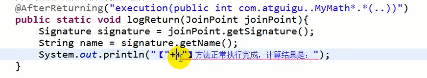

## 注解开发

### 介绍

```java
步骤
	导包    
		导入 AOP 相关坐标
    java 代码
    	1. 目标接口、目标类（内部有切点）
		2. 切面类（内部有增强方法）
    	// 重要 ： 切面类中使用注解配置织入关系
    	3. 
	bean.xml 
		开启组件扫描和 AOP 的自动代理
	测试代码   
```


### 快速入门

#### 导包

#### xml配置

```java
xml 配置
 xmlns:context="http://www.springframework.org/schema/context" 
 xmlns:aop="http://www.springframework.org/schema/aop" 
  xsi:schemaLocation="http://www.springframework.org/schema/beans 
        http://www.springframework.org/schema/beans/spring-beans.xsd 
         http://www.springframework.org/schema/context 
        http://www.springframework.org/schema/context/spring-context.xsd 
         http://www.springframework.org/schema/aop 
        http://www.springframework.org/schema/aop/spring-aop.xsd" 

<!--组件扫描-->
<context:component-scan base-package="com.itheima.aop"/>

<!--aop的自动代理-->
<aop:aspectj-autoproxy></aop:aspectj-autoproxy>
 
```

#### java 代码

##### 目标类

```java
@Component
public class User {
    public void add(){
        System.out.println("user");
    }
}
```

##### 切面类

```java
@Component("userProxy")@Aspect  //生成代理对象，增强的类，来增强其他类的方法public class UserProxy {     //前置通知     //@Before 注解表示作为前置通知     @Before(value = "execution(* com.atguigu.spring5.aopanno.User.add(..))")     public void before() {    	 System.out.println("before.........");     }     //后置通知（返回通知）， 返回值之后执行     @AfterReturning(value = "execution(* com.atguigu.spring5.aopanno.User.add(..))")     public void afterReturning() {     	System.out.println("afterReturning.........");     }     //最终通知		方法之后执行     @After(value = "execution(* com.atguigu.spring5.aopanno.User.add(..))")     public void after() {     	System.out.println("after.........");     }     //异常通知     @AfterThrowing(value = "execution(* com.atguigu.spring5.aopanno.User.add(..))")     public void afterThrowing() {     	System.out.println("afterThrowing.........");     }     //环绕通知     @Around(value = "execution(* com.atguigu.spring5.aopanno.User.add(..))")     public void around(ProceedingJoinPoint proceedingJoinPoint) throws Throwable {     	System.out.println("环绕之前.........");         //被增强的方法执行         proceedingJoinPoint.proceed();         System.out.println("环绕之后.........");     }}  
```


### 被增强方法信息

```java
介绍    获取被增强的类（连接点）的方法的信息： 参数、名称    使用 JoinPoint    // 参数不能乱写，需要提前告诉 spring 每个参数的含义是什么    // 类型不固定，尽量往大了写返回值    标签属性 returnning    @AfterReturning(value="execurion(...)", returnning="result")    public static void logReturn(JointPoint jointPoint, Object result){    	return result	}异常返回    标签属性 throwing    @Throwing(value="execurion(...)", throwing="exception")        public static void logReturn(JointPoint jointPoint, Exception exception){    	return result	}
```



### 完全注解

```java
// 创建配置类，不需要创建 xml 配置文件 @Configuration@ComponentScan(basePackages = {"com.atguigu"})@EnableAspectJAutoProxy(proxyTargetClass = true)public class ConfigAop {}
```


### 相同切入点提取

```java
介绍
    公共方法
    是在切面内定义方法，在该方法上使用@Pointcut注解定义切点表达式，然后在在增强注解中进行引用
    
@Component("myAspect")
@Aspect
public class MyAspect {
    // 方式一：@Before("MyAspect.myPoint()")
    // 方拾二：@Before("Pointcut()")
    @Before("MyAspect.myPoint()")
    public void before(){
        System.out.println("前置代码增强.....");
    }
    @Pointcut("execution(* com.itheima.aop.*.*(..))")
    public void myPoint(){}
}    
    
    
    
    
//相同切入点抽取
// User 类的 add 方法    
@Pointcut(value = "execution(* com.atguigu.spring5.aopanno.User.add(..))")
public void pointdemo() {
}
//前置通知
//@Before 注解表示作为前置通知
@Before(value = "pointdemo()")
public void before() {
 	System.out.println("before.........");
}
```


### 多切面类

```java
介绍
    有多个增强类多同一个方法进行增强
    设置增强类优先级
语法例子
// 在增强类上面添加注解 @Order(数字类型值)，数字类型值越小优先级越高    
@Component
@Aspect
@Order(1)
public class PersonProxy
    
// 执行顺序： 需要验证    
```


