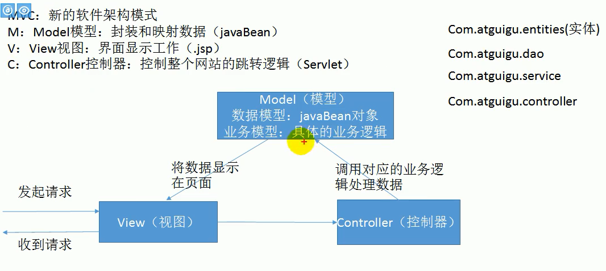
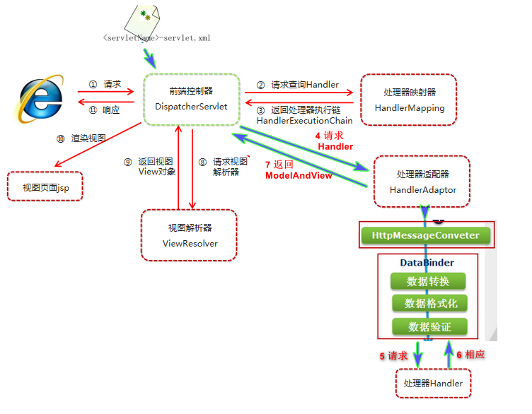

## 注意

```java
https://www.jianshu.com/p/03ef27950d73
```

## 介绍

```java
介绍
	其实就是 spring  的 web 模块
    Spring Web MVC 框架提供 模型-视图-控制器 架构和随时可用的组件，
    用于开发灵活且松散耦合的 Web 应用程序。
    
SpringMVC 的三大组件： 
    处理器映射器、处理器适配器、视图解析器
    
特点

    1）Spring 基于 Java 的实现 MVC 设计模型的请求驱动类型的轻量级 Web 框架，
    2）Spring3.0 后全面超越 Struts2，成为最优秀的 MVC 框架。
    3）Spring MVC 通过一套 MVC 注解，让 POJO 成为处理请求的控制器，而无须实现任何接口。
    4）支持 REST 风格的 URL 请求。   Restful
    5）采用了松散耦合可插拔组件结构，比其他 MVC 框架更具扩展性和灵活性
```


## mvc模式

### 介绍

```java
  MVC 框架提供了模型-视图-控制的体系结构和可以用来开发灵活


模型
      封装了应用程序数据，并且通常它们由 POJO 组成。
视图
      主要用于呈现模型数据，并且通常它生成客户端的浏览器可以解释的 HTML 输出。
控制器
      主要用于处理用户请求，并且构建合适的模型并将其传递到视图呈现
```



## 快速入门

### 使用步骤

```java
导入SpringMVC相关坐标
配置SpringMVC核心控制器DispathcerServlet
创建Controller类和视图页面
使用注解配置Controller类中业务方法的映射地址
配置SpringMVC核心文件 spring-mvc.xml
客户端发起请求测试

```


### 导包 pom.xml

```xml
// 坐标
<!--Spring坐标-->
 <dependency>
     <groupId>org.springframework</groupId>
     <artifactId>spring-context</artifactId>
     <version>5.0.5.RELEASE</version>
 </dependency>
<!--spring-web-->
<dependency>
    <groupId>org.springframework</groupId>
    <artifactId>spring-web</artifactId>
    <version>5.0.5.RELEASE</version>
</dependency>

 <!--SpringMVC坐标-->
 <dependency>
     <groupId>org.springframework</groupId>
     <artifactId>spring-webmvc</artifactId>
     <version>5.0.5.RELEASE</version>
 </dependency>
<!--Servlet坐标-->
<dependency>
    <groupId>javax.servlet</groupId>
    <artifactId>servlet-api</artifactId>
    <version>3.0.1</version>
    <scopt>provided</scopt>
</dependency>
<!--Jsp坐标-->
<dependency>
    <groupId>javax.servlet.jsp</groupId>
    <artifactId>jsp-api</artifactId>
    <version>2.2.1</version>
    <scopt>provided</scopt>
</dependency>


```


### 配置 bean

#### web.xml 

```xml
文件目录
    webapp
    	|- WEB-INF
			|- web.xml
    		 |- HelloWeb-servlet.xml 
    	|- 

文件目录
    webapp
    	|- WEB-INF
			|- web.xml
    		 |- HelloWeb-servlet.xml 
两文件区别
    区别
        在于 <servlet-name>
        都是 bean 标签文件
    web.xml
        默认值： springDispatcherServ1et(springMVC 默认的前端控制器类)
        springMVC 配置文件位置： 
            自定义位置： classPath:springmvc.xml
		   默认位置： /WEB-INF/springDispatcherServlet-servlet.xm1
    [servlet-name]-servlet.xml 
        自定义： 前端控制器类名
        springMVC 配置文件位置：
		   自定义位置： classPath:[servlet-name]-servlet.xml
            默认位置： /WEB-INF/[servlet-name]-servlet.xml
作用
	初始化前端控制器的时候，框架将尝试加载位于该应用程序此目录中文件名为  的应用程序内容
	在初始化 HelloWeb DispatcherServlet 时，
    框架将尝试加载位于该应用程序此目录中文件名为 [servlet-name]-servlet.xml 的应用程序内容            

配置
<servlet>
	<!-- 前端控制器的名字 -->
    <servlet-name>springDispatcherServ1et</servlet-name>
	<!-- 前端控制器类型，自定义、默认都是这个类型 -->
    <serv1et-class>org.springframework.web.servlet.DispatcherServlet</servlet-class>
    <init-param>
        <!-- contextConfigLocation 
			:指定SpringMVC配置文件位置， 不指定也有默认值
		-->
        <paramname>contextConfigLocation</param-name>
        <param-value>classPath:springmvc.xml</param-value>
    </init-param>
    <!-- servlet启动加载， servlet原本是第一次访问创建对象;
    load-on-startup :服务器启动的时候创建对象;值越小优先级越高，越先创建对象;
	-->
    <load-on-startup>1</load-on-startup>
</servlet>

<!-- Map all requests to the DispatcherServlet for handling-->
<servlet - mapping>
    <servlet-name>springDispatcherServ1et</ servlet-name>
	<!-- 
		/  拦截所有请求， 还会拦截到 *.jsp 请求，一旦拦截 jsp 界面无法显示
		/	拦截所有请求， 不会拦截 *.jsp
	-->
	<url-pattern>/*</url-pattern>
</servlet-mapping>
<!--字符编码乱码， 注意 字符编码 filter 要在其他所有 filter 之前设置 -->
   <filter>
        <filter-name>CharacterEncodingFilter</ filter-name>
        <filter-class>org. springframework.web.filter.CharacterEncodingFilter</filter-class>
            <init-param>
                <param-name>encoding</param-name>
                <param-value>utf-8</param-value>
             </init-param>
             <init-param>
				<!-- forceEncoding :顺手解诀响应乱码; response.setCharacterEncoding -->
                <param-name>forceEncoding</param-name>
                <param-value>true</param-va1ue>
             </init-param>
    </filter>
    <filter-mapping>
        <filter- name>CharacterEncodingF ilter</filter-name>
        <ur1 -pattern>/ *</ur1-pattern>
    </fi1ter-mapping>

========================================================================================
url-pattern
	*.jsp 
		处理是 tomcat 做的事;
    DefaultServlet是Tomcat中处理静态资源的
		
	index.html
		静态资源，tomcat就会在服务器下找到这个资源并返回;
        除过jsp，和servlet外剩下的都是静态资源;

我们前端控制器的
    1)服务器的大 web.xml 
		有个 DefaultServlet 是 url-pattern=/
		所有项目的小 web.xm1 都是继承于服务器大 web.xml
    2)我们的配置中
		前端控制器 url-pattern=/
		/ 禁用了 tomcat 服务器中的 DefaultServlet ,但是没有覆盖服务器中的 JspServlet 的配置
	    静态资源会来到 DispatcherServlet (前端控制器)看那个方法的RequestMapping是这个 index.html
	3)  /* 覆盖了所有的, 所以拦截所有的请求
		/  只是拦截了静态文件的， 放过了 jsp , 也是为了迎合后面的 rest 风格的 URL 地址

    
    
servlet 监听器
   servlet 监听器 ContextLoaderListener 自定义该文件的名称和位置
   不再使用默认文件名 [servlet-name]-servlet.xml 和默认位置 WebContent/WEB-INF
    // 注意 IDEA 中的是 spring 配置文件
    <context-param>
       <param-name>contextConfigLocation</param-name>
       <param-value>/WEB-INF/HelloWeb-servlet.xml</param-value>
    </context-param>
    <listener>
       <listener-class>
          org.springframework.web.context.ContextLoaderListener
       </listener-class>
    </listener>
```

#### xxxservlet.xml

```java
文件目录
    webapp
    	|- WEB-INF
			|- web.xml
    		 |- HelloWeb-servlet.xml 

    
标签解读
    

[servlet-name]-servlet.xml 
    文件将用于创建 bean 定义，重新定义在全局范围内具有相同名称的任何已定义的 bean。

<context:component-scan>
    标签将用于激活 Spring MVC 注释扫描功能，
    该功能允许使用注释，如 @Controller 和 @RequestMapping 等等。
InternalResourceViewResolver 
    将使用定义的规则来解决视图名称。
    按照上述定义的规则，一个名称为 hello 的逻辑视图将发送给位于 /WEB-INF/jsp/hello.jsp 中实现的视图。

    
实例
<beans>    
  // 注意 IDEA 中的是 spring 配置文件
   <context:component-scan base-package="com.tutorialspoint" />

   <bean class="org.springframework.web.servlet.view.InternalResourceViewResolver">
      <property name="prefix" value="/WEB-INF/jsp/" />
      <property name="suffix" value=".jsp" />
   </bean>
</beans>
       
```

#### springMVC.xml(bean)

```dtd

    组件扫描： 
    	1. SpringMVC基于Spring容器, 但是各自扫描各自的，各自管各自的
		2. 
            // SpringMVC基于Spring容器，
            //所以在进行SpringMVC操作时，需要将Controller存储到Spring容器中，
            // 如果使用@Controller注解标注的话，就需要使用
            <context:component-scan base-package="com.itheima.controller"/>
            </context:component-scan>


命名空间 & 约束地址： 
    context mvc

	<!--
		组件扫描， 在进行SpringMVC操作时，需要将Controller存储到Spring容器中，
		如果使用@Controller注解标注的话，就需要使用
		可以设置哪些文件可以扫描或者不扫描， 不过一般只用设置 controller
	-->
    <context:component-scan base-package="com.itheima.controller"/>
        
    <context:component-scan base-package="com.tutorialspoint" />
	<!--
		视图解析器， 拼接页面地址
	-->
   <bean class="org.springframework.web.servlet.view.InternalResourceViewResolver">
        <property name="prefix" value="/WEB-INF/pages/" />
        <property name="suffix" value=".jsp" />
    </bean>

```


### java 代码

```java
介绍
    注释定义该类作为一个 Spring MVC 控制器

@Controller
@RequestMapping("/hello")
public class HelloController{
	// 代表从当前项目下开始:处理当前项目下的 hello 请求
	// 可以省略也可以不省略，一般情况下最好不要省
   @RequestMapping(value="/hello", method = RequestMethod.GET)
   public String printHello(ModelMap model) {
      model.addAttribute("message", "Hello Spring MVC Framework!");
       
       // return "/WEB-INF/pages/success.jsp";
       // 视图解析器会自动对返回值进行前缀 、后置拼串
       // "/WEB-INF/pages/"+ 返回值+".jsp"
      return "hello";
   }
}

介绍
    // 处理器类
    // 标识哪个组件是控制器
    @Controller
    public class MyFirstController {
        

        @Request("/hello")
        public void myFirstRequest(){
  
            return success;
        }
    }

```


### springMVC 和 spring 整合

```java
springMVC
    配置文件来配置和网站转发逻辑以及网站功能有关的
    (视图解析器，文件上传解析器、支持 ajax, xxx)
spring
    业务逻辑有关的
    (事务控制、数据源，xxx)
    
合并方法
    方式一：
    	// 启动的是一个 bean 容器
    	<import resource="spring.xml">
    方式二：
    	// spring、springMVC 分别使用自己的 bean 容器
    	设置 listener ， 同时spring 和springMVC 各自扫描各自的4
    
方式二
    spring
    	扫描 排除扫描 controller controllerAdvice
    springMVC
    	扫描 只扫描 controller
```

### 执行流程

```java
// 执行流程
	1)、客户端点击链接会发送http://localhost:8080/springmvc/he1lo
    2)、来到tomcat服务器;
    3)、SpringMVC的前端控制器收到所有请求;
	4)、来看请求地址和@RequestMapping标注的哪个匹配，来找到到底使用那个类的哪个方法来处理
    5)、前端控制器找到了目标处理器类和目标方法，直接利用返回执行目标方法;
    6)、方法执行完成以后会有一个返回值; SpringMVC认为这个返回值就是要去的页面地址
    7)、拿到方法返回值以后:用视图解析器进行拼串得到完整的页面地址;
    8)、拿到页面地址，前端控制器帮我们转发到页面;
```


## springMVC  执行流程

```java
收到一个 HTTP 请求后，
    DispatcherServlet 根据 HandlerMapping 来选择并且调用适当的控制器。

    控制器接受请求，并基于使用的 GET 或 POST 方法来调用适当的 service 方法。
    Service 方法将设置基于定义的业务逻辑的模型数据，并返回视图名称到 DispatcherServlet 中。

    DispatcherServlet 会从 ViewResolver 获取帮助，为请求检取定义视图。
    一旦确定视图，DispatcherServlet 将把模型数据传递给视图，最后呈现在浏览器中。
```




## 核心组件

```java
前端控制器：DispatcherServlet
    
处理器/页面控制器   Controller  
    
处理器：		  Handler  
处理器映射器：		HandlerMapping
处理器适配器：		HandlerAdapter

视图：View    
视图解析器：	   View Resolver
本地化			LocalResolver
文件上传解析器	  MultipartResolver
异常处理器	   HandlerExceptionResolver
    
    
DispatcherServlet：
    前端控制器
Controller：
    处理器/页面控制器，
    做的是MVC中的C的事情，但控制逻辑转移到前端控制器了，用于对请求进行处理
HandlerMapping ：
    请求映射到处理器，
    找谁来处理，如果映射成功返回一个HandlerExecutionChain对象（包含一个Handler处理器(页面控制器)对象、多个HandlerInterceptor拦截器对象） 
View Resolver : 
	视图解析器，
    找谁来处理返回的页面。把逻辑视图解析为具体的View,进行这种策略模式，很容易更换其他视图技术；
        InternalResourceViewResolver 将逻辑视图名映射为JSP视图
LocalResolver：
        本地化、国际化
MultipartResolver：
        文件上传解析器
HandlerExceptionResolver：
        异常处理器
```

## REST 风格

### jsp文件

```java
介绍
    jsp 文件
    	并不能直接发送 rest 风格的请求，只支持 get post 请求， 包括 表单形式
    html 文件
    	是支持的
注意
    高版本的 tomcat 可能会出现不允许注解中含有 delete update
    添加
    	// 头部标签中这个属性值
    	<%@ page isErrorPage="true "%>

方法
    // SpringMVC中有一-个Filter
    他可以把普通的请求转化为规定形式的请求;配置这个filter
// 配置 web.xml
	<filter>
    	<filter-name>HiddenHttpMethodFilter</filter-name>        
        <filter-class>org.springframework.web.filter.HiddenHttpMethodFilter</filter-class>
     </filter>
	<filter- mapping>
        <filter-name>HiddenHttpMethodFilter</filter-name>        
        <url-pattern>/*</url-pattern> // 中间是 */
    </fi1ter-mapping>

//  发送请求
创建一个 POST 类型的表单，表单项设置 _method="DELETE/UPDATE"

<a href= "book/1 ">查询图书</a>
            
<form action= "book”method= "post">
    <input type= "submit" value= "添加1号图书"/>
</form>
            
<form action="book/1”method= "post"> :
	<input name=" method" value= "delete"/ >
	<input type= "submit" value= "删除1号图书"/>
</form>
            
<form action= "book/1" method= "post">
	<input name=" method" value="put"/ >
	<input type= "submit" value="更新1号图书"/ >
</form><br/>
            
```

