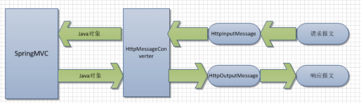

## 介绍

```java
1)、返回数据是json就ok
2)、页面,$.ajax() ;


原生 javaWeb
    导入GSON ;
	返回的数据用GSON转成json
	写出去
springMVC-ajax
	导包 pom.xml  jackson三方库
	配置
    测试     
```

## jackson

### 疑问

```java
怎么获取 jackson 的标注库？
```


### 返回 json

```java
springMVC-ajax
	导包 pom.xml  jackson三方库
	配置
    测试 

```

### responseBody

```java
用法
   // 在方法上添加 @ResponseBody 注解 
    将返回数据放在响应体中，
    如果返回的是对象， jackson 自动将对象转化为 json 对象

java 代码
    @ResponseBody
    @RequestMapping(" /getUsers")
    public List<User> testAjax(){
        List<User> users = new ArrayList<>();
        users.add(new User(1,"a", new Date(), 1000));
        users.add(new User(2, "b"， new Date(), 2000)) ;
        return users ;
    }

```

### requestBody

```java
介绍
    获取一个请求的请求体, 接受 json 数据
java 代码
    
    @RequestBody
    public String testRequestBody(String body){
    
}
```




