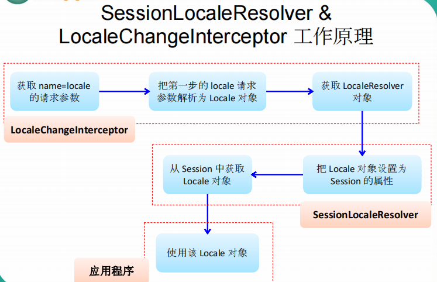

## 国际化

### 介绍

```java
默认情况下，SpringMVC 根据 Accept-Language 参数,判断客户端的本地化类型。
当接受到请求时，SpringMVC 会在上下文中查找一个本地化解析器（LocalResolver），找到后使用它获取请求所对应的本地化类型信息。
SpringMVC 还允许装配一个动态更改本地化类型的拦截器，这样通过指定一个请求参数就可以控制单个请求的本地化类型。
    
    
AcceptHeaderLocaleResolver：根据 HTTP 请求头的 Accept-Language 参数确定本地化类型，如果没有显式定义
本地化解析器， SpringMVC 使用该解析器。
    CookieLocaleResolver：
    	根据指定的 Cookie 值确定本地化类型
    SessionLocaleResolver：
    	根据 Session 中特定的属性确定本地化类型
    LocaleChangeInterceptor：
    	从请求参数中获取本次请求对应的本地化类型    
```



## 简单国际化

```java
步骤
    写好国际化资源文件
    让 spring 的 ResourceBundleMessageSource 管理国际化文件
    直接去页面取值

 	    
```

## 区域信息

```java
介绍
    springMVC 中区域信息是由区域信息解析器得到的
		private LocaleResolver localeResolver;
	区域信息是由浏览器带来的语言信息决定的
        request.getLocale();// 获取浏览器的区域信息

```

## 使用

### 点击连接切换国际化

```java
介绍
    实现接口 LocaleResolver 

java 代码    
    public class MyLocaleResolver implements LocaleResolver {
        // 重写一下两个方法
        Locale resolveLocale(){
            req.getParameter("locale")
        }
		setLocale()            
    }
```


## jstl 国际化

### 介绍

```java
1、导包导入了jstl的时候会自动创建为一个jstIView ;可以快速方便的支持国际化功能; 
2、可以支持快速国际化;
    1 )、javaWeb国际化步骤;
        1)、得得到一个Locale对象;
        2)、使用ResourceBundle绑定国际化资源文件;
        3)、使用ResourceBundle.getString("key") ;获取到国际化配置文件中的值;
        4)、web页面的国际化, fmt标签库来做;
            < fmt:setLocale>
            < fmt:setBundle >
            <fmt:message>


```

### xxx-servlet.xml

```xml
<bean class= "org. springframework. web. servlet. view. InternalResou">
	<property name= "prefix" value="/WEB-INF/pages/"></property>
	<property name="suffix" value=".jsp"></ property>
 	<property name="viewClass" value="org.springframework.web.servlet.view.JstLView"></ property>   
</bean>


<bean class="">
	<property name="urL" value="/heLLo"></property>
</bean>

```

### springMVC.xml  管理

```java
步骤
        2)、有了JstIView以后;
        1 )、让Spring管理国际化资源就行
        2)、直接去页面使用<fmt:message> ; 


<! --让SpringMVC管理国际化资源文件;配置一个资源文件管理器-->
<bean 
    id= "messageSource" 
    class="org.springframework.context.support.ResourceBundLeMessageSource"
>
        <!-- basename指定基础名-- >
	<property name="basename" value="i18n"></property>

        
</bean>    

```

## 数据错误


