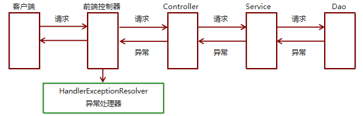

## 错误处理

### 基础

```java
介绍
	预期异常
    	通过捕获异常从而获取异常信息
    运行时异常RuntimeException
    	通过规范代码开发、测试等手段减少运行时异常的发生
处理
    Spring MVC提供
    	简单异常处理器SimpleMappingExceptionResolver
    Spring的异常处理接口
    	HandlerExceptionResolver 自定义自己的异常处理器
概述
    系统的Dao、Service、Controller出现都通过throws Exception向上抛出，
    最后由SpringMVC前端控制器交由异常处理器进行异常处理，如下图：
```



### springMVC

```java
介绍
	Spring MVC 通过 HandlerExceptionResolver 处理程序的异常，
    包括 Handler 映射、数据绑定以及目标方法执行时发生的异常。
    
HandlerExceptionResolver
    DispatcherServlet 默认装配的 HandlerExceptionResolver ：可以不用使用 <mvc:annotation-driven/> 配置
常用实现类
    ExceptionHandlerExceptionResolver
        @ExceptionHandler
    DefaultHandlerExceptionResolver 
       判断是否为 springMVC 自带的异常
        一些特殊的异常进行处理
    ResponseStatusExceptionResolver
        @ResponseStatus  自定义异常
    SimpleMappingExceptionResolver
		基于配置的方式处理异常
```

####  @ExceptionHandler

```java
介绍
    对于多个异常，此候会根据异常的最近继承关系找到继承深度最浅的那个
    多个该标执行的时候，精确优先
注意
    ExceptionHandlerMethodResolver 内部若找不到@ExceptionHandler 注解的话，
    会找 @ControllerAdvice 中的@ExceptionHandler 注解方法

java 代码
    // 告诉 springMVC 这个方法专门处理这个类发生的异常
    // 属性值 value  异常的类型 value={ArithmeticException.class}
    // exception 只能使用这个用来接受异常信息
     @ExceptionHandler
     public String handlerException01(Excepttion exception){
		// 视图解析器进行拼串
    	return "myerror";
	}

	 @ExceptionHandler
     public ModelAndView handlerException01(Excepttion exception){
         ModelAndView view = new ModelAndView("myerror");
         view.addObject("ex",exception);
         // 视图解析器进行拼串
    	return view;
	}
```

#### @ResponseStatus

```java
介绍
    在异常及异常父类中找到 @ResponseStatus 注解，然后使用这个注解的属性进行处理
{@ResponseStatus
属性（
	reason="错误原因" 
    value=httpStatus  , 这些值是固定的，是别人确定好的
）}    
标注
    // 标注在类上
    @ResponseStatus (HttpStatus.UNAUTHORIZED)
	public class UnauthorizedException extends RuntimeException {}

    // 标注在方法上
    @ResponseStatus(...)
    public String handler(){}
```

### 异常处理

####  xml

```xml
介绍
	<!--SimpleMappingExceptionResolver-->
	SpringMVC已经定义好了该类型转换器，
	在使用时可以根据项目情况进行相应异常与视图的映射配置


配置
	<!--配置简单映射异常处理器-->
<bean class=“org.springframework.web.servlet.handler.SimpleMappingExceptionResolver”>    
    <property name=“defaultErrorView” value=“error”/>   默认错误视图
	<!--  配置异常类型   具体视图页面   对应关系-->
    <property name=“exceptionMappings”>	
        <map>		异常类型，全类名		                       错误视图  error.jsp
            <entry key="com.itheima.exception.MyException" value="error"/>
            <entry key="java.lang.ClassCastException" value="error"/>
        </map>
        
        <props>
            <!-- key属性指定异常全类名 -->
            <!-- 标签体中写对应的视图（这个值要拼前后缀得到具体路径） -->
            <prop key="java.lang.Exception">system-error</prop>
        </props>
    </property>
    <!--指定错误信息取出时使用的 key, ${ex}-->
    <property name="exceptionAttribute" value="ex"></property>
</bean>


```

#### 注解

```java
分三层
    异常处理器
    

// @ControllerAdvice表示当前类是一个基于注解的异常处理器类
@ControllerAdvice
public class CrowdExceptionResolver {
	
    // @ExceptionHandler(value = NullPointerException.class)
    // 可以重复这个方法， 设置不同的 异常处理类
	@ExceptionHandler(value = ArithmeticException.class)
	public ModelAndView resolveMathException(
				ArithmeticException exception,
				HttpServletRequest request,
				HttpServletResponse response
			) throws IOException {

		String viewName = "system-error";
        
		// 将一个具体的异常类型和一个方法关联起来
		return commonResolve(viewName, exception, request, response);
	}
    
	
	// @ExceptionHandler 将一个具体的异常类型和一个方法关联起来
	private ModelAndView commonResolve(
			String viewName,  // 异常处理完成后要去的页面
			Exception exception,  // 实际捕获到的异常类型
			HttpServletRequest request,  // 当前请求对象
			HttpServletResponse response 	// 当前响应对象
    ) throws IOException {
		
		// 1.判断当前请求类型
		boolean judgeResult = CrowdUtil.judgeRequestType(request);
		
		// 2.如果是Ajax请求
		if(judgeResult) {
			
			// 3.创建ResultEntity对象
			ResultEntity<Object> resultEntity = ResultEntity.failed(exception.getMessage());
			
			// 4.创建Gson对象
			Gson gson = new Gson();
			
			// 5.将ResultEntity对象转换为JSON字符串
			String json = gson.toJson(resultEntity);
			
			// 6.将JSON字符串作为响应体返回给浏览器
			response.getWriter().write(json);
			
			// 7.由于上面已经通过原生的response对象返回了响应，所以不提供ModelAndView对象
			return null;
		}
        
        if(!judgeResult) { 
            // 8.如果不是Ajax请求则创建ModelAndView对象
            ModelAndView modelAndView = new ModelAndView();

            // 9.将Exception对象存入模型
            modelAndView.addObject("exception", exception);

            // 10.设置对应的视图名称
            modelAndView.setViewName(viewName);

            // 11.返回modelAndView对象
            return modelAndView;
        
        }
		

	}

}

```


## 自定义异常处理器

```java
步骤
	创建异常处理器类实现HandlerExceptionResolver
	配置异常处理器
	编写异常页面
	测试异常跳转
代码实现
public class MyExceptionResolver implements HandlerExceptionResolver {
    @Override
    // exception	异常对象
    // modelAndView	 跳转到错误视图信息
    public ModelAndView resolveException(
        HttpServletRequest request, 
        HttpServletResponse response, 
        Object handler, 
        Exception ex
    ) {
        //处理异常的代码实现
        //创建ModelAndView对象
        ModelAndView modelAndView = new ModelAndView(); 
        modelAndView.setViewName("exceptionPage");
        return modelAndView;
    }
}

// xml 配置
<bean id="exceptionResolver"        
      class="com.itheima.exception.MyExceptionResolver"/>
// 编写异常界面          
```

