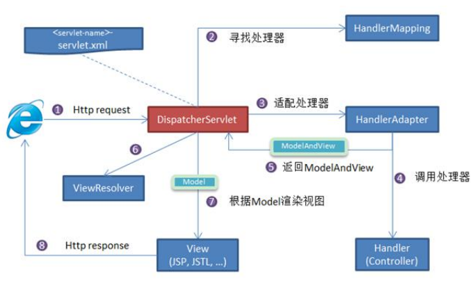

## 介绍

```java
Spring 的 MVC 框架是围绕 DispatcherServlet 来设计的，它用来处理所有的 HTTP 请求和响应。
```


## 工作流程



```java
1. 向服务器发送 HTTP 请求，请求被前端控制器 DispatcherServlet 捕获
    
2. 向服务器发送 HTTP 请求，请求被前端控制器 DispatcherServlet 捕获
    然后根据该 URI，调用 HandlerMapping获得该 Handler 配置的所有相关的对象
    	（包括 Handler 对象以及 Handler 对象对应的拦截器），
    最后以 HandlerExecutionChain 对象的形式返回。
3. DispatcherServlet 根据获得的 Handler，选择一个合适的HandlerAdapter。
    （附注：如果成功获得 HandlerAdapter 后，此时将开始执行拦截器的 preHandler(...)方法）。
    
4. 提取 Request 中的模型数据，填充 Handler 入参，开始执行 Handler（ Controller)。    
    在填充 Handler 的入参过程中，根据你的配置，
    Spring 将帮你做一些额外的工作：
    
    HttpMessageConveter：
    	将请求消息（如 Json、xml 等数据）转成一个对象，将对象转换为指定的响应信息。
	数据转换：
    	对请求消息进行数据转换。如 String 转换成 Integer、Double 等。
	数据根式化：
    	对请求消息进行数据格式化。如将字符串转换成格式化数字或格式化日期等。
	数据验证：
    	验证数据的有效性（长度、格式等），验证结果存储到BindingResult 或 Error 中
5、Handler(Controller)执行完成后，向 DispatcherServlet 返回一个ModelAndView 对象；
    
6、根据返回的 ModelAndView，选择一个适合的 ViewResolver
    （必须是已经注册到 Spring 容器中的 ViewResolver)返回给 DispatcherServlet。 
    
7、 ViewResolver 结合 Model 和 View，来渲染视图。
    
8、视图负责将渲染结果返回给客户端。    
```

