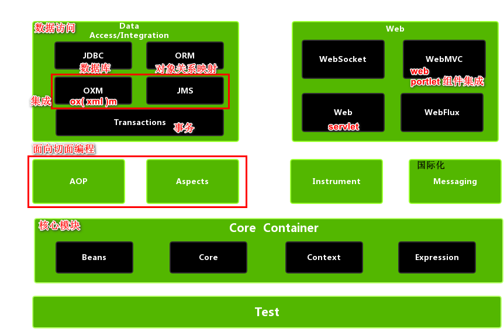
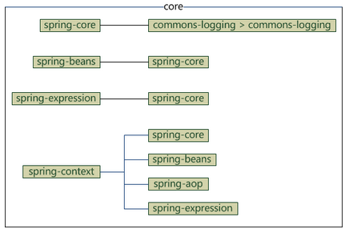

## 介绍

* 是轻量级的开源的 JavaEE 框
* 两个核心部分：IOC 和 Aop
    * IOC: 
        * 控制反转，把创建对象过程交给 Spring 进行管理
        * 我们不需要进行new 对象，交给 spring 去 new

## 特点

（1）方便解耦，简化开发

（2）Aop 编程支持

（3）方便程序测试

（4）方便和其他框架进行整合

（5）方便进行事务操作

（6）降低 API 开发难度、

（7）由于依赖注入和控制反转，JDBC 得以简化。它是开源免费的


## 功能

```java
轻量级 
    Spring 在代码量和透明度方面都很轻便。
IOC - 
    控制反转 
AOP - 
    面向切面编程可以将应用业务逻辑和系统服务分离，以实现高内聚。
容器 - 
    Spring 负责创建和管理对象（Bean）的生命周期和配置。
MVC - 
    对 web 应用提供了高度可配置性，其他框架的集成也十分方便。
事务管理 - 
    提供了用于事务管理的通用抽象层。
    Spring 的事务支持也可用于容器较少的环境。
JDBC 异常 - 
    Spring的 JDBC 抽象层提供了一个异常层次结构，简化了错误处理策略。
```


## 开发步骤

```java
导入坐标
创建Bean
创建applicationContext.xml
在配置文件中进行配置
创建ApplicationContext对象getBean

    
1.导入Spring开发的基本依赖
2.编写Dao接口和实现类
3.创建spring核心配置文件
4.在spring配置文件中配置UserDaoImpl
5.使用Spring API获得Bean实例    
```


## 发展历史

```java
1.Spring1.x 时代
	在Spring1.x时代，都是通过xml文件配置bean，
    随着项目的不断扩大，需要将xml配置分放到不同的配置文件中，需要频繁的在java类和xml配置文件中切换。
2.Spring2.x时代
	随着JDK 1.5带来的注解支持，
    Spring2.x可以使用注解对Bean进行申明和注入，大大的减少了xml配置文件，同时也大大简化了项目的开发。

    // 最佳实践：
    1、应用的基本配置用xml，比如：数据源、资源文件等；
    2、业务开发用注解，比如：Service中注入bean等；
3.Spring3.x到Spring4.x
	从Spring3.x开始提供了Java配置方式，使用Java配置方式可以更好的理解你配置的Bean，
    现在我们就处于这个时代，并且Spring4.x和Spring boot都推荐使用java配置的方式。
```


## 体系结构



### 数据库 -- 数据集成访问

```java
数据访问/集成层包括 JDBC，ORM，OXM，JMS 和事务处理模块，
该层提供与数据库交互的支持:
    
    它们的细节如下：
    JDBC = Java Data Base Connectivity，
    ORM = Object Relational Mapping，
    OXM = Object XML Mapper，
    JMS = Java Message Service
    
    
JDBC 模块
    提供了 JDBC 抽象层，它消除了冗长的 JDBC 编码和对数据库供应商特定错误代码的解析。

ORM 模块
    提供了对流行的对象关系映射 API 的集成，
    包括 JPA、JDO 和 Hibernate 等。通过此模块可以让这些 ORM 框架和 spring的其它功能整合，
    比如前面提及的事务管理。

OXM 模块
    提供了对 OXM 实现的支持，比如 JAXB、Castor、XML Beans、JiBX、XStream 等。

JMS 模块
    包含生产（produce）和消费（consume）消息的功能。
    从 Spring 4.1 开始，集成了 spring-messaging 模块。
    事务模块为实现特殊接口类及所有的 POJO 支持编程式和声明式事务管理。
    // 编程式事务: 需要自己写 beginTransaction()、commit()、rollback() 等事务管理方法，
    // 声明式事务: 是通过注解或配置由 spring 自动处理，编程式事务力度更细
```


### web

```java
// 注意
	通常说的 spring mvc 就是 spring web mvc

Web 模块
    提供面向 web 的基本功能和面向 web 的应用上下文，
    比如多部分（multipart）文件上传功能、使用 Servlet 监听器初始化 IoC 容器等。
    它还包括 HTTP 客户端以及 Spring 远程调用中与 web 相关的部分。

Web-MVC 模块
    web 应用提供了模型视图控制（MVC）和 REST Web服务的实现。
    Spring 的 MVC 框架可以使领域模型代码和 web 表单完全地分离，且可以与 Spring 框架的其它所有功能进行集成。

Web-Socket 模块
    WebSocket-based 提供了支持，而且在 web 应用程序中提供了客户端和服务器端之间通信的两种方式。
Web-Portlet 模块
    提供了用于 Portlet 环境的 MVC 实现，并反映了 spring-webmvc 模块的功能。
    
    
    
```


### aop

```java
AOP 模块
    提供了面向方面（切面）的编程实现，
    允许你定义方法拦截器和切入点对代码进行干净地解耦，从而使实现功能的代码彻底的解耦出来。
    使用源码级的元数据，可以用类似于.Net属性的方式合并行为信息到代码中。

Aspects 模块
    提供了与 AspectJ 的集成，这是一个功能强大且成熟的面向切面编程（AOP）框架。
```


### bean -- 核心模块 



```java
// Core Container
要使用这个部分的完整功能,这些jar都需要导入
    Spring Core
    Spring Bean
    SpEL (Spring Expression Language)
    Spring Context


spring-core
    模块提供了框架的基本组成部分，包括 IoC 和依赖注入功能。

spring-beans
    模块提供 BeanFactory，工厂模式的微妙实现，
    它移除了编码式单例的需要，并且可以把配置和依赖从实际编码逻辑中解耦体系结构
context 
    以一种类似于 JNDI 注册的方式访问对象。
    Context 模块继承自 Bean 模块，并且添加了国际化（比如，使用资源束）、事件传播、资源加载和透明地创建上下文（比如，通过 Servelet 容器）等功能。
    Context 模块也支持 Java EE 的功能，比如 EJB、JMX 和远程调用等。
    ApplicationContext 接口是 Context 模块的焦点。
    spring-context-support 提供了对第三方集成到 Spring 上下文的支持，比如缓存（EhCache, Guava, JCache）、邮件（JavaMail）、调度（CommonJ, Quartz）、模板引擎（FreeMarker, JasperReports, Velocity）等。    
    
spring-expression 
    模块提供了强大的表达式语言，用于在运行时查询和操作对象图。
    它是 JSP2.1 规范中定义的统一表达式语言的扩展，
    支持 set 和 get 属性值、属性赋值、方法调用、访问数组集合及索引的内容、逻辑算术运算、命名变量、通过名字从 Spring IoC 容器检索对象，还支持列表的投影、选择以及聚合等。    
```


### test

```JAVA
test
    测试模块支持对具有 JUnit 或 TestNG 框架的 Spring 组件的测试。
```

### 其他

```java
Instrumentation 模块
    在一定的应用服务器中提供了类 instrumentation 的支持和类加载器的实现。

Messaging 
    模块为 STOMP 提供了支持作为在应用程序中 WebSocket 子协议的使用。
    它也支持一个注解编程模型，它是为了选路和处理来自 WebSocket 客户端的 STOMP 信息。
	
```

## 相关专业名词

### sprting 配置文件

```java
Spring 配置文件是 XML 文件
    该文件主要包含类信息。
    它描述了这些类是如何配置以及相互引入的。
    但是，XML 配置文件冗长且更加干净。
    如果没有正确规划和编写，那么在大项目中管理变得非常困难
```

