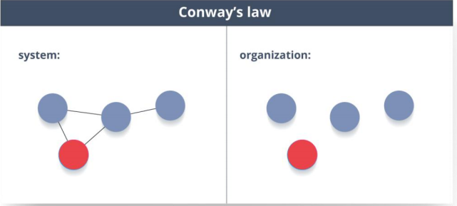

## 微服务

### 介绍

```java
介绍
    又称微服务 架构，是一种架构风格，它将应用程序构建为以业务领域为模型的小型自治服务集合
    各个模块可以单独处理模块的内容， 而对整个应用程序没有影响或影响最小。
    
    其中系统的所有组件都被放入单独的组件中，这些组件可以单独构建，部署和扩展。
    微服务的某些原则和最佳实践有助于构建弹性应用程序。

```


### 运作方式


```java
客户端 – 来自不同设备的不同用户发送请求。
身份提供商 – 验证用户或客户身份并颁发安全令牌。
API 网关 – 处理客户端请求。
静态内容 – 容纳系统的所有内容。
管理 – 在节点上平衡服务并识别故障。
服务发现 – 查找微服务之间通信路径的指南。
内容交付网络 – 代理服务器及其数据中心的分布式网络。
远程服务 – 启用驻留在 IT 设备网络上的远程访问信息。
```


### 优点

```java
优点
    独立开发 – 所有微服务都可以根据各自的功能轻松开发
	独立部署 – 基于其服务，可以在任何应用程序中单独部署它们
	故障隔离 – 即使应用程序的一项服务不起作用，系统仍可继续运行
	混合技术堆栈 – 可以使用不同的语言和技术来构建同一应用程序的不同服务
	粒度缩放 – 单个组件可根据需要进行缩放，无需将所有组件缩放在一起
    
特点
    解耦 – 系统内的服务很大程度上是分离的。因此，整个应用程序可以轻
松构建，更改和扩展
组件化 – 微服务被视为可以轻松更换和升级的独立组件
业务能力 – 微服务非常简单，专注于单一功能
自治 – 开发人员和团队可以彼此独立工作，从而提高速度
持续交付 – 通过软件创建，测试和批准的系统自动化，允许频繁发布软件
责任 – 微服务不关注应用程序作为项目。相反，他们将应用程序视为他们负责的产品
分散治理 – 
    重点是使用正确的工具来做正确的工作。
    这意味着没有标准化模式或任何技术模式。开发人员可以自由选择最有用的工具来解决他们的问题
敏捷 – 微服务支持敏捷开发。任何新功能都可以快速开发并再次丢弃
```


### 缺点

​	

### 双重身份验证

#### 介绍

*   帐户登录过程启用第二级身份验证。
*   假设用户必须只输入用户名和密码，那么这被认为是单因素身份验证


#### 凭据类型


#### 客户证书

```java
介绍
    客户端系统用于向远程服务器发出经过身份验证的请求的一种数字证书
    客户端证书在许多相互认证设计中起着非常重要的作用，为请求者的身份提供了强有力的保证
```

## 微服务测试


### 不同类型的微服务测试

```java
介绍
    在使用微服务时，由于有多个微服务协同工作，测试变得非常复杂。
    因此，测试分为不同的级别
    
底层
    我们有面向技术的测试，如单元测试和性能测试。
    这些是完全自动化的。
    
中间层面，
    我们进行了诸如压力测试和可用性测试之类的探索性测试。
顶层
    我们的 验收测试数量很少。
    这些验收测试有助于利益相关者理解和验证软件功能。
```

### 合同测试

```java
合同测试
    是在外部服务边界进行的测试，用于验证其是否符合消费服务预期的合同
    不会深入测试服务的行为。
    更确切地说，它测试该服务调用的输入＆输出包含所需的属性和所述响应延迟，吞吐量是允许的限度内。
```


### 端到端测试

```java
介绍
    试验证了工作流中的每个流程都正常运行。这可确保系统作为一个整体协同工作并满足所有要求
    在特定时期后测试所有东西
```


## 测试领域驱动设计 DDD

### 介绍


### 使用原因


### 有界上下文

```java
介绍
    有界上下文是域驱动设计的核心模式
    DDD 战略设计部门的重点是处理大型模型和团队。
    DDD 通过将大型模型划分为不同的有界上下文并明确其相互关系来处理大型模型
```


## 分布式事务

```java
介绍
    Distributed Transaction
    指单个事件导致两个或多个不能以原子方式提交的单独数据源的突变的任何情况。
    
    在微服务的世界中，它变得更加复杂，
    因为每个服务都是一个工作单元，并且大多数时候多个服务必须协同工作才能使业务成功。
```

### 幂等性

```java
//  Idempotence
幂等性
    是能够以这样的方式做两次事情的特性，即最终结果将保持不变，即好像它只做了一次。
用法：
    在远程服务或数据源中使用 Idempotence，这样当它多次接收指令时，它只处理指令一次。
```

## pact

```java
介绍
    PACT 是一个开源工具，允许测试服务提供者和消费者之间的交互，与合同隔离，从而提高微服务集成的可靠性。
    
用法    
    用于在微服务中实现消费者驱动的合同。
	测试微服务的消费者和提供者之间的消费者驱动的合同。
```


## OAuth

```java
OAuth 
    代表开放授权协议。
    这允许通过在 HTTP 服务上启用客户端应用程序
    （例如第三方提供商 Facebook，GitHub 等）来访问资源所有者的资源。
    因此，您可以在不使用其凭据的情况下与另一个站点共享存储在一个站点上的资源
```

## 合同

### 消费者驱动的合同（CDC）

```java
```


## 辨析


### 单片 vs 微服务

```java
单片架构
    类似于大容器，其中应用程序的所有软件组件组装在一起并紧密封装。

面向服务的架构
    是一种相互通信服务的集合。通信可以涉及简单的数据传递，也可以涉及两个或多个协调某些活动的服务    
    
微服务架构
    是一种架构风格，它将应用程序构建为以业务域为模型的小型自治服务集合。    
```

### soa vs 微服务


### 无处不在的语言

```java
如果您必须定义泛在语言（UL），那么它是特定域的开发人员和用户使用的通用语言，通过该语言可以轻松解释域。
    
无处不在的语言必须非常清晰，以便它将所有团队成员放在同一页面上，并以机器可以理解的方式进行翻译。    
```

### 凝聚力

```java
模块内部元素所属的程度被认为是凝聚力。
```

### 耦合

```java
组件之间依赖关系强度的度量被认为是耦合。
一个好的设计总是被认为具有高内聚力和低耦合性
```

### REST / RESTful

```java
介绍
    Representational State Transfer（REST）/ RESTful Web
    是一种帮助计算机系统通过 Internet 进行通信的架构风格
    
    // 说 REST 是构建微服务的媒介。
	微服务可以使用或不使用 RESTful API 实现，
    但使用 RESTful API 构建松散耦合的微服务总是更容易
    
```


### 康威定律

```java
任何 设计 系统 的组 织（ 广泛 定义 ）都 将产 生一 种设 计， 其结 构是 组织 通信 结构的副 本。
即
    为了使软件模块起作用，整个团队应该进行良好的沟通。
    因此，系统的结构反映了产生它的组织的社会边界。
```

