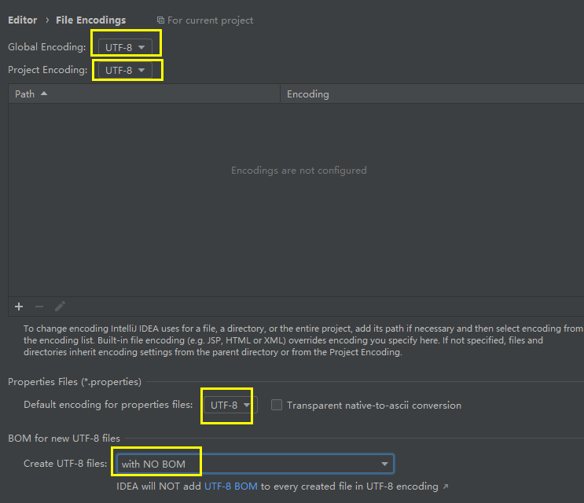
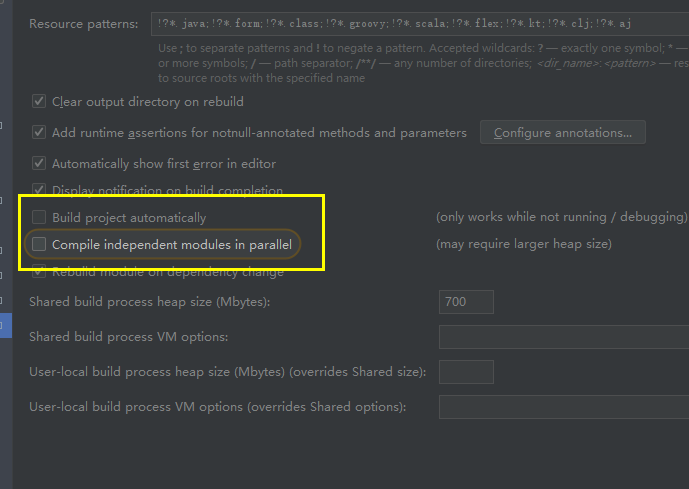

## 首次安装配置

```java
本机的jdk版本：
    命令提示输入：java -version
解决
    file  -- > project structure -->
    	project --> 
    		project sdk -->8
    		language level --> 8
    		// 在项目下面新建一个编译输出文件
    		project ... output --> project项目/out
    	moudles --> 
    		sources --> language level --> 8 
    		dependencies --> Module SDK --> 8
    	plateform Settings -- 
    		SDKs -- JDK home path: java 安装目录（bin的上层目录就行了）
	file --> settings -->
    		Build,eccution... --> project bytecode version --> 8
    
	
```


## 配置 JDK

```java
// 新建项目之前前配置 JDK
	file -- project structure -- SDKs -- 选择java安装位置寄了（bin目录上一层目录）
        
// 新建项目的时候配置JDK
    file - new - project - java -new(右上角) --找到jdk
        
 // 切换项目 jdk
    file -- project structure -  project -- new  - 找到Jdk   
```


## 快捷键更改

```java
settings --> keymap --> 齿轮(fuplicate) --> 
    main menu -->  main menu --> code --> completion（完成） --> 
    	basic: 改为 shift ; // 双击就会出来修改的提示

鼠标右键单击快捷键
    settings -  keymap -- Show Context Menu -- add 添加更改
    
文件展开目录
    // 默认绑定 数字键盘 * 
   settings -  keymap --  Fully Expand Tree Node  --  ctrl 右键
    
    
```


## 编码格式更改

```java
setting -- fileEncoding
```



## 设置自动编译

```java
setting  -- 搜索：compile
    需要自动编译就选上
```



## 操作设置

```java
// vim 切换
 keymap -> 搜索 Vim Emulator，先取消原先的 option+command+v，
     再重新输入一个即可，我选择的是 ctrl+; 因为键数少，且不冲突，非常方便。


// 滚轮确定字体大小
editor -- general 
    Change font size (Zoom) with Ctrl+ Mouse Wheel  // 前面打上对号

// 行号、方法分界线
editor -- general -- appearance
    Show line numbers		// 行号
	Show method separators	// 方法分界线
// 空格修改
    editor -- code style -- java
    	// 以下四个都改成 1
        In declarations:
        In code:
        Before 
        Between header and package:

// 提示不区分大小写
editor -- general -- code completion
    去掉 math case

// 自动导包
 editor -- general -- auto import
    // 下面两个前面都勾上对号
    Add unambiguous imports on the fly
    Optimize imports on the fly (for current project)

    
// 鼠标放到类上面，会出现提示  show quick
editor -- general -- 当前页面中 other 
    Show quick documentation on mouse move  掐年打对号

```


## 注释设置

```java
setting 
    Editor-Code 
    Style-Java
    Code Generation
    取消Line comment at first column和Block comment at first column的选中即可。
```

## 注释模板设置

### 注释语法

```java
${NAME}：设置类名，与下面的${NAME}一样才能获取到创建的类名
TODO：代办事项的标记，一般生成类或方法都需要添加描述
${USER}、${DATE}、${TIME}：设置创建类的用户、创建的日期和时间，这些事IDEA内置的方法，   
1.0：设置版本号，一般新创建的类都是1.0版本，这里写死就可以了
$END$	用来在代码片段生成后，确定光标位置
${PROJECT_NAME}项目名

```


### 类、接口、枚举注释

```java
位置
	File->Settings->File and Code Templates
        ->Files -> class
	类 class
    接口 interface
    枚举
    // 设置接口的还也可以选择Interface文件  

        
// 模板        
#if (${PACKAGE_NAME} && ${PACKAGE_NAME} != "")package ${PACKAGE_NAME};#end
#parse("File Header.java")

/**
 * @title: ${NAME}
 * @Description //TODO $end$
 * @Author slsun
 * @Date:  ${DATE} ${HOUR}:${MINUTE}
 * @Version 1.0
 */

public class ${NAME} {
}


```


### 方法注释

```java
介绍
    需要手动添加注释，不能自动添加哦，
位置
	File->Settings->Editor->Live Templates
    
    // abbreviation（缩写）和描述以及模板内容
    1. 先添加Template Group ：进行分组
    2. 然后添加Live template ： 实际例子
    3. 定义模板应用的范围。单击define。选择everywhere - java
 格式
    
*
 * @Description 
 * @since:jdk1.8
$params$
 * @return: $returns$
 * @author: slsun
 * @Date: ${DATE} ${HOUR}:${MINUTE}
 */
    
// params
groovyScript("def result='';
def params=\"${_1}\".replaceAll('[\\\\[|\\\\]|\\\\s]', '').split(',').toList();
for(i = 0; i < params.size();
i++) {result+=' * @param ' + params[i] + ((i < params.size() - 1) ? '\\n':'')}; 
return result", methodParameters())
             
// return
groovyScript("def result=''; 
def params=\"${_1}\".replaceAll('[\\\\[|\\\\]|\\\\s]', '').split('<').toList();
for(i = 0; i < params.size();
i++) {if(i!=0){result+='<';}; 
def p1=params[i].split(',').toList(); 
for(i2 = 0; i2 < p1.size(); i2++) 
{ def p2=p1[i2].split('\\\\.').toList(); 
result+=p2[p2.size()-1]; if(i2!=p1.size()-1){result+=','} 
} ;
}; 
return result", methodReturnType())             
```


### 方法模板

```java
// main
public static void main(String[] args) { 
$ $
	System.out.println($second$); 
}
```


| 缩略   | 代码片段                                                     | 描述                           |
| ------ | ------------------------------------------------------------ | ------------------------------ |
| ife    | `if($END$){ // TODO }else{ // TODO }`                        | if else                        |
| eif    | `else if($END$){ // TODO }`                                  | else if                        |
| sw     | `switch ($END$) { case T: // TODO break; default: break; }`  | switch case …                  |
| syso   | `System.out.println($START$);`                               | Prints a string to System.out  |
| syse   | `System.err.println($START$);`                               | Prints a string to System.err  |
| mian   | `public static void main(String[] args) { System.out.println($START$); }` | main method                    |
| psfs   | `private static final String $varName$ = "$var$";`           | private static final String …  |
| psfi   | `private static final Integer $varName$ = "$var$";`          | private static final Integer … |
| logger | `private static final Logger logger = LoggerFactory.getLogger($CLASS$.class);` | private static final Logger …  |

```java
package test;

public class test2 {
    public static void main(String[] args) {
        Singleton instance1 =  Singleton.getInstance();
        Singleton instance2 =  Singleton.getInstance();
    	System.out.println("123"+ (instance1 == instance2));
    }
}

// 饿汉式
class Singleton {
    private Singleton() {
    };

    // 对象实例 ,字段
    // 类装载的时候， 就进行实例化，
    private  final static Singleton instance = new Singleton();

    // 提供一个公有的方法， 返回对象实例
    public static Singleton getInstance() {
        return instance;
    }
}


```

