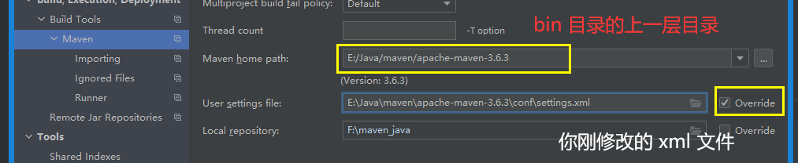

## 介绍

* 如果使用了 IntelliJ IDEA ，可以不用去额外下载 Maven，直接使用 IDEA 中自带的 Maven 插件即可。
* 这个地方只是开始装 IDEA 的时候进行操作的，操作一次就不用操作了

## 配置

### 全局配置

```java
介绍
    需要在创建 project 之前就要设置好
注意
    不同版本的设置方式不同
    
// IntelliJ IDEA 中自带的 Maven 插件在 \ideaIU-2019.2.4.win\plugins\maven\lib\maven3 
File->Settings->Build,Execution,Deployment->Build Tools->Maven

    
// maven 自动导入
...   -->    maven  -- importing 
    Import Maven projects automatically  前面打对号

  
// 新版本的全局设置貌似在新建 project 的时候出现的
closeProject -- customize -- allSetting -- 搜索 maven    
```



#### maven

```java
maven 镜像源
maven- runner 添加（参见问题）
	-DarchetypeCatalog=internal    
```

