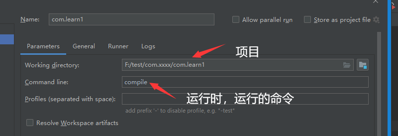

## 介绍

* 如果使用了 IntelliJ IDEA ，可以不用去额外下载 Maven，直接使用 IDEA 中自带的 Maven 插件即可。

## 配置

```java
// ntelliJ IDEA 中自带的 Maven 插件在 \ideaIU-2019.2.4.win\plugins\maven\lib\maven3 
File->Settings->Build,Execution,Deployment->Build Tools->Maven

  
// 新版本的全局设置貌似在新建 project 的时候出现的
closeProject -- customize -- allSetting -- 搜索 maven    
```


## 项目创建

### 注意

```java
idea 升级到 2020.x 版后，
    MAVEN 不会自动更新依赖 原因是新版本取消了自动更新jar包功能 也取消了设置选项
解决
    // 方式一
    点完最后一个 finish 别手太快， 等着右上角的 m 小图形出来
    // 方拾二
    项目 -- 右键 -- maven -- reload
```

### 分析

```java

```


### 模板创建

```java
// 普通 java 项目创建
new -- project -- maven -- create from archtype + maven-archtype-quickstart -- com.xxx --
重新配置下 maven 路径 -- finish  -- 别手太快， 等下右上角有一个 m 的小图形，点一下，进行自动导入    

// java 项目
new -- project -- maven -- create from archtype + maven-archtype-webApp -- com.xxx --
重新配置下 maven 路径 -- finish  -- 别手太快， 等下右上角有一个 m 的小图形，点一下，进行自动导入    
    
    
// resources
// 方法一    
创建文件夹 resources  -- 右键  -- 新建 directory(注意不是package、moudle) -- make directory as xxx sources
// 方拾二
project structure -- moudle -- 右侧的 sources -- 选中文件夹，然后右键更改文件的属性
    
```


### 文件修改

#### jdk 版本

```java
 // 改为 1.8
<properties>
    <project.build.sourceEncoding>UTF-8</project.build.sourceEncoding>
    <maven.compiler.source>1.8</maven.compiler.source>
    <maven.compiler.target>1.8</maven.compiler.target>
  </properties>
```

#### juint

```java
// 改为 4.12
 <dependencies>
    <dependency>
      <groupId>junit</groupId>
      <artifactId>junit</artifactId>
      <version>4.12</version>
      <scope>test</scope>
    </dependency>
  </dependencies>

    
```

#### pluginManagement

```xml
<pluginManagement></pluginManagement>   标签中及其中的内容删除
```

### 文件夹修改

```java
注意各个文件夹的颜色
```


## 命令设置



## web 插件配置

* build 标签中添加 plugins 标签

### Jetty 插件

```xml
<!--配置 Jetty 插件-->
<plugins>
    <plugin>
        <groupId>org.mortbay.jetty</groupId>
        <artifactId>maven-jetty-plugin</artifactId>
        <version>6.1.25</version>
        <configuration>
            <!-- 热部署，每10秒扫描一次 -->
            <scanIntervalSeconds>10</scanIntervalSeconds>
            <!--指定当前项目的网站名-->
            <webApp>
                <contextPath>/jetty-demo</contextPath>
                <war>${project.basedir}/target/${project.build.finalName}.war</war>
            </webApp>
            <connectors>
                <connector implementation="org.mortbay.jetty.nio.SelecChannelConnector">
                	<port>9090</port> <!--启动端口-->
                </connector>
            </connectors>
        </configuration>
   </plugin>
</plugins>
```

### tomcat 插件

```xml

```


## 问题

### 检测到框架，检测到Web框架

```java
Frameworks Detected Web framework is detected.

翻译：检测到框架，检测到Web框架
一个web项目新导入到IDEA，Event Log提示的
IDEA工具检测到这是一个web项目，检测到web.xml
// 貌似很短时间就会消失， 速度点。。。。    
    直接点configure安装web框架
```


### No archetype found in remote catalog

```java
方法一
	可以不用管【因为使用了maven模版构建项目，要从网上获取模版，然而没有找到这个模版或者网络慢，导致获取失败 】，
	选择File ---> 再选择Close Project，关闭项目后重启就可以了
方法二
	删除原本地仓库，用默认镜像下载初始化的maven项目，再改阿里的镜像下载其它配置
方法三
	Build,Execution,Deployment>>>Build Tools>>>Maven>>> Runner 中的 VM Options输入
	// archetypeCatalog可选值为：remote，internal ，local等，
    // 用来指定archetype-catalog.xml文件从哪里获取。
	 -DarchetypeCatalog=internal
    -------------------------------------------------------------------------------
    下载： archetype-catalog.xml, 下载 pom 文件(自己新建一个)
    	进入网址选一个版本
    		https://search.maven.org/artifact/org.apache.maven.archetype/archetype-catalog
		新建一个  archetype-catalog.xml 文件， 将 pom 中的代码复制进去保存
            网站右上角有一个 download ，点开找到 pom, 复制展开的代码
         将 archetype-catalog.xml 放入你的本地库
```


### 创建XML文件没有Spring Config选项

```java
// 导入依赖，记得点击左上角出现的 m 进行刷新
// 注意 dependencies 只能有一个，是赋值内层的代码
<dependencies>
	<dependency>
	      <groupId>org.springframework</groupId>
	      <artifactId>spring-context</artifactId>
	      <version>4.3.7.RELEASE</version>
	 </dependency>
 </dependencies>
```


