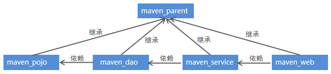

## 注意

```java
文件配置出现问题
```

## 思路分析

```java

创建maven web项目
    模板创建以后，注意标记不同的颜色
配置pom.xml文件
    记得锁定版本
实现spring+mybatis整合
    创建POJO类
    持久层DAO接口编写
    	不需要实现，
    		直接使用动态代理即可, Mapper映射文件编写
    
    业务层Service编写
    	需要实现接口， 
    		注入 dao 层的对象， 配置文件，执行 sql 语句
	    spring配置文件applicationContext-dao.xml编写
    		数据源，整合 myBatis 的 sqlSessionFactory, 扫描产生代理对象
    	spring配置文件applicationContext-service.xml编写
    		扫描器， 事务管理器， 事务注解驱动
    		
加入springmvc相关配置
    表现层Controller编写
    	springmvc.xml文件编写
    		扫描器 视图解析器 
     	jsp页面编写
    		视图
    配置web.xml文件
		spring配置文件 框架启动监听器   springMVC 前端控制器(sevlet)  
```

## 目录详情

### src- main

#### java

```java
// com --> projectName
dao
pojo
    
controller
    AccountController.java
domain
mapper
    AccountMapper.java
service
    impl
```


#### resources

```java
com --> projectName
    
    dao
    
	pojo
    
    controller
    	AccountController.xml  
    		// 业务类配置 ：beans
    domain
    mapper
    	AccountMapper.xml     
    	// MyBatis映射文件 : mapper
    service
        impl
    
    
applicationContext-dao.xml 
applicationContext-service.xml     
    // Spring配置文件：beans
    // 组件扫描 properties 加载 数据源 sessionFactory s事务 切面

    
sqlMapConfig-spring.xml  
    // myBatis 映射文件 mapper
sqlMapConfig.xml  	  
    // MyBatis核心文件 : configuration
   
spring-mvc.xml     	 
    // SprngMVC配置文件：beans
    // controller 类， 视图解析器
    
jdbc.properties		 
    // 数据库连接信息文件
log4j.properties	  
    // 日志文件        
```

#### webapp

```java
WEB-INFO
    pages
    	a.jsp
	Web.xml	
    	// web文件 ：web-app   
    	// spring 监听器 、 springmvc的前端控制器、 乱码过滤器
index.jsp
```


### pom.xml

```java
介绍
	坐标配置
具体含有坐标
	// spring 相关
	spring-context
	aspectjweaver
    spring-jdbc
    spring-tx
    spring-test
    spring-webmvc
    
    // servlet jsp
    servlet-api
	jsp-api
	
    // mybatis
	mybatis
	mybatis-spring
    mysql-connector-java
    c3p0
    
    // 测试
    junit
    jstl
```


## 模块化构建 maven 工程

### 拆分分析

```java
介绍
    每一个 module 都是 maven 工程
项目常见拆分方法
 // 第一种
    按照业务模块进行拆分，
    每个模块拆分成一个maven工程, 例如将一个项目分为用户模块、 订单模块、购物车模块等,
	每个模块对应就是一个maven工程
// 第二种  
	按照层进行拆分，
    例如持久层、业务层、表现层等，
    每个层对应就是- -个maven工程    
综述
	不管是上面哪种拆分方式，通常都会提供一个父工程,
	将一些公共的代码和配置提取到父工程中进行统一 管理和配置。        
```



### maven 继承

```java
介绍
    在maven工程之间也可以继承，子工程继承父工程后，就可以使用在父工程中引入的依赖。继承的目的是为了消除重复代码
    
父工程    
    被继承的maven工程通常称为父工程
    父工程的打包方式必须为pom
    <packaging>pom</packaging>
    
子工程
    继承其他maven父工程的工程通常称为子工程
    在pom.xml文件中通过parent标签进行父工程的继承
	<parent>
    	父工程的坐标
    <parent>
```


### maven 聚合

#### 介绍

```xml
介绍
    使用<modules>标签将其他maven工程聚合到一起
    使用<modules>标签将这些工程统一聚合到maven工程中，
    	需要打包的时候，只需要在此工程中执行一次打包命令，其下被聚合的工程就都会被打包了。
语法例子
< groupId>com. i the ima</ groupId>
<artifactId>maven_ parent</artifactId>
<version>1.0-SNAPSH0T</version>
<!--四个工程聚合到一个工程中-->        
<modules>
	<module>maven_ dao</module>
	<module>maven_service</module>
	<module>maven_ web</module>
	<module>maven_ pojo</module>
</modules)
<packaging>pom</packaging)

```


### 模块构建

```java
子moudlue 最好写在 parent moudle 中，
    创建 moudle 的时候， 需要选择 parent（可以使用继承和聚合）
```

