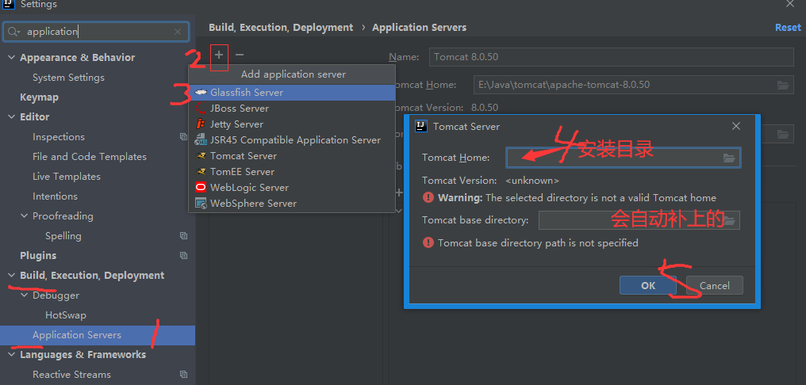
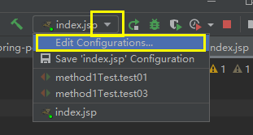
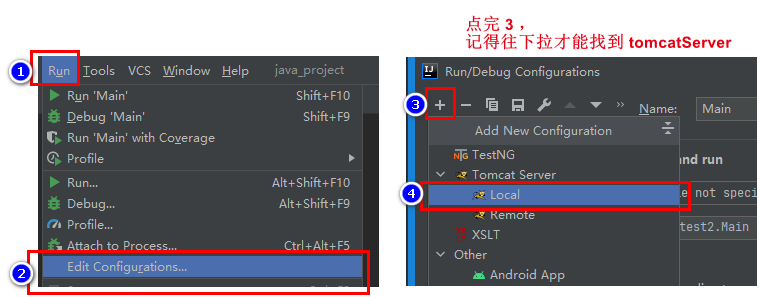
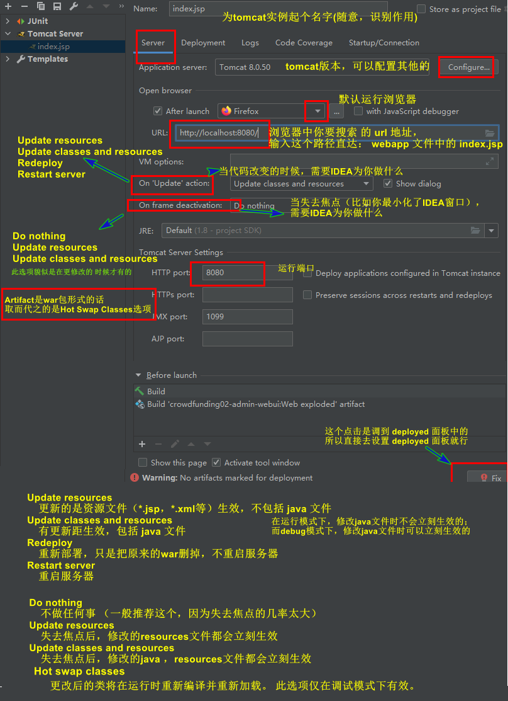
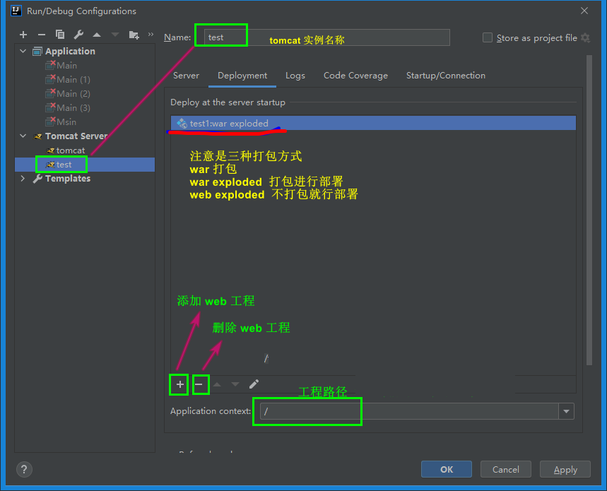
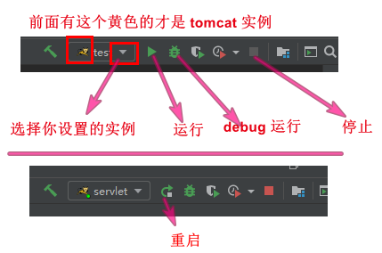

## IDEA 整合 tomcat

```java
// 打开 settings 直接搜 Application Servers
File | Settings | Build, Execution, Deployment | Application Servers | + 号
```



## 创建 tomcat 实例

### 介绍

```java
// 最好一个一个 tomcat 实例对应一个 web 工程
```

### 1. 编辑界面打开

#### 方式一:



#### 方式二：

* 对于没有这个运行的界面的



### 2. 参数设置

#### 介绍

```java
详细参数文档
    https://www.jetbrains.com/help/idea/run-debug-configuration-tomcat-server.html
```


#### server 面板



#### deployment 面板



### 运行 tomcat




