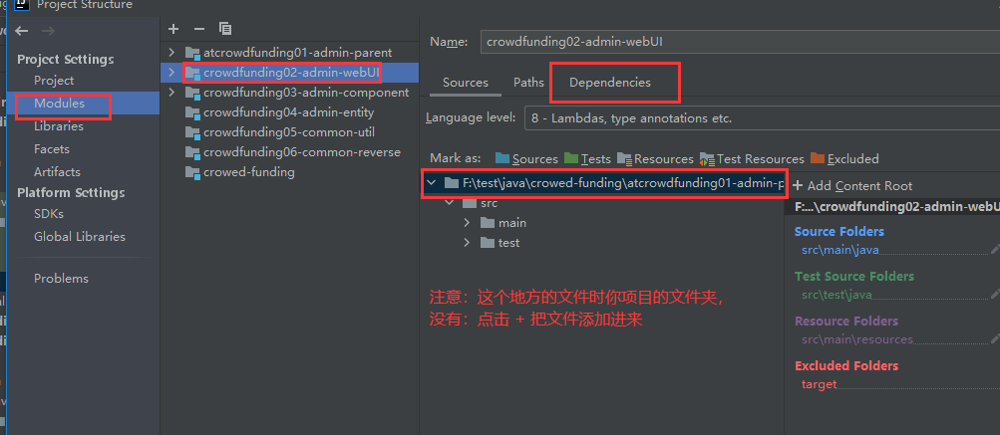

## （1）java: 错误: 无效的源发行版：15

```java
原因
    出现该问题的原因是项目Project当中的jdk与电脑当中的jdk版本不一致造成的。
    
本机的jdk版本：
    命令提示输入：java -version
解决
    file  -- > project structure -->
    	project --> 
    		project sdk -->8
    		language level --> 8
    		project ... output --> project项目/out
    	moudles --> 
    		sources --> language level --> 8 
    		dependencies --> Module SDK --> 8
	file --> settings -->
    		Build,eccution... --> project bytecode version --> 8
    
```

## （2）jdk warning

```java
Warning:No JDK specified for module "XXX"
```



## （3）Unmapped Spring configuration files

```java
Unmapped Spring configuration files found.Please configure Spring facet
```


## （4）Class not found

```java
Class not found: "org.example.crowd.crowdTest"
```

## （5）Ignored pom.xml

```java
maven 中删除一个 module ，然后又出创建一个同名的 module 名称，弹出被忽略(Ignored)的Ignored pom.xml文件    
    
原因
    相同名称的module在之前被创建过，因此在IDEA中留有痕迹。
    重新创建一个新的同名module会让IDEA误以为是之前被删除掉的module，所以才自动将这个pom.xml文件忽略了呢。
    
解决
    // file -- setting -- 直接搜 maven -- 找到 ignore files -- 点进去，取消掉打对号的文件即可
    // 打对号的文件就是忽略的文件
    file -- setting -- 找到 Build ... -- Build Tool -- maven -- ignore files -- 找到文件，取消对号
```


## （6）application context not configured for this file


## （7）spring  library  not  found in  the   module  depencencies  list


## （8）Failed to load ApplicationContext

* 错误一

```java
// 报错信息1
Caused by: org.springframework.beans.factory.xml.XmlBeanDefinitionStoreException: 
Line 7 in XML document from URL 
    [file:/F:/test/java/projectOne/crowdfunding01-admin-parent/crowdfunding02-admin-webui/target
     /classes/spring-persist-mybatis.xml] is invalid; 
    nested exception is org.xml.sax.SAXParseException; 
lineNumber: 7; columnNumber: 73; cvc-complex-type.2.4.c: 通配符的匹配很全面, 但无法找到元素 'context:property-placeholder' 的声明。

// 解决办法
    自己引空间的时候，出现问题，context 引成了 c  然后导致这个错误
```

## （9） modules have been removed from Maven stucture

```java
IDEA中删除一个module后，我再新建同名的module时就会出现
```

## （10） ...WebXml.setVersion Unknown version string [4.0]

```java
问题
    org.apache.tomcat.util.descriptor.web.WebXml.setVersion Unknown version string [4.0]
    
解决
    // 当前Tomcat8.5不支持Web4.0版本，那要么降低Web版本，要么提高Tomcat版本就好了
    // 降低 web 版本
    <web-app xmlns="http://xmlns.jcp.org/xml/ns/javaee"
         xmlns:xsi="http://www.w3.org/2001/XMLSchema-instance"
         xsi:schemaLocation="http://xmlns.jcp.org/xml/ns/javaee
         http://xmlns.jcp.org/xml/ns/javaee/web-app_3_1.xsd"
         version="3.1"><!-- // 将web版本4.0修改为3.1，注意上一行约束文件也要修改-->
	</web-app>
	// 使用高版本的 tomcat
```


## （11）  Full details will be found in the appropriate container log file

```java
具体错误
    org.apache.catalina.core.StandardContext.startInternal One or more listeners failed to start. 
    Full details will be found in the appropriate container log file
    
    
解决
    // 未解决，只是往上翻了翻，看到最初报错的地方，可以看到报错信息
    
    
未尝试的方式
    WEB-INF/classes目录下新建一个logging.properties文件
    // 文件内容， 重新启动tomcat。tomcat黑窗口会给出具体的错误信息，就可以直接排查咯
    // 疑问：没感觉出来啥报错信息，还是往上翻的看到的错误， 
    
    
    handlers = org.apache.juli.FileHandler, java.util.logging.ConsoleHandler  
     
    ############################################################  
    # Handler specific properties.  
    # Describes specific configuration info for Handlers.  
    ############################################################  
     
    org.apache.juli.FileHandler.level = FINE  
    org.apache.juli.FileHandler.directory = ${catalina.base}/logs  
    org.apache.juli.FileHandler.prefix = error-debug.  
     
    java.util.logging.ConsoleHandler.level = FINE  
    java.util.logging.ConsoleHandler.formatter = java.util.logging.SimpleFormatter  
```


## （12）NoClassDefFoundError 

```java
问题
    java.lang.NoClassDefFoundError: Lorg/apache/commons/logging/Log;

原因
    此class所在的包没有引入；
    此class依赖的包没有引入；
    此class所在包没有通过相关文件进行配置;
```

## (13) 子项目找不到父项目定义的依赖

```java
问题
    父项目中定义了项目的版本，在子项目中使用
    但是子项目中一直显示找不到相关版本，也没有下载下来 jar 包
解决
    在子项目中，写上项目版本，然后更信息，就把相关的包下载下来了
```


## (14)Cannot obtin primary key information from the database. generated objets may be incomplete

```java
问题
    使用 mybatis 代码生成器，生成的代码是不完全的
    Cannot obtin primary key information from the database. generated objets may be incomplete

```


## //--------------------

## （12）...org.springframework.web.context.ContextLoaderListener

```java
错误
    java.lang.ClassNotFoundException: org.springframework.web.context.ContextLoaderListener
解决
 	Project Structure窗口，在Output Layout标签中找到Available Elements，鼠标右击下面的元素：

        
        
需要总结
	   https://www.jianshu.com/p/18d068f47b09     
```

## org.apache.catalina.core.ContainerBase.addChildInternal ContainerBase.addChild: start: 

```java
 在Tomcat配置文件/conf/catalina.properties中
将(约122行)
org.apache.catalina.startup.ContextConfig.jarsToSkip=
后添加 *.jar
改为:
org.apache.catalina.startup.ContextConfig.jarsToSkip=*.jar 
```

