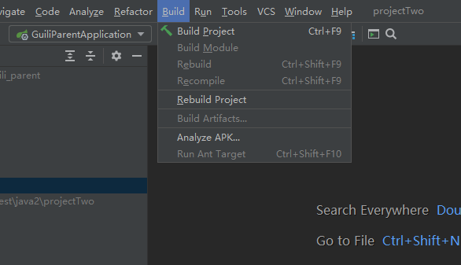

## 1.依赖飘红

```java
Maven Resources Compiler: Maven project configuration required for module 'xxx' isn't available.
解决
    找到上面的Build(构造) ---> Build Project(构造项目)即可
    Build(构造) 结束之后如果报错，
    	右键点击pom.xml， 选择maven选项，然后选择reimport(2020的变为 reload project)
    
```



## 2. sql 时区不对

```java
问题
	No timezone mapping entry for 'GMT+
源代码
	// 变量改为GMT+8或者Asia/Shanghai        
spring:
  profiles:
    active: dev # 环境设置
  application:
    name: service-edu # 服务名
  datasource: # mysql数据库连接
    driver-class-name: com.mysql.cj.jdbc.Driver
    url: jdbc:mysql://localhost:3306/db_guli_edu?serverTimezone=Asia/Shanghai        
```

