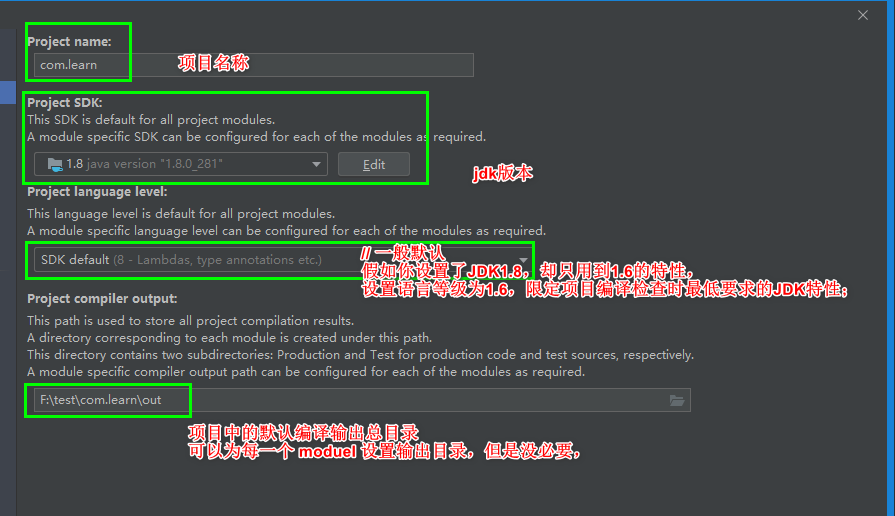
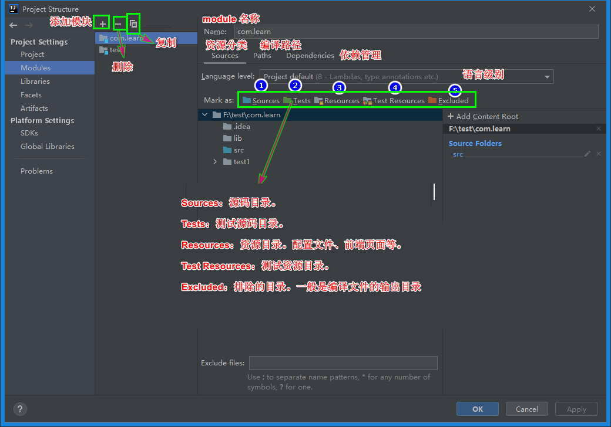
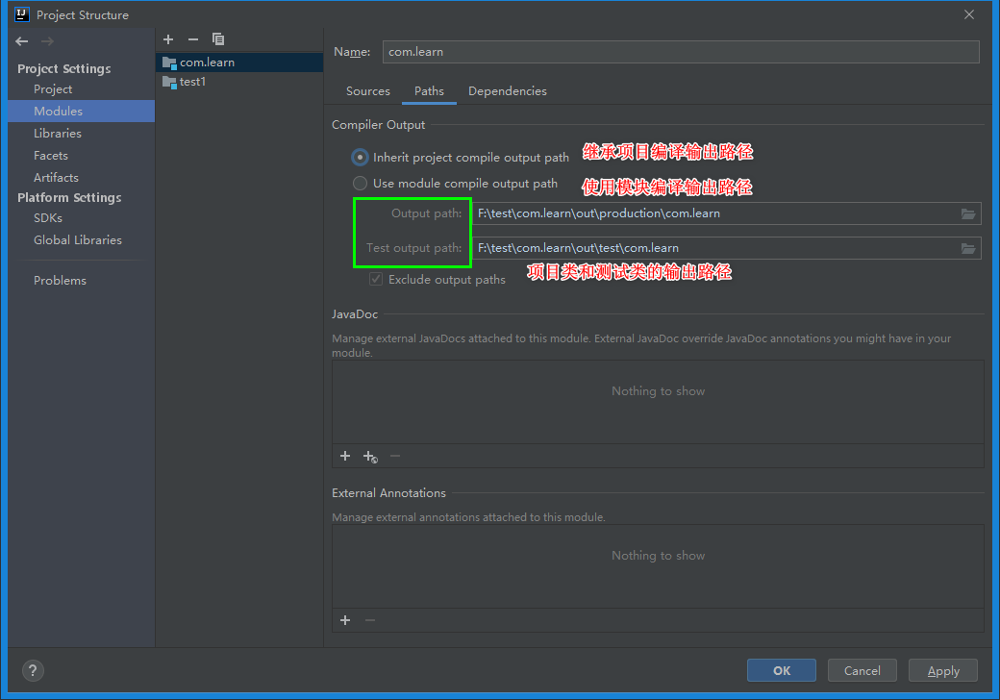
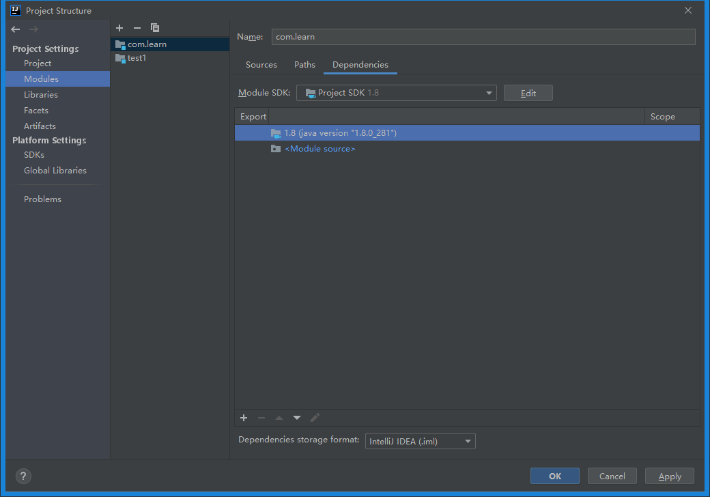

## 注意

### project vs module

```java
介绍
	单Module项目的时候，这个单独的Module实际上就是一个Project
	多Module项目的时候，多个模块处于同一个Project之中，此时彼此之间具有互相依赖的关联关系    
project
    Project是一个不具备任何编码设置、构建等开发功能的概念，
    其主要作用就是起到一个项目定义、范围约束、规范类型的效果
    就是一个目录，一个项目
module
    子项目
    一个项目中可以有多个子项目，每个子项目相当于一个模块。 一般我们项目只是单独的一个
IDEA
    默认也是单子项目的形式，所以只需要配置一个模块
```


## Project Setting

### project

```java
这个一般最初设置以后，就沿用之前的设置了
```



### modules







### Libraries

```java
介绍
    显示所添加的jar包，同时也可以添加jar包，并且可以把多个jar放在一个组里面，类似于jar包整理
    // 主要就是引入第三方 jar 包，详情参看第三方包引入
```

### Facets

```java
述了在Module中使用的各种各样的框架、技术和语言
用来说明模块具有的特征，所使用的框架等。如：Spring、Web、Strust等。
    
```


### Artifacts

```java
是maven中的一个概念，表示某个module要如何打包，例如war exploded、war、jar、ear等等这种打包形式
整合编译后的 java 文件，资源文件等
Module 而言，有了 Artifact 就可以部署到 web 容器中    
```


## Plateform settings

### GDKs

### Golbal Libraries

```java
// 全局类库
所有的项目都可以使用这里配置的类库。
```


## 需要总结

```java
https://blog.csdn.net/weixin_42609240/article/details/99935156
```

