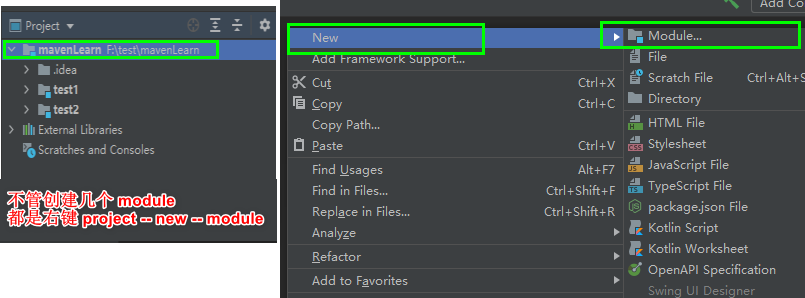

## 多层文件展开

```java

```


## IDEA 创建工程

### 创建静态 web 工程

```java
介绍
    
// 2020 版本
    static web 在 2020 版本中，更名为 javascript 
    
// 2020.3
    new -- module -- web -- 创建
```


### 创建动态 web 工程

#### 方法一

```java
// 2020.3 版本

// 先创建一个空的项目
	new -- module -- java -- 项目名称进行创建
// 点击 module 右键，     
	Add frameworks support -- java application  -- 前面点对号就行
// 注意
	test.iml 是自动创建的，是你创建 java 自动创建的，只不过创建的比较慢 
    必要需要在 web-inf 中创建一个 lib
```


#### 方式二

```java
project structure -- facets
注意
    必要需要在 web-inf 中创建一个 lib
```


### 添加第三方 jar 包

```java
// 普通 web 项目
   // lib 不存在的话，添加一个， 推荐
   1. 把依赖的 jar 包，添加到 web -- web-inf -- lib 文件夹中
   2. 选中  -- 右键  -- add as library -- 选择类型（module library）
    
方式二
    // 最终的效果跟方式一是一样的
    // 加入本地库
    首先：把依赖的 jar 包，添加到 web -- web-inf -- lib 文件夹中
    然后进入 project structure 
      1. 
    		-- 修改名称 -- apply
      2. moudle -- +  -- library - 选择刚才的设置的 -- add selected -- apply
      3. artifacts --  你需要设置的项目 -- fixed -- add ... the artifacts -- 选择文件夹 -- ok
    
    
// 已有项目中添加第三方非开源包， 安装到本地 maven 中
场景
    微服务项目，进行添加
	不存在 web-info 文件夹       
方法
    // 项目依赖的资源
    1. library -> + -> java  -> 选择进行添加的 jar 包（进入 jar 包所在的文件，找到需要安装的 jar包） -> 
       ok -> apply
	2. 执行命令       
   	 mvn install:install-file 
         -DgroupId=com.aliyun 
         -DartifactId=aliyun-sdk-vod-upload 
         -Dversion=1.4.11 
         -Dpackaging=jar 
         -Dfile=aliyun-java-vod-upload-1.4.11.jar
         /*
         Installing  ...(jar包所在位置)  to  ...（本地仓库）
         */
	3. 引入
         使用 dependency 标签引入， 进行加载即可
```


## 多 module 项目

### 多 module 创建

```java
注意
    IDEA 默认是单 moudule 模式创建的
    也就是你 new project 一个项目， 就会创建一个单 modlue 项目
步骤
    1. 先创建一个文件夹， 里面啥也不放
    2. IDEA 中 file - open
```



### 多 modle 的 maven 项目

```java
步骤

```

