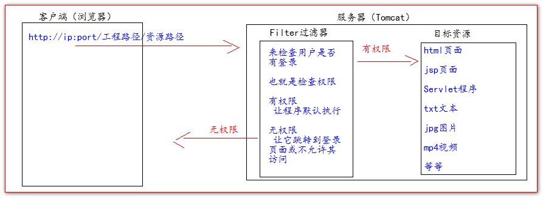

## 注意

```java
// 不同的类都可能有过滤器
java.servlet.Filter
```


## 介绍

### 使用

```java
拦截请求
    在客户端的请求访问后端资源之前，拦截这些请求。
处理响应    
    在服务器的响应发送回客户端之前，处理这些响应。

```

## 分类

```java
// 根据规范建议的各种类型的过滤器

    身份验证过滤器（Authentication Filters）。
    数据压缩过滤器（Data compression Filters）。
    加密过滤器（Encryption Filters）。
    触发资源访问事件过滤器。
    图像转换过滤器（Image Conversion Filters）。
    日志记录和审核过滤器（Logging and Auditing Filters）。
    MIME-TYPE 链过滤器（MIME-TYPE Chain Filters）。
    标记化过滤器（Tokenizing Filters）。
    XSL/T 过滤器（XSL/T Filters），转换 XML 内容。

```


* Filter 过滤器它是 JavaEE 的规范。也就是接口 
* Filter 过滤器它的作用是：**拦截请求**，过滤响应。




## 生命周期

```java
1、构造器方法 
2、init 初始化方法
    第 1，2 步，在 web 工程启动的时候执行（Filter 已经创建） 
3、doFilter 过滤方法 
    第 3 步，每次拦截到请求，就会执行 
4、destroy 销毁 
    第 4 步，停止 web 工程的时候，就会执行（停止 web 工程，也会销毁 Filter 过滤器）
```

## 配置

### 介绍

```java
配置在 web.xml 中
注意
    可以设置多个 filter 标签，对应多个过滤器
    一个过滤器对应一个 filter filter-Mapping
    
// 标签说明
    
<filter>
    指定一个过滤器。
    <filter-name>
        // 类名
        用于为过滤器指定一个名字，该元素的内容不能为空, 
    <filter-class>
        // 全类名
        元素用于指定过滤器的完整的限定类名。
    <init-param>
        // 在过滤器中，可以使用FilterConfig接口对象来访问初始化参数。
        元素用于为过滤器指定初始化参数，它的子元素
        <param-name>指定参数的名字，
        <param-value>指定参数的值。

<filter-mapping>
        元素用于设置一个 Filter 所负责拦截的资源。
        一个Filter拦截的资源可通过两种方式来指定：Servlet 名称和资源访问的请求路径
    <filter-name>
            // <filter>元素中声明过的  filter-name
            子元素用于设置filter的注册名称。
    <url-pattern>
            设置 filter 所拦截的请求路径(过滤器关联的URL样式)
    <servlet-name>
            指定过滤器所拦截的Servlet名称。        
    <dispatcher>
            指定过滤器所拦截的资源被 Servlet 容器调用的方式，
            可以是REQUEST,INCLUDE,FORWARD和ERROR之一，默认REQUEST。
            用户可以设置多个<dispatcher>子元素用来指定 Filter 对资源的多种调用方式进行拦截。
    <dispatcher>
            子元素可以设置的值及其意义
    REQUEST：
            当用户直接访问页面时，Web容器将会调用过滤器。
            如果目标资源是通过RequestDispatcher的include()或forward()方法访问时，那么该过滤器就不会被调用。
    INCLUDE：
            如果目标资源是通过RequestDispatcher的include()方法访问时，
            那么该过滤器将被调用。除此之外，该过滤器不会被调用。
    FORWARD：
            如果目标资源是通过RequestDispatcher的forward()方法访问时，
            那么该过滤器将被调用，除此之外，该过滤器不会被调用。
    ERROR： 
            如果目标资源是通过声明式异常处理机制调用时，那么该过滤器将被调用。
            除此之外，过滤器不会被调用。    
```

### 过滤器配置

```xml
<!--filter 标签用于配置一个 Filter 过滤器--> 
<filter> 
    <!--给 filter 起一个别名--> 
    <filter-name>AdminFilter</filter-name> 
    <!--配置 filter 的全类名--> 
    <filter-class>com.atguigu.filter.AdminFilter</filter-class> 
    
    
    <!-- 初始化配置参数-->
    <init-param> 
        <param-name>username</param-name> 
        <param-value>root</param-value> 
    </init-param>
</filter>
        
<!--filter-mapping 配置 Filter 过滤器的拦截路径， 过滤器映射--> 
<!--定义过滤器，然后映射到一个 URL 或 Servlet-->
<filter-mapping> 
    <!--filter-name 表示当前的拦截路径给哪个 filter 使用--> 
    <filter-name>AdminFilter</filter-name> 
    <!--url-pattern 配置拦截路径--> 
   	<!-- / 表示请求地址为：http://ip:port/工程路径/ 映射到 IDEA 的 web 目录  -->
	<!--/admin/* 表示请求地址为：http://ip:port/工程路径/admin/*-->
	<url-pattern>/admin/*</url-pattern> 
</filter-mapping>        
```

### 拦截 url 设置

```xml
// 精确匹配
	<url-pattern>/target.jsp</url-pattern> 
    以上配置的路径，表示请求地址必须为：http://ip:port/工程路径/target.jsp
// 目录匹配
	<url-pattern>/admin/*</url-pattern> 
	以上配置的路径，表示请求地址必须为：http://ip:port/工程路径/admin/*
// 后缀名匹配
	<url-pattern>*.html</url-pattern> 
		以上配置的路径，表示请求地址必须以.html 结尾才会拦截到 
	<url-pattern>*.do</url-pattern> 
		以上配置的路径，表示请求地址必须以.do 结尾才会拦截到 
	<url-pattern>*.action</url-pattern> 
		以上配置的路径，表示请求地址必须以.action 结尾才会拦截到

注意
	Filter 过滤器它只关心请求的地址是否匹配，不关心请求的资源是否存在！！！
```

## 调用顺序

```java
规则
    // 按照 web.xml 中定义的顺序
	web.xml 中的 filter-mapping 元素的顺序决定了 Web 容器应用过滤器到 Servlet 的顺序
```


## servlet 过滤器方法

```java
// 过滤器是一个实现了 javax.servlet.Filter 接口的 Java 类
public void doFilter (ServletRequest, ServletResponse, FilterChain)
	该方法在每次一个请求/响应对因客户端在链的末端请求资源而通过链传递时由容器调用。
public void init(FilterConfig filterConfig)
	该方法由 Web 容器调用，指示一个过滤器被放入服务。
public void destroy()
	该方法由 Web 容器调用，指示一个过滤器被取出服务。
```


## Filter 接口

### 使用

```java
public class AdminFilter implements Filter { 
    /*** doFilter 方法，专门用于拦截请求。可以做权限检查 */ 
    @Override 
    public void doFilter(ServletRequest servletRequest, ServletResponse servletResponse,
          FilterChain filterChain) throws IOException, ServletException { 
        HttpServletRequest httpServletRequest = (HttpServletRequest) servletRequest; 
        HttpSession session = httpServletRequest.getSession(); 
        Object user = session.getAttribute("user"); 
        // 如果等于 null，说明还没有登录 
        if (user == null) { 
            servletRequest.getRequestDispatcher("/login.jsp").forward(servletRequest,servletResponse); 
            return; 
        } else { 
            // 让程序继续往下访问用户的目标资源 
            filterChain.doFilter(servletRequest,servletResponse); 
        } 
    }
}    
```

### 配置

```xml

```


