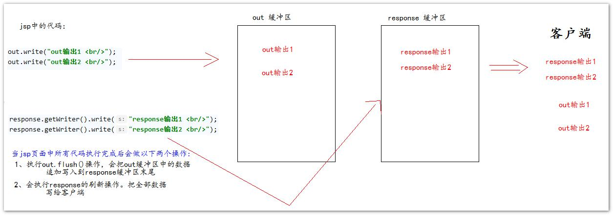

## page 指令(属性)

```java
page
    <%@ page contentType="text/html; charset=UTF-8" language="java" %>

language 属性   
    表示 jsp 翻译后是什么语言文件。暂时只支持 java。 
contentType 属性   
    表示 jsp 返回的数据类型是什么。也是源码中 response.setContentType()参数值 
pageEncoding 
    属性  表示当前 jsp 页面文件本身的字符集。 
import 属性   
    跟 java 源代码中一样。用于导包，导类。 
// 两个属性是给 out 输出流使用
autoFlush 属性   
    设置当 out 输出流缓冲区满了之后，是否自动刷新冲级区。默认值是 true。 
buffer 属性   
    设置 out 缓冲区的大小。默认是 8kb
    
errorPage 
    属性 设置当 jsp 页面运行时出错，表示错误后自动跳转去的路径
    errorPage="/error500.jsp"
     这个路径一般都是以斜杠打头，它表示请求地址为 http://ip:port/工程路径/
    映射到代码的 Web 目录
isErrorPage 属性 
        设置当前 jsp 页面是否是错误信息页面。默认是 false。如果是 true 可以 获取异常信息。 
session 属性 
        设置访问当前 jsp 页面，是否会创建 HttpSession 对象。默认是 true。 
extends 属性 
        设置 jsp 翻译出来的 java 类默认继承谁。    
        
```

## 注释

```java
// html 注释
	html 注释会被翻译到 java 源代码中。在_jspService 方法里，以 out.writer 输出到客户端。
// java 注释
	java 注释会被翻译到 java 源代码中。
// jsp 注释
	<%-- 这是 jsp 注释 --%>    
    jsp 注释可以注掉，jsp 页面中所有代码。	
```


## 脚本

### 声明格式

```java
<%! 
	java 代码    
%>
作用
    可以给 jsp 翻译出来的 java 类定义属性和方法甚至是静态代码块。内部类等
例子
1、声明类属性
    <%!
    	private Integer id;
    %>
2、声明 static 静态代码块
    <%!
    	static { 
        	map = new HashMap<String,Object>(); 
            map.put("key1", "value1");
    	}
    %>
3、声明类方法 
    <%!
        public int abc(){ return 12; }
	%>
4、声明内部类
    <%!
		public static class A { 
            private Integer id = 12; 
            private String abc = "abc"; 
        }
    %>
```

### 表达式脚本

```java
格式
    <%= 表达式 %>
作用
    jsp 页面上输出数据。
特点
	1、所有的表达式脚本都会被翻译到_jspService() 方法中 
    2、表达式脚本都会被翻译成为 out.print()输出到页面上 
    3、由于表达式脚本翻译的内容都在_jspService() 方法中,所以_jspService()方法中的对象都可以直接使用。 
    4、表达式脚本中的表达式不能以分号结束。
例子
	<%=12 %> 
    <%=12.12 %>  
    <%="我是字符串" %> 
    <%=map%> 
    <%=request.getParameter("username")%>
```

### 代码脚本

```java
格式
    <%
    	java 代码语句
    %>
作用
    可以在 jsp 页面中，编写我们自己需要的功能（写的是 java 语句）
特点
    1、代码脚本翻译之后都在_jspService 方法中 
    2、代码脚本由于翻译到_jspService()方法中，所以在_jspService()方法中的现有对象都可以直接使用。 
    3、还可以由多个代码脚本块组合完成一个完整的 java 语句。 
    4、代码脚本还可以和表达式脚本一起组合使用，在 jsp 页面上输出数据
```

## 九大内置对象

```java
介绍
    是指 Tomcat 在翻译 jsp 页面成为 Servlet 源代码后，内部提供的九大对象
对象
    request		请求对象
    response	响应对象
    pageContext	jsp 上下文对象
    session		会话对象
    application	 ServletContext 对象
    config		ServletConfig 对象
    out			jsp 输出流对象
    page		指向当前 jsp 对象
    exception	异常对象 
```

## 四大域对象

```js
介绍
	域对象是可以像 Map 一样存取数据的对象。四个域对象功能一样。不同的是它们对数据的存取范围。
分类
    pageContext  (PageContextImpl 类)  当前 jsp 页面范围内有效 
    request  (HttpServletRequest 类)、 一次请求内有效 
    session  (HttpSession 类)、  一个会话范围内有效（打开浏览器访问服务器，直到关闭浏览器） 
    application  (ServletContext 类) 整个 web 工程范围内都有效（只要 web 工程不停止，数据都在）
使用顺序
	pageContext ====>>> request ====>>> session ====>>> application
```

## 输出问题

```java
 jsp 翻译之后，底层源代码都是使用 out 来进行输出，
所以一般情况下。我们在 jsp 页面中统一使用 out 来进行输出。避 免打乱页面输出内容的顺序
     // 在 jsp 页面中，可以统一使用 out.print()来进行输出
     out.write() 输出字符串没有问题 
     out.print() 输出任意数据都没有问题（都转换成为字符串后调用的 write 输出）
```





## 标签

### 静态包含

```java
格式
	<%@ include file=""%> 
	静态包含 file 属性指定你要包含的 jsp 页面的路径 
    地址中第一个斜杠 / 表示为 http://ip:port/工程路径/ 映射到代码的 web 目录
特点
	1、静态包含不会翻译被包含的 jsp 页面。 
     2、静态包含其实是把被包含的 jsp 页面的代码拷贝到包含的位置执行输出。
```


### 动态包含

```java
介绍
	<%--<jsp:include page=""></jsp:include> 
     这是动态包含 page 属性是指定你要包含的 jsp 页面的路径 
     动态包含也可以像静态包含一样。把被包含的内容执行输出到包含位置 
特点： 
    1、动态包含会把包含的 jsp 页面也翻译成为 java 代码 
    2、动态包含底层代码使用如下代码去调用被包含的 jsp 页面执行输出。 
      JspRuntimeLibrary.include(request, response, "/include/footer.jsp", out, false); 
	3、动态包含，还可以传递参数 --%>
```


### 标签转发

```java
<jsp:forward page=""></jsp:forward> 
    是请求转发标签，它的功能就是请求转发 page 属性设置请求转发的路径
```

