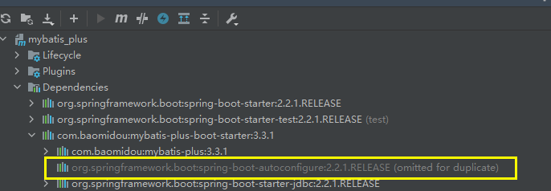

* Plugin 'org.springframework.boot:spring-boot-maven-plugin:' not found

    ```java
    // 修改后的代码， 注意修改后需要 Invalidate Caches / Restart...
    <plugins>
        <plugin>
            <groupId>org.springframework.boot</groupId>
            <artifactId>spring-boot-maven-plugin</artifactId>
        	// 添加上版本就行了，没有说
            <version>2.2.1.RELEASE</version>
        </plugin>
    </plugins>
    ```

* maven 项目，依赖包是灰色

    ```java
    是因为pom里面带上了<scope>test</scope>导致的，
    scope为test表示依赖项目仅仅参与测试相关的工作，包括测试代码的编译，执行    
    ```

    