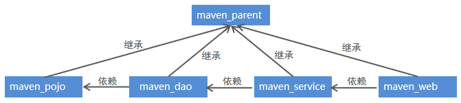

## 模块化构建 maven 工程

### 拆分分析

```java
介绍
    每一个 module 都是 maven 工程
项目常见拆分方法
 // 第一种
    按照业务模块进行拆分，
    每个模块拆分成一个maven工程, 例如将一个项目分为用户模块、 订单模块、购物车模块等,
	每个模块对应就是一个maven工程
// 第二种  
	按照层进行拆分，
    例如持久层、业务层、表现层等，
    每个层对应就是- -个maven工程    
综述
	不管是上面哪种拆分方式，通常都会提供一个父工程,
	将一些公共的代码和配置提取到父工程中进行统一 管理和配置。        
```



### maven 继承

#### 介绍

```java
介绍
    在maven工程之间也可以继承，子工程继承父工程后，就可以使用在父工程中引入的依赖。继承的目的是为了消除重复代码
    
父工程    
    被继承的maven工程通常称为父工程
	注意
    	父工程的打包方式必须为pom
子工程
    继承其他maven父工程的工程通常称为子工程
    在pom.xml文件中通过parent标签进行父工程的继承    
```

#### 导包配置

```xml
<parent>
    <!--父工程坐标-->
    <groupId>org.springframework.boot</groupId>
    <artifactId>spring-boot-starter-parent</artifactId>
    <!-- 父项目打包方式必须是pom  -->
    <packaging>pom</packaging>
	<version>2.2.1.RELEASE</ version>
	<relativePath/> <!-- lookup parent from repository-->
</parent>
```

#### 注意

```java
子moudlue 最好写在 parent moudle 中，
    创建 moudle 的时候， 需要选择 parent（可以使用继承和聚合）
```


### maven 聚合

#### 介绍

```xml
介绍
    使用<modules>标签将其他maven工程聚合到一起
    使用<modules>标签将这些工程统一聚合到maven工程中，
    	需要打包的时候，只需要在此工程中执行一次打包命令，其下被聚合的工程就都会被打包了。
```

#### 导包配置

```xml
< groupId>com. i the ima</ groupId>
<artifactId>maven_ parent</artifactId>
<version>1.0-SNAPSH0T</version>
<!--四个工程聚合到一个工程中-->        
<modules>
	<module>maven_ dao</module>
	<module>maven_service</module>
	<module>maven_ web</module>
	<module>maven_ pojo</module>
</modules)
<packaging>pom</packaging)
```


### 多模块工程例子

```java
parent	// 父项目不应该设置为 web 项目
    child
    	pom.xml
    
    pom.xml
```

