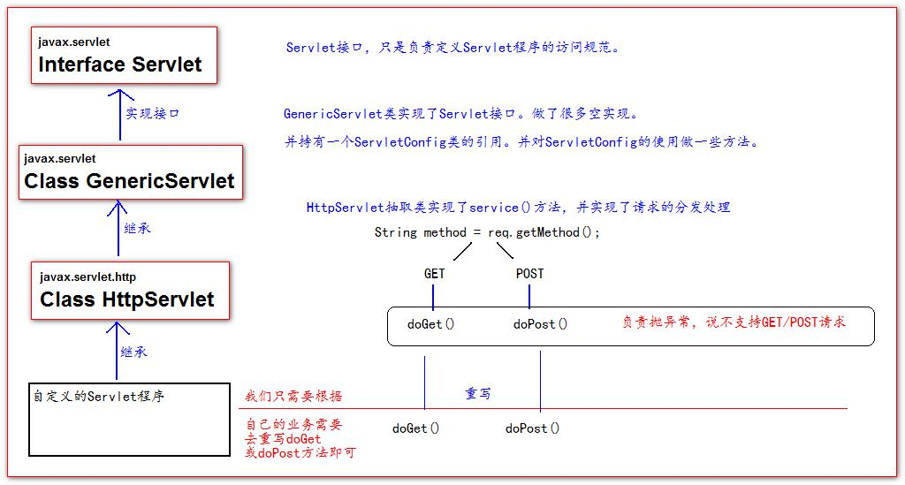

## servlet 类




## ServletConfig 类

```java
介绍
    1、可以获取 Servlet 程序的别名 servlet-name 的值 
    2、获取初始化参数 init-param 
    3、获取 ServletContext 对象
```

## ServletContext

```java
介绍
    1、ServletContext 是一个接口，它表示 Servlet 上下文对象 
    2、一个 web 工程，只有一个 ServletContext 对象实例。 
    3、ServletContext 对象是一个域对象
    4、ServletContext 是在 web 工程部署启动的时候创建。在 web 工程停止的时候销毁。
    
域对象
    域对象，是可以像 Map 一样存取数据的对象，叫域对象。 
    这里的域指的是存取数据的操作范围，整个 web 工程。
			存数据 		 取数据  		删除 数据 
    Map 	put() 			get() 		 remove() 
    域对象	  setAttribute()  getAttribute() removeAttribute();
    
    
    
作用
	1、获取 web.xml 中配置的上下文参数 context-param 
    2、获取当前的工程路径，格式: /工程路径 
    3、获取工程部署后在服务器硬盘上的绝对路径 
    4、像 Map 一样存取数据   
web.xml
<!--context-param 是上下文参数(它属于整个 web 工程)--> 
    <context-param> 
        <param-name>username</param-name> 
        <param-value>context</param-value> 
    </context-param>   
获取
	ServletContext context = getServletConfig().getServletContext(); 
	String username = context.getInitParameter("username");
	context.setAttribute("key","value")
	System.out.println("工程部署的路径是:" + context.getRealPath("/")); 
	System.out.println("工程下 css 目录的绝对路径是:" + context.getRealPath("/css")); 
	System.out.println("工程下 imgs 目录 1.jpg 的绝对路径是:" + context.getRealPath("/imgs/1.jpg")); }
```

## httpservlet

### 问题

```java
// doget 中文乱码
protected void doGet(HttpServletRequest req, HttpServletResponse resp) 
    throws ServletException, IOException {
    // 获取请求参数 
    	String username = req.getParameter("username"); 
    //1 先以 iso8859-1 进行编码 
    //2 再以 utf-8 进行解码 
    username = new String(username.getBytes("iso-8859-1"), "UTF-8");
}

// dopost 出现乱码
@Override protected void doPost(HttpServletRequest req, HttpServletResponse resp) 
    throws ServletException, IOException { 
    // 设置请求体的字符集为 UTF-8，从而解决 post 请求的中文乱码问题 
    req.setCharacterEncoding("UTF-8");

    // 获取请求参数 
    String username = req.getParameter("username"); 
}
```


## HttpServletRequest

```java

	getRequestURI()  获取请求的资源路径 
    getRequestURL()  获取请求的统一资源定位符（绝对路径）
    getRemoteHost()  获取客户端的 ip 地址 
        
    getHeader() 获取请求头
    getParameter()  获取请求的参数 
    getParameterValues( 获取请求的参数（多个值的时候使用）
    getMethod()  获取请求的方式 GET 或 POST 
    setAttribute(key, value);  设置域数据 
    getAttribute(key);  获取域数据
    getRequestDispatcher()  获取请求转发对象
```

## HttpServletResponse

```java
介绍
    每次请求进来，Tomcat 服务器都会创建一个 Response 对象传 递给 Servlet 程序去使用
两个输出流方法
    // 两个流同时只能使用一个。
	字节流 getOutputStream(); 常用于下载（传递二进制数据） 
	字符流 getWriter(); 常用于回传字符串（常用）
```

