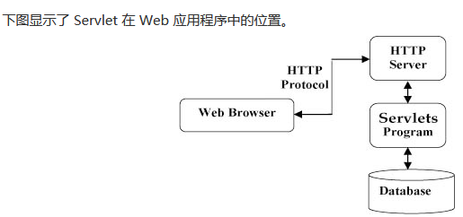

## 介绍

```java
基础
	Servlet（Server Applet），全称Java Servlet，未有中文译文
     Servlet = Service + Applet，表示小服务程序。
作用
    用Java编写的服务器端程序。
    其主要功能在于交互式地浏览和修改数据，生成动态Web内容
    Servlet可以响应任何类型的请求，但绝大多数情况下Servlet只用来扩展基于HTTP协议的Web服务器。
分类
    狭义的Servlet是指Java语言实现的一个接口，
    广义的Servlet是指任何实现了这个Servlet接口的类，（默认此种请情况）
    
```

## 运行

### 作用

```java
// 接收请求
	// 客户端（浏览器）发送的
	显式的数据	： HTML 表单 
	隐式的 HTTP 请求数据  ： cookies
        
// 处理
    处理数据并生成结果        
    可能需要访问数据库，执行 RMI 或 CORBA 调用，调用 Web 服务
        
// 发送响应
    // 发送消息给浏览器
	显式的数据	： HTML 表单 
	隐式的 HTTP 请求数据  ： cookies
```


### 程序位置



### 访问流程

```java
url 地址到 Servlet 程序访问
```

 

## 生命周期

```java
// 1 2 只执行一次
1. Sevlet 构造器方法
    
2. init 初始化方法
    init() 方法简单地创建或加载一些数据，这些数据将被用于 Servlet 的整个生命周期。
// 3 每次访问都会调用    
3. service 方法执行
    执行实际任务的主要方法
// 4 web 工程停止的时候调用    
4. 执行 destory 销毁方法
最后，Servlet 是由 JVM 的垃圾回收器进行垃圾回收的。    
```


## Sevlet 程序实现

### 实现 Servlet 接口

### 继承 httpServlet 类

```java
介绍
    1、编写一个类去继承 HttpServlet 类 
    2、根据业务需要重写 doGet 或 doPost 方法 
    3、到 web.xml 中的配置 Servlet 程序的访问地址
方法
    doget  get请求
    dopost post请求
注意
    IDEA 右键可以直接创建这个继承
```


