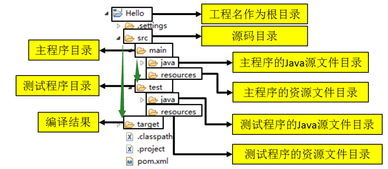

## 约定的目录结构

```java
使用原因
    maven 要负责我们自动化构建，就需要直到 java 源代码保存在哪里
    我们自己定义的东西，想让框架或者工具直到，就需要符合一定的规则
    	已配置的方式告诉框架
    	遵守框架的规则


// 以下几个包的目录结构最好都设置成一致的
// com.example.项目名.    
ProjectName(工程名)
    src
    	main
    		java
    		resource
    	test
    target
```



## 模块化

### 介绍

```java
介绍
    每一个 module 都是 maven 工程
项目常见拆分方法
 // 第一种
    按照业务模块进行拆分，
    每个模块拆分成一个maven工程, 例如将一个项目分为用户模块、 订单模块、购物车模块等,
	每个模块对应就是一个maven工程
// 第二种  
	按照层进行拆分，
    例如持久层、业务层、表现层等，
    每个层对应就是- -个maven工程    
综述
	不管是上面哪种拆分方式，通常都会提供一个父工程,
	将一些公共的代码和配置提取到父工程中进行统一 管理和配置。        
```


### 结构关系

```java
聚合
    为了快速方便地构建项目中的多个模块
    聚合模块来说，它知道有哪些模块被聚合，但那些被聚合的模块则不知道这个聚合模块的存在
继承
    为了消除POM中的重复配置。
    父模块来说，它不知道有哪些子模块继承它，但那些子模块则必须知道其继承是哪个模块
    
共同点
    1. POM的打包类型(packaging)均为pom
    2. 除了POM文件外，均不含项目任何的实际源码
    3. 通常， 一个模块是父模块的同时也可是聚合模块
    
// 第三种方案
import
    // maven 只支持单继承
    通过 import 将目标POM的dependencyManagement配置导入、合并到当前POM的dependencyManagement元素中
    
```


### 平行项目 

```java
api	// 父项目
   pom.xml    
manager-controller
    pom.xml
manager-mapper
    pom.xml
    
// 注意
父项目 / pom.xml
    // module元素的值是基于当前POM文件的相对目录, 需要修改
    <modules>
        <module>../manager-mapper</module>
        <module>../manager-controller</module>
    </modules>
```


### 父子项目

```java
manager
    pom.xml
    manager-mapper
    	pom.xml
    manager-controller
    	pom.xml
```

### import

```java
介绍
    // maven 只支持单继承
    如果当前项目已经继承了一个父模块，此时即可通过import导入的方式来复用其他POM中的dependencyManagement配置
代码
    <dependencyManagement>
        <dependencies>
            ...
            <dependency>
                <groupId>com.tony</groupId>
                <artifactId>json</artifactId>
                <version>1.0</version>
                <type>pom</type>	// 类型特殊，其一般指向的是打包类型为pom的模块
                <scope>import</scope> // 
            </dependency>
            ...
        </dependencies>
    </dependencyManagement>

```


### 父项目标签

#### modules

```java
介绍	子模块列表语法例子  <modules>    <module>my-project</module>    <module>another-project</module>    <module>third-project/pom-example.xml</module>  </modules>
```

#### properties

```java
介绍	属性列表。	定义的属性可以在 pom.xml 文件中任意处使用 ！！！！！！	使用方式为 ${propertie} 语法例子<project>      ...      <properties>        <maven.compiler.source>1.7<maven.compiler.source>        <maven.compiler.target>1.7<maven.compiler.target>        <project.build.sourceEncoding>UTF-8</project.build.sourceEncoding>        <project.reporting.outputEncoding>UTF-8</project.reporting.outputEncoding>      </properties>      ...</project>
```


#### dependencies

```java
介绍    引入 jar 包作用    dependencies声明的依赖    	未指定版本号，将使用dependencyManagement中该依赖指定的版本    	指定版本号， 将覆盖dependencyManagement中该依赖指定的版本    注意    子模块可通过继承获得父模块中声明的dependencies元素——即全部依赖    但是会导致子模块中引入了不必要的依赖继承  父项目    该标签中的依赖会被子项目直接继承，即使子项目没有声明同样的坐标  子项目    该标签中坐标    	// 子模块也继承了 dependencyManage    	没有版本号：会向父项目中的 dependencyManagement 中该依赖指定的版本    	有版本号： 优先使用本项目中的版本号	没有该标签或者与父项目标签没有冲突    	子项目会自动继承父项目中的 dependencies 中的依赖
```


#### dependencyManagement

```java
dependencyManagement    管理依赖jar版本号的作用, 一般只用在父项目中, 可以被子 POM 继承作用    // 即你在项目中的 dependencyManagement 下声明了依赖，maven 不会加载该依赖    该元素下的依赖声明不会实际引入到模块中，只有在dependencies元素下同样声明了该依赖，才会引入到当前模块中    dependencies声明的依赖    	未指定版本号，将使用dependencyManagement中该依赖指定的版本    	指定版本号， 将覆盖dependencyManagement中该依赖指定的版本注意    // 注意！！！子模块也要声明    子项目使用到里面声明的 jar, 需要写声明依赖，但是不用写版本号，    不是真实的下载jar，只有在子module中使用到，才会去下载依赖    // 版本号获取    各个依赖的版本号由properties标签定义，通过$ {变量名}的形式动态获取版本号。      原理    由于dependencyManagement元素同样可被继承。    故我们在各个子模块POM的dependencies元素下声明实际需要用到的依赖使用场景	当有父子项目的时候，父项目中可以利用 dependencyManagement 声明子项目中需要用到的依赖 jar 包，之后，	当某个或者某几个子项目需要加载该依赖的时候，就可以在子项目中 dependencies 节点只配置 groupId 和 artifactId 就可以完成依赖的引用。
```

#### pluginManagement

```java
介绍    针对插件进行管理， 原理和 dependencyManagement 原理一样作用    在pluginManagement元素声明的插件及插件配置不会发生实际效果，    只有当继承该POM的子模块声明了相应插件才会被实际引入,	同时默认使用pluginManagement中该插件的版本及插件配置
```


### 子项目标签

#### parent

```java
介绍	maven 支持继承功能。	子 POM 可以使用 parent 指定父 POM ，然后继承其配置语法<!ELEMENT parent子元素(	groupId artifactId	version		<!--同 project 的-->	relativePath		指明父模块 POM 的路径，    	值默认值:	    		../pom.xml。其值同样是一个是基于当前POM文件的相对路径    	使用：     		父子目录结构： 该元素值可省略，使用默认值即可    		平行目录结构： ../springBoot2-root/pom.xml    properties / version    	<properties><version>1.o</version></properties>    	引用父模块，不要直接写父模块版本号，避免父版本号变动，子模块改动遗漏出现问题    	此处的 1.0 只是占位作用，并不能起到版本限定的作用)>
```

​    


## 父子项目

### 介绍

```java
介绍
    在maven工程之间也可以继承，子工程继承父工程后，就可以使用在父工程中引入的依赖。继承的目的是为了消除重复代码
    
父工程/父项目    
    被继承的maven工程通常称为父工程
	注意
    	父工程的打包方式必须为pom
    依赖
    	modules 聚合
    	properties 标签进行版本控制
    	dependencyManagement 进行版本管理
    
    
子工程/子项目
    介绍
    	继承其他maven父工程的工程通常称为子工程
    依赖
	    parent标签 进行父工程的继承    
    	dependency 标签进行无版本号的坐标引用
    
父子交互    
    父项目找到子项目
        通过 modules 找到子项目
    子项目找到父项目
        通过 parents 找到
    依赖传递
    // 父项目

    // 子项目        	
```


### 父项目 -- 聚合

#### 介绍

```xml
介绍
    使用<modules>标签将这些工程统一聚合到maven工程中，
    	需要打包的时候，只需要在此工程中执行一次打包命令，其下被聚合的工程就都会被打包了。
```

#### 导包配置 - pom

```xml
<!-- 父项目打包方式必须是pom  --><packaging>pom</packaging><!--四个工程聚合到一个工程中-->        <modules>	<module>maven_ dao</module>	<module>maven_service</module>	<module>maven_ web</module>	<module>maven_ pojo</module></modules>
```

### 子项目 -- 继承

#### 介绍

```java
子 moudlue 最好写在 parent moudle 中，    创建 moudle 的时候， 需要选择 parent（可以使用继承和聚合）    parent    child_1    	pom.xml    child_2    	pom.xml    pom.xml
```


#### 导包配置 - pom

```xml
<parent>    <!--父工程坐标-->    <groupId>org.springframework.boot</groupId>    <artifactId>spring-boot-starter-parent</artifactId>    <!-- 父项目打包方式必须是pom  -->    <packaging>pom</packaging>	<version>2.2.1.RELEASE</ version>	<relativePath/> <!-- lookup parent from repository--></parent>
```


