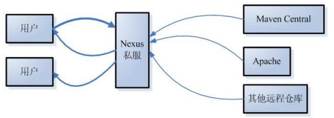

## maven 仓库

### 介绍

```java
仓库能帮助我们管理构件（主要是JAR），它就是放置所有JAR文件（WAR，ZIP，POM等等）的地方。
    
默认
    // 不管Linux还是 Windows，
    默认情况下，每个用户在自己的用户目录下都有一个路径名为 .m2/respository/ 的仓库目录。
    
分类
    本地仓库 
    远程仓库
   		 maven中央仓库
    		（地址：http://repo2.maven.org/maven2/）
   		 maven私服
             （公司局域网内的仓库，需要自己搭建）
    	 其他公共远程仓库
             （例如apache提供的远程仓库，地址：http://repo.maven.apache.org/maven2/）
搜索顺序
    // 参看 maven jar 包导入顺序
```

### 内容

```java
[1]Maven 的插件
[2]我们自己开发的项目的模块
[3]第三方框架或工具的 jar 包
※不管是什么样的 jar 包，在仓库中都是按照坐标生成目录结构，所以可以通过统一的方式查询或依赖。
```


### 本地仓库

```xml
默认
    认被创建在 %USER_HOME% 目录下。
	电脑上部署的仓库目录
修改默认位置
	参看 maven 安装配置中的配置

```


### 远程仓库

#### 中央仓库

```java
介绍
    // Maven 社区提供的仓库，其中包含了大量常用的库, 不需配置
	maven 社区提供了一个 URL：http://search.maven.org/#browse。
	使用这个仓库，开发人员可以搜索所有可以获取的代码库。
设置
	maven 远程库在国外，需要配置国内镜像点
	// 参看实用仓库阿里云仓库设置

```

#### 私服（私有服务器）

```xml
介绍
    开发人员自己定制仓库，包含了所需要的代码库或者其他工程中用到的 jar 文件。
	公司局域网内的maven远程仓库，每个员工的电脑上安装maven软件并且连接maven私服，
	程序员可以将自己开发的项目打成jar并发布到私服，其它项目组成员就可以从私服下载所依赖的jar。
	私服还充当一个代理服务器的角色，当私服上没有jar包时会从maven中央仓库自动下载。

仓库管理器
	nexus 是一个maven仓库管理器（其实就是一个软件），nexus可以充当maven私服，
	同时nexus还提供强大的仓库管理、构件搜索等功能。
	
向项目发布到 maven
	配置maven的settings.xml文件
     配置项目的pom.xml文件
     执行mvn deploy命令
从私服下载
	在maven的settings.xml文件中配置下载模板
	在maven的settings.xml文件中配置激活下载模板
```



##### 发布

```xml
<!--maven 的 setting.xml -->
<!-- 一定要在idea工具中引入的maven的settings.xml文件中配置 -->
<server>
    <id>releases</id>
    <username>admin</username>
    <password>admin123</password>
</server>
<server>
    <id>snapshots</id>
    <username>admin</username>
    <password>admin123</password>
</server>

  
 <!--pom.xml-->
<!--pom.xml文件的<id>的值和前面配置的settings.xml 文件的<id>值需要一致-->
<distributionManagement>
    <repository>
        <id>releases</id>
        <url>http://localhost:8081/nexus/content/repositories/releases/</url>
    </repository>
    <snapshotRepository>
        <id>snapshots</id>
        <url>http://localhost:8081/nexus/content/repositories/snapshots/</url>
    </snapshotRepository>
</distributionManagement>

<!-- 项目发布到maven私服 -->
执行mvn deploy命令
```

##### 下载

```xml
<!-- 在maven的settings.xml文件中配置下载模板 -->
<profile>
    <id>dev</id>
    <repositories>
        <repository>
            <id>nexus</id>
            <!--仓库地址，即nexus仓库组的地址-->
            <url>http://localhost:8081/nexus/content/groups/public/</url>
            <!--是否下载releases构件-->
            <releases>
                <enabled>true</enabled>            
            </releases>
            <!--是否下载snapshots构件-->
            <snapshots>
                <enabled>true</enabled>
            </snapshots>
        </repository>
    </repositories>
    <pluginRepositories>
        <!-- 插件仓库，maven的运行依赖插件，也需要从私服下载插件 -->
        <pluginRepository>
            <id>public</id>
            <name>Public Repositories</name>
            <url>http://localhost:8081/nexus/content/groups/public/</url>
        </pluginRepository>
    </pluginRepositories>
</profile>

<!-- maven的settings.xml文件中配置激活下载模板 -->
<activeProfiles>
    <activeProfile>dev</activeProfile>
</activeProfiles>

```


