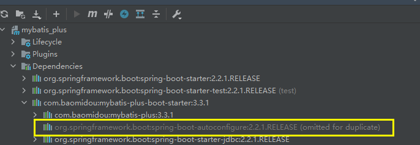
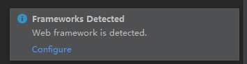
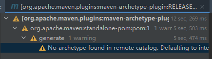
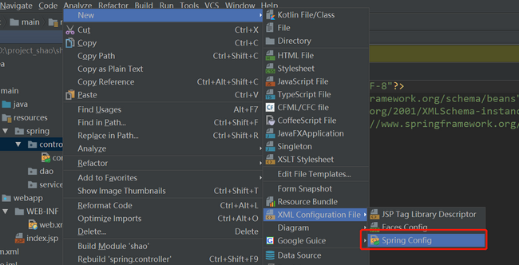

### Plugin ' xxx ' not found

```java
// 修改后的代码， 注意修改后需要 Invalidate Caches / Restart...
<plugins>
    <plugin>
        <groupId>org.springframework.boot</groupId>
        <artifactId>spring-boot-maven-plugin</artifactId>
    	// 添加上版本就行了，没有说
        <version>2.2.1.RELEASE</version>
    </plugin>
</plugins>
```

### maven 项目，依赖包是灰色

```java
是因为pom里面带上了<scope>test</scope>导致的，
scope为test表示依赖项目仅仅参与测试相关的工作，包括测试代码的编译，执行    
```



### 检测到框架，检测到Web框架

```java
Frameworks Detected Web framework is detected.

翻译：检测到框架，检测到Web框架
一个web项目新导入到IDEA，Event Log提示的
IDEA工具检测到这是一个web项目，检测到web.xml
// 貌似很短时间就会消失， 速度点。。。。    
    直接点configure安装web框架
```




### No archetype found in remote catalog

```java
方法一
	可以不用管【因为使用了maven模版构建项目，要从网上获取模版，然而没有找到这个模版或者网络慢，导致获取失败 】，
	选择File ---> 再选择Close Project，关闭项目后重启就可以了
方法二
	删除原本地仓库，用默认镜像下载初始化的maven项目，再改阿里的镜像下载其它配置
方法三
	Build,Execution,Deployment>>>Build Tools>>>Maven>>> Runner 中的 VM Options输入
	// archetypeCatalog可选值为：remote，internal ，local等，
    // 用来指定archetype-catalog.xml文件从哪里获取。
	 -DarchetypeCatalog=internal
    -------------------------------------------------------------------------------
    下载： archetype-catalog.xml, 下载 pom 文件(自己新建一个)
    	进入网址选一个版本
    		https://search.maven.org/artifact/org.apache.maven.archetype/archetype-catalog
		新建一个  archetype-catalog.xml 文件， 将 pom 中的代码复制进去保存
            网站右上角有一个 download ，点开找到 pom, 复制展开的代码
         将 archetype-catalog.xml 放入你的本地库
```




### 创建XML文件没有Spring Config选项

```java
// 没有导包(导入坐标)造成的
// 导入依赖，记得点击左上角出现的 m 进行刷新
// 注意 dependencies 只能有一个，是赋值内层的代码
<dependencies>
	<dependency>
	      <groupId>org.springframework</groupId>
	      <artifactId>spring-context</artifactId>
	      <version>4.3.7.RELEASE</version>
	 </dependency>
 </dependencies>
```



