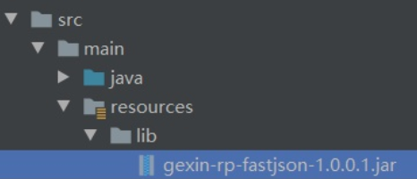

## maven引入外部 jar 

### 介绍

```java
在Maven项目里，我们经常需要导入jar包依赖，
    正常情况下
    	需要到Maven仓库（https://mvnrepository.com/）里去搜索对应资源，
		修改pom.xml文件即可。
    Maven仓库是搜索不到的，
            这时候就需要引入外部依赖。
```


### 创建 lib 文件夹



### 安装本地库

#### 命令安装

```java
//  格式
mvn install:install-file 
    -Dfile=<path-to-file> 
    -DgroupId=<group-id> 
    -DartifactId=<artifact-id> 
    -Dversion=<version> 
    -Dpackaging=<packaging>
// 参数含义
    <path-to-file>
    		为你jar包所在的路径（尽量简单并且不要含中文）
    <group-id> 
    		// 为 grouId 号，
    		与组成唯一识别你jar包的坐标，当不在公共资源jar包中，
    		自己自定义的jar时，可以自定义groupId号
    <artifact-id>
    		// 为 artifactId 号，
    		与组成唯一识别你jar包的坐标，当不在公共资源jar包中，
    		自己自定义的jar时，可以自定义artifactId号
    <version>
    		// jar包版本号，
    		也可以自定义
    <packaging>
    		// 包的后缀，
    		一般都是jar
    
    
    
// 示例
mvn install:install-file 
    -Dfile=F:\gexin-rp-fastjson-1.0.0.1.jar 
    -DgroupId=com.gexin.rp 
    -DartifactId=fastjson 
    -Dversion=1.0.0.1 
    -Dpackaging=jar
```

### 修改 pom

```xml
<dependencies>
    <dependency>
        <groupId>com.gexin.rp</groupId>   <!-- 库名称，自定义 -->
        <artifactId>fastjson</artifactId> <!-- 库名称，自定义 -->
        <version>1.0.0.1</version>        <!-- 版本号 -->
        <scope>system</scope>             <!-- 作用域 -->
        <systemPath>${pom.basedir}/src/main/resources/lib/gexin-rp-fastjson-1.0.0.1.jar</systemPath>                  <!-- lib文件夹下的路径 -->
    </dependency>
</dependencies>
```

