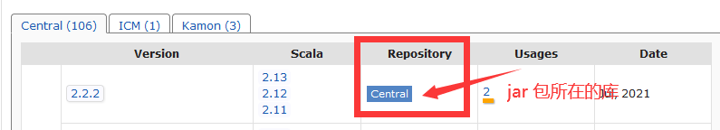

## 解决描述

```java
一直提示Dependency 'xxxx‘ not found
  
// 问题排除
本地仓库   
    有这个包
    
    没有这个包
    	
	maven仓库中真的没有该jar包：
    maven仓库做了其他镜像，去该镜像下去找
    
```

## 本地库查询

```java

// 例如 lombok
// 如果maven仓库做了其他镜像，去该镜像下去找一下有没有这个jar包
1. 先到本地 maven 仓库中查看该文件是否存在，
    存在
    	// jar 和 pom 都存在， 说明拉取成功
    	log4j-1.2.17.jar
    	log4j-1.2.17.pom
    不存在
    	jar 不存在,
		方法一： 一个对应的jar包放到该目录下就可以了
         方法二：
         	将对应版本的文件夹删除，重新进行远程库拉取

2.本地库存在
// 方法一
	1. pom.xml中的相关 dependency 代码删掉。            
    2. 将maven仓库中生成的jar包路径下除jar包外的其他所有文件删掉
	3. 然后将刚才pom.xml中删掉的那部分代码重新还原回去，更新maven
// 方法二：手动安装
	1. 将你pom.xml中的这段dependency代码删掉
	2. 将maven仓库中生成的jar包整个路径删掉
	3. 将jar包放到你本地的任意路径
	4. 安装
		1. 管理员打开cmd，运行命令
		 mvn install:install-file 
             -Dfile=“D:\XXX.jar” 
             -DgroupId=org.slf4j 
             -DartifactId=log4j-over-slf4j 
             -Dversion=1.7.25 -Dpackaging=jar             
            
	5.将刚才pom.xml中删掉的那部分代码重新还原回去，更新maven
```

## 远程库拉取

### 查询所在的库

```java
可是在maven仓库是能搜索到的，地址http://mvnrepository.com/

注意
	1. 在setting.xml文件中指了默认情况下，只会从 Central中下载，而镜像一般只会镜像central库
    2. 
查看jar包所在的库
```


### 中心库




### 非中心库


#### 方案一 : settings.xml

```xml
修改 maven 的配置文件，添加响应的库
    在settings.xml中添加对应的镜像
    
<mirror>  
	<id>jboss</id>      
	<name>jboss</name>  
     <url>https://repository.jboss.org/nexus/content/repositories/releases/</url>  
     <mirrorOf>JBoss Releases</mirrorOf>     
</mirror> 
```

#### 方案二:  pom.xml

```java
/*
	url 信息，点击相应的库， 会跳转一个界面就会出现，对应的 url
*/
<repositories>
    <repository>
        <id>JBoss repository</id>
        <url>https://repository.jboss.org/nexus/content/repositories/releases/</url>
    </repository>
</repositories>

```


