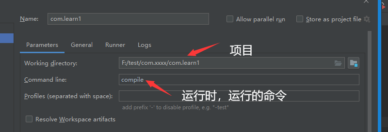

### 模板创建

```java
// 普通 java 项目创建
new -- project -- maven -- create from archtype + maven-archtype-quickstart -- com.xxx --
重新配置下 maven 路径 -- finish  -- 别手太快， 等下右上角有一个 m 的小图形，点一下，进行自动导入    

// java 项目
new -- project -- maven -- create from archtype + maven-archtype-webApp -- com.xxx --
重新配置下 maven 路径 -- finish  -- 别手太快， 等下右上角有一个 m 的小图形，点一下，进行自动导入    
    
    
// resources
// 方法一    
创建文件夹 resources  -- 右键  -- 新建 directory(注意不是package、moudle) -- make directory as xxx sources
// 方拾二
project structure -- moudle -- 右侧的 sources -- 选中文件夹，然后右键更改文件的属性
    
```


### 文件修改

#### jdk 版本

```java
 // 改为 1.8
<properties>
    <project.build.sourceEncoding>UTF-8</project.build.sourceEncoding>
    <maven.compiler.source>1.8</maven.compiler.source>
    <maven.compiler.target>1.8</maven.compiler.target>
  </properties>
```

#### juint

```java
// 改为 4.12
 <dependencies>
    <dependency>
      <groupId>junit</groupId>
      <artifactId>junit</artifactId>
      <version>4.12</version>
      <scope>test</scope>
    </dependency>
  </dependencies>

    
```

#### pluginManagement

```xml
<pluginManagement></pluginManagement>   标签中及其中的内容删除
```

### 文件夹修改

```java
注意各个文件夹的颜色
```


## 命令设置



## web 插件配置

* build 标签中添加 plugins 标签

### Jetty 插件

```xml
<!--配置 Jetty 插件-->
<plugins>
    <plugin>
        <groupId>org.mortbay.jetty</groupId>
        <artifactId>maven-jetty-plugin</artifactId>
        <version>6.1.25</version>
        <configuration>
            <!-- 热部署，每10秒扫描一次 -->
            <scanIntervalSeconds>10</scanIntervalSeconds>
            <!--指定当前项目的网站名-->
            <webApp>
                <contextPath>/jetty-demo</contextPath>
                <war>${project.basedir}/target/${project.build.finalName}.war</war>
            </webApp>
            <connectors>
                <connector implementation="org.mortbay.jetty.nio.SelecChannelConnector">
                	<port>9090</port> <!--启动端口-->
                </connector>
            </connectors>
        </configuration>
   </plugin>
</plugins>
```

### tomcat 插件

```xml

```

