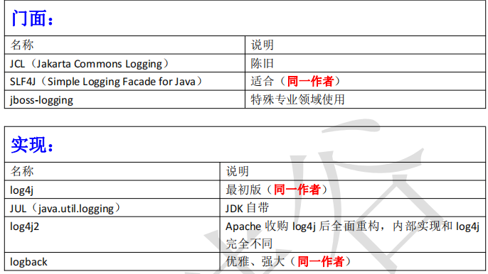

## 日志选型




##   	日志介绍

**commons-logging**
 `apache`最早提供的日志的门面接口。避免和具体的日志方案直接耦合。类似于`JDBC` 的`api` 接口，具体的的`JDBC driver` 实现由各数据库提供商实现。通过统一接口解耦，不过其内部也实现了一些简单日志方案。

**Log4j**
 `Logging for Java`，经典的一种日志解决方案。内部把日志系统抽象封装成`Logger` 、`appender` 、`pattern` 等实现。我们可以通过配置文件轻松的实现日志系统的管理和多样化配置。

**slf4j**
 全称为`Simple Logging Facade for Java`。 是对不同日志框架提供的一个门面封装。可以在部署的时候不修改任何配置即可接入一种日志实现方案。和`commons-loging` 类似。个人感觉设从计上更好一些，没有`commons` 那么多潜规则。同时有两个额外特点：①能支持多个参数，并通过`{}`占位符进行替换，避免老写`logger.isXXXEnabled`这种无奈的判断，带来性能提升见；②`OSGI`机制更好兼容支持。

**logback**
 作为一个通用可靠、快速灵活的日志框架，将作为`Log4j` 的替代和`slf4j` 组成新的日志系统的完整实现。具有极佳的性能，在关键路径上执行速度是`log4j` 的10 倍，且内存消耗更少。

**Log4j2**
 `Log4j2`是`Log4j`的升级版，与之前的版本`Log4j 1.x`相比、有重大的改进，在修正了`Logback`固有的架构问题的同时，改进了许多`Logback`所具有的功能。

## 总结

```java
// log4j -->JUL-->JCL--> slf4j --> logback --> log4j2
抽象接口
     commons-logging
	slf4j
 实现
    Log4j、
    Log4j2
    logback
使用组合
    slf4j+Log4j2
    slf4j+logback

```

