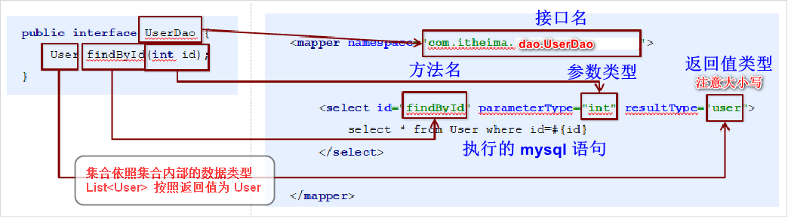

## 面向接口编程

```java
介绍
    只用写一个 mapper 接口文件
    然后写一个 xml 文件
    不用写 mapper 的接口实现，在 xml 中就有方法实现
```



## 介绍

```java
概述
    SQL 映射文件有很少的几个顶级元素（按照它们应该被定义的顺序）：
    
    cache –  给定命名空间的缓存配置。
    cache-ref –  其他命名空间缓存配置的引用。
    resultMap –  是最复杂也是最强大的元素，用来描述如何从数据库结果集中来加载对象。
    sql –  可被其他语句引用的可重用语句块。
    insert –  映射插入语句
    update –  映射更新语句
    delete –  映射删除语句
    select –  映射查询语句

```

## select

### 介绍

```sql
#  selectPerson，
# 接受一个 int（或 Integer）类型的参数，
# 返回一个 HashMap 类型的对象，其中的键是列名，值便是结果行中的对应值
# 很多单独的 JDBC 的代码来提取结果并将它们映射到对象实例中, mybatis 省略了时间
<select id="selectPerson" parameterType="int" resultType="hashmap">
  SELECT * FROM PERSON WHERE ID = #{id}
</select>  
```

### 属性介绍

```sql
 <select
  id="selectPerson"
  parameterType="int"
  parameterMap="deprecated"
  resultType="hashmap"
  resultMap="personResultMap"
  flushCache="false"
  useCache="true"
  timeout="10000"
  fetchSize="256"
  statementType="PREPARED"
  resultSetType="FORWARD_ONLY">   
```

| 属性          | 描述                                                         |
| ------------- | ------------------------------------------------------------ |
| id            | 在命名空间中唯一的标识符，可以被用来引用这条语句。           |
| parameterType | 将会传入这条语句的参数类的完全限定名或别名。这个属性是可选的，因为 MyBatis 可以通过 TypeHandler 推断出具体传入语句的参数，默认值为 unset。 |
| resultType    | 从这条语句中返回的期望类型的类的完全限定名或别名。注意如果是集合情形，那应该是集合可以包含的类型，而不能是集合本身。使用 resultType 或 resultMap，但不能同时使用。 |
| resultMap     | 外部 resultMap 的命名引用。结果集的映射是 MyBatis 最强大的特性，对其有一个很好的理解的话，许多复杂映射的情形都能迎刃而解。使用 resultMap 或 resultType，但不能同时使用。 |
| flushCache    | 将其设置为 true，任何时候只要语句被调用，都会导致本地缓存和二级缓存都会被清空，默认值：false。 |
| useCache      | 将其设置为 true，将会导致本条语句的结果被二级缓存，默认值：对 select 元素为 true。 |
| timeout       | 这个设置是在抛出异常之前，驱动程序等待数据库返回请求结果的秒数。默认值为 unset（依赖驱动）。 |
| fetchSize     | 这是尝试影响驱动程序每次批量返回的结果行数和这个设置值相等。默认值为 unset（依赖驱动）。 |
| statementType | STATEMENT，PREPARED 或 CALLABLE 的一个。这会让 MyBatis 分别使用 Statement，PreparedStatement 或 CallableStatement，默认值：PREPARED。 |
| resultSetType | FORWARD_ONLY，SCROLL_SENSITIVE 或 SCROLL_INSENSITIVE 中的一个，默认值为 unset （依赖驱动）。 |
| databaseId    | 如果配置了 databaseIdProvider，MyBatis 会加载所有的不带 databaseId 或匹配当前 databaseId 的语句；如果带或者不带的语句都有，则不带的会被忽略。 |
| resultOrdered | 这个设置仅针对嵌套结果 select 语句适用：如果为 true，就是假设包含了嵌套结果集或是分组了，这样的话当返回一个主结果行的时候，就不会发生有对前面结果集的引用的情况。这就使得在获取嵌套的结果集的时候不至于导致内存不够用。默认值：false。 |
| resultSets    | 这个设置仅对多结果集的情况适用，它将列出语句执行后返回的结果集并每个结果集给一个名称，名称是逗号分隔的。 |

## Insert, Update 和 Delete

### 介绍

```sql
<insert
  id="insertAuthor"
  parameterType="domain.blog.Author"
  flushCache="true"
  statementType="PREPARED"
  keyProperty=""
  keyColumn=""
  useGeneratedKeys=""
  timeout="20">

<update
  id="updateAuthor"
  parameterType="domain.blog.Author"
  flushCache="true"
  statementType="PREPARED"
  timeout="20">

<delete
  id="deleteAuthor"
  parameterType="domain.blog.Author"
  flushCache="true"
  statementType="PREPARED"
  timeout="20">
```

### 属性介绍

| 属性             | 描述                                                         |
| ---------------- | ------------------------------------------------------------ |
| id               | 命名空间中的唯一标识符，可被用来代表这条语句。               |
| parameterType    | 将要传入语句的参数的完全限定类名或别名。这个属性是可选的，因为 MyBatis 可以通过 TypeHandler 推断出具体传入语句的参数，默认值为 unset。 |
| flushCache       | 将其设置为 true，任何时候只要语句被调用，都会导致本地缓存和二级缓存都会被清空，默认值：true（对应插入、更新和删除语句）。 |
| timeout          | 这个设置是在抛出异常之前，驱动程序等待数据库返回请求结果的秒数。默认值为 unset（依赖驱动）。 |
| statementType    | STATEMENT，PREPARED 或 CALLABLE 的一个。这会让 MyBatis 分别使用 Statement，PreparedStatement 或 CallableStatement，默认值：PREPARED。 |
| useGeneratedKeys | （仅对 insert 和 update 有用）这会令 MyBatis 使用 JDBC 的 getGeneratedKeys  方法来取出由数据库内部生成的主键（比如：像 MySQL 和 SQL Server 这样的关系数据库管理系统的自动递增字段），默认值：false。 |
| keyProperty      | （仅对 insert 和 update 有用）唯一标记一个属性，MyBatis 会通过 getGeneratedKeys  的返回值或者通过 insert 语句的 selectKey  子元素设置它的键值，默认：unset。如果希望得到多个生成的列，也可以是逗号分隔的属性名称列表。 |
| keyColumn        | （仅对 insert 和 update 有用）通过生成的键值设置表中的列名，这个设置仅在某些数据库（像 PostgreSQL）是必须的，当主键列不是表中的第一列的时候需要设置。如果希望得到多个生成的列，也可以是逗号分隔的属性名称列表。 |
| databaseId       | 如果配置了 databaseIdProvider，MyBatis 会加载所有的不带 databaseId 或匹配当前 databaseId 的语句；如果带或者不带的语句都有，则不带的会被忽略。 |


## selectKey

```java
<selectKey
  keyProperty="id"
  resultType="int"
  order="BEFORE"
  statementType="PREPARED">
```

| 属性          | 描述                                                         |
| ------------- | ------------------------------------------------------------ |
| keyProperty   | selectKey 语句结果应该被设置的目标属性。如果希望得到多个生成的列，也可以是逗号分隔的属性名称列表。 |
| keyColumn     | 匹配属性的返回结果集中的列名称。如果希望得到多个生成的列，也可以是逗号分隔的属性名称列表。 |
| resultType    | 结果的类型。MyBatis 通常可以推算出来，但是为了更加确定写上也不会有什么问题。MyBatis 允许任何简单类型用作主键的类型，包括字符串。如果希望作用于多个生成的列，则可以使用一个包含期望属性的 Object 或一个 Map。 |
| order         | 这可以被设置为 BEFORE 或 AFTER。如果设置为 BEFORE，那么它会首先选择主键，设置 keyProperty  然后执行插入语句。如果设置为 AFTER，那么先执行插入语句，然后是 selectKey 元素 - 这和像 Oracle  的数据库相似，在插入语句内部可能有嵌入索引调用。 |
| statementType | 与前面相同，MyBatis 支持 STATEMENT，PREPARED 和 CALLABLE 语句的映射类型，分别代表 PreparedStatement 和 CallableStatement 类型 |

## sql    ？？？？？

### 概述

```java
介绍
    用来定义可重用的 SQL 代码段，可以包含在其他语句中。
    它可以静态地(在加载阶段)参数化。
    不同的属性值可以在include实例中有所不同
    
定义的语句
    <sql id="userColumns"> ${alias}.id,${alias}.username,${alias}.password </sql>
使用的语句
     <include refid="userColumns"><property name="alias" value="t2"/></include>
    
```

### 使用

#### 包含在其他语句

```sql
<select id="selectUsers" resultType="map">
  select
    <include refid="userColumns"><property name="alias" value="t1"/></include>,
    <include refid="userColumns"><property name="alias" value="t2"/></include>
  from some_table t1
    cross join some_table t2
</select>
```

#### 属性值 应用

```sql
# 属性值也可以用于 include refid 属性或 include 子句中的属性值

<sql id="sometable">
  ${prefix}Table
</sql>

<sql id="someinclude">
  from
    <include refid="${include_target}"/>
</sql>

<select id="select" resultType="map">
  select
    field1, field2, field3
  # 属性值用于 include refid 属性
  <include refid="someinclude">
    <property name="prefix" value="Some"/>
    <property name="include_target" value="sometable"/>
  </include>
</select>
```


## //  == 待整理

## 自动生成主键

```java
如果你的数据库支持自动生成主键的字段（比如 MySQL 和 SQL Server），
那么你可以设置 useGeneratedKeys=”true”，然后再把 keyProperty 设置到目标属性上就OK了
    
// 如果 Author 表已经对 id 使用了自动生成的列类型    
<insert id="insertAuthor" useGeneratedKeys="true"
    keyProperty="id">
  insert into Author (username,password,email,bio)
  values (#{username},#{password},#{email},#{bio})
</insert>    
```

## 多行插入

```java
// selectKey 元素将会首先运行，Author 的 id 会被设置，然后插入语句会被调用。
// 这给你了一个和数据库中来处理自动生成的主键类似的行为，避免了使 Java 代码变得复杂。
<insert id="insertAuthor" useGeneratedKeys="true"
    keyProperty="id">
  insert into Author (username, password, email, bio) values
  <foreach item="item" collection="list" separator=",">
    (#{item.username}, #{item.password}, #{item.email}, #{item.bio})
  </foreach>
</insert>
```


# // ===

## 介绍

```java
crud
    create		创建
    Delete		删除      
    retrieve	查询
    update		更新
REST 风格的 crud
    就是 springMVC 的 restful 风格设置 
```


# 联合查询

## 介绍

```java
介绍
    对于多表联合查询，要使用 resultType 进行自定义类型结果集
注意
    id 是主键， 
    方式一： 级联属性
    	使用级联属性进行封-装， property="a.属性"
    方拾二： association 标签
```

