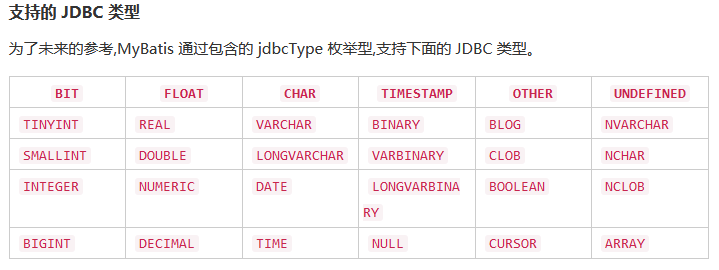

## 类型别名

```xml
<!-- In mybatis-config.xml file -->
<!-- 类型别名是你的伙伴。使用它们你可以不用输入类的全路径-->
<typeAlias type="com.someapp.model.User" alias="User"/>

<!-- In SQL Mapping XML file -->
<select id="selectUsers" resultType="User">
  select id, username, hashedPassword
  from some_table
  where id = #{id}
</select>
```


##  == resultMaps ==

## 介绍

```sql
 ResultMap 的设计就是简单语句不需要明确的结果映射,而很多复杂语句确实需要描述它们 的关系
```

## 结果集

### 简单结果集

#### 内部结果集

```sql
package com.someapp.model;
   //  JavaBeans 或 POJOs(Plain Old Java Objects,普通 Java 对象)来作为领域 模型
    public class User {
      private int id;
      private String username;
      private String hashedPassword;
      
      省去 get set 方法
    }
}

# 简单作用于所有列被自动映射到 HashMap 的键上,这由  resultType  属性 指定
# 基于 JavaBean 的规范,上面这个类有 3 个属性: id ,  username  和  hashedPassword 
# 这些 在 select 语句中会精确匹配到列名。

/*
原理
	MyBatis 会在幕后自动创建一个 ResultMap,基于属性名来映射列到 JavaBean 的属性上
	列名没有精确匹配,你可以在列名上使用 select 字句的别名(一个 基本的 SQL 特性)来匹配标签
*/
<select id="selectUsers" resultType="User">
  select
    user_id            ,
    user_name           as "userName",
    hashed_password     as "hashedPassword"
  from some_table
  where id = #{id}
</select>
    

```

#### 外部结果集

```sql
# 定义结果集的样式
# 解决列名不匹配的另外一种方式。
<resultMap id="userResultMap" type="User">
  <id property="id" column="user_id" />
  <result property="username" column="username"/>
  <result property="password" column="password"/>
</resultMap>    

# 使用
# 引用它的语句使用 resultMap 属性就行了(注意我们去掉了 resultType 属性)
<select id="selectUsers" resultMap="userResultMap">
  select user_id, user_name, hashed_password
  from some_table
  where id = #{id}
</select>
```

### 高级结果映射

```sql
<!-- Very Complex Statement -->
<select id="selectBlogDetails" resultMap="detailedBlogResultMap">
  select
       B.id as blog_id,
       B.title as blog_title,
       B.author_id as blog_author_id,
       A.id as author_id,
       A.username as author_username,
       A.password as author_password,
       A.email as author_email,
       A.bio as author_bio,
       A.favourite_section as author_favourite_section,
       P.id as post_id,
       P.blog_id as post_blog_id,
       P.author_id as post_author_id,
       P.created_on as post_created_on,
       P.section as post_section,
       P.subject as post_subject,
       P.draft as draft,
       P.body as post_body,
       C.id as comment_id,
       C.post_id as comment_post_id,
       C.name as comment_name,
       C.comment as comment_text,
       T.id as tag_id,
       T.name as tag_name
  from Blog B
       left outer join Author A on B.author_id = A.id
       left outer join Post P on B.id = P.blog_id
       left outer join Comment C on P.id = C.post_id
       left outer join Post_Tag PT on PT.post_id = P.id
       left outer join Tag T on PT.tag_id = T.id
  where B.id = #{id}
</select>

# xml 映射写法
!-- Very Complex Result Map -->
<resultMap id="detailedBlogResultMap" type="Blog">
  <constructor>
    <idArg column="blog_id" javaType="int"/>
  </constructor>
  <result property="title" column="blog_title"/>
  <association property="author" javaType="Author">
    <id property="id" column="author_id"/>
    <result property="username" column="author_username"/>
    <result property="password" column="author_password"/>
    <result property="email" column="author_email"/>
    <result property="bio" column="author_bio"/>
    <result property="favouriteSection" column="author_favourite_section"/>
  </association>
  <collection property="posts" ofType="Post">
    <id property="id" column="post_id"/>
    <result property="subject" column="post_subject"/>
    <association property="author" javaType="Author"/>
    <collection property="comments" ofType="Comment">
      <id property="id" column="comment_id"/>
    </collection>
    <collection property="tags" ofType="Tag" >
      <id property="id" column="tag_id"/>
    </collection>
    <discriminator javaType="int" column="draft">
      <case value="1" resultType="DraftPost"/>
    </discriminator>
  </collection>
</resultMap>
```


## 属性

| 属性          | 描述                                                         |
| ------------- | ------------------------------------------------------------ |
| `id`          | 此名称空间中的唯一标识符，可用于引用此结果映射。             |
| `type`        | 一个完全特定的 Java 类名，或者一个类型别名(参见上表中的内置类型别名列表)。 |
| `autoMapping` | 如果存在，MyBatis 将启用或禁用这个 ResultMap 的自动操作。此属性覆盖全局`autoMappingBehavior`。默认值:未设置的。 |


## 字标签

### 介绍

```sql

    constructor - 类在实例化时,用来注入结果到构造方法中
        idArg - ID 参数;标记结果作为 ID 可以帮助提高整体效能
        arg - 注入到构造方法的一个普通结果
    id – 一个 ID 结果;标记结果作为 ID 可以帮助提高整体效能
    result – 注入到字段或 JavaBean 属性的普通结果
    association – 一个复杂的类型关联;许多结果将包成这种类型
        嵌入结果映射 – 结果映射自身的关联,或者参考一个
    collection – 复杂类型的集
        嵌入结果映射 – 结果映射自身的集,或者参考一个
    discriminator – 使用结果值来决定使用哪个结果映射
        case – 基于某些值的结果映射
            嵌入结果映射 – 这种情形结果也映射它本身,因此可以包含很多相 同的元素,或者它可以参照一个外部的结果映射。

```

### id & result

```sql
介绍
	映射一个单独列的值到简单数据类型(字符 串,整型,双精度浮点数,日期等)的单独属性或字段。
id
	表示的结果将是当比较对象实例时用到的标识属性（主键，标识键）
	这帮 助来改进整体表现,特别是缓存和嵌入结果映射(也就是联合映射) 。

<id property="id" column="post_id"/>
<result property="subject" column="post_subject"/>

```

| 属性          | 描述                                                         |
| ------------- | ------------------------------------------------------------ |
| `property`    | 映射到列结果的字段或属性。如果匹配的是存在的,和给定名称相同 的 JavaBeans 的属性,那么就会使用。否则 MyBatis 将会寻找给定名称 property 的字段。这两种情形你可以使用通常点式的复杂属性导航。比如,你 可以这样映射一些东西: `"username" `,或者映射到一些复杂的东西: `"address.street.number"` 。 |
| `column`      | 从数据库中得到的列名,或者是列名的重命名标签。这也是通常和会 传递给 `resultSet.getString(columnName)`方法参数中相同的字符串。 |
| `javaType`    | 一个 Java 类的完全限定名,或一个类型别名(参考上面内建类型别名 的列表) 。如果你映射到一个 JavaBean,MyBatis 通常可以断定类型。 然而,如果你映射到的是 HashMap,那么你应该明确地指定 javaType 来保证所需的行为。 |
| `jdbcType`    | 在这个表格之后的所支持的 JDBC 类型列表中的类型。JDBC 类型是仅 仅需要对插入,更新和删除操作可能为空的列进行处理。这是  JDBC jdbcType 的需要,而不是 MyBatis 的。如果你直接使用 JDBC 编程,你需要指定 这个类型-但仅仅对可能为空的值。 |
| `typeHandler` | 我们在前面讨论过默认的类型处理器。使用这个属性,你可以覆盖默 认的类型处理器。这个属性值是类的完全限定名或者是一个类型处理 器的实现,或者是类型别名 |

### constructor

```sql
介绍
	大多数数据传输对象(Data Transfer Object,DTO)类型,属性可以起作用
	 构造方法注入允许你在初始化时 为类设置属性的值,而不用暴露出公有方法

例子
	   public class User {
           //...
           public User(int id, String username) {
             //...
          }
        //...
        }
    <constructor>
       <idArg column="id" javaType="int"/>
       <arg column="username" javaType="String"/>
    </constructor>
```

| 属性          | 描述                                                         |
| ------------- | ------------------------------------------------------------ |
| `column`      | 来自数据库的类名,或重命名的列标签。这和通常传递给 `resultSet.getString(columnName)`方法的字符串是相同的。 |
| `javaType`    | 一个 Java 类的完全限定名,或一个类型别名(参考上面内建类型别名的列表)。 如果你映射到一个 JavaBean,MyBatis 通常可以断定类型。然而,如 果你映射到的是 HashMap,那么你应该明确地指定 javaType 来保证所需的 行为。 |
| `jdbcType`    | 在这个表格之前的所支持的 JDBC 类型列表中的类型。JDBC 类型是仅仅 需要对插入, 更新和删除操作可能为空的列进行处理。这是  JDBC 的需要, jdbcType 而不是 MyBatis 的。如果你直接使用 JDBC 编程,你需要指定这个类型-但 仅仅对可能为空的值。 |
| `typeHandler` | 我们在前面讨论过默认的类型处理器。使用这个属性,你可以覆盖默认的 类型处理器。 这个属性值是类的完全限定名或者是一个类型处理器的实现, 或者是类型别名。 |
| `select`      | 另一个映射语句的 ID，该语句将加载此属性映射所需的复杂类型。从列属性中指定的列检索的值将作为参数传递给目标 select 语句。更多信息请参见关联元素。 |
| `resultMap`   | 这是 ResultMap 的 ID，它可以将此参数的嵌套结果映射到适当的对象图中。这是对另一个 select  语句调用的替代方法。它允许您将多个表连接到一个结果集中。这样的ResultSet  将包含重复的、重复的数据组，需要对这些数据进行分解并正确地映射到嵌套的对象图中。为了实现这一点，MyBatis  允许将结果映射“链”在一起，以处理嵌套的结果。更多信息请参见下面的关联元素。 |

###  association - 有一个

#### 介绍

```sql
关联查询
	处理"有一个"类型的关系： 一个博客有一个用户
	你指定了目标属性,来获取值的列,属性的 java 类型
	// 关联中不同的是你需要告诉 MyBatis 如何加载关联
	
分类
	嵌套查询:
		通过执行另外一个 SQL 映射语句来返回预期的复杂类型
	嵌套结果:
		使用嵌套结果映射来处理重复的联合结果的子集。
		首先,然让我们来查看这个元素的属性。
		所有的你都会看到,它和普通的只由 select 和 resultMap 属性的结果映射不同。		
```

#### 关联的嵌套查询(1:1)

```sql
# 博客的结果映射描 述了"selectAuthor"语句应该被用来加载它的 author 属性。
# 其他所有的属性将会被自动加载,假设它们的列和属性名相匹配。


<resultMap id="blogResult" type="Blog">
  <association property="author" column="author_id" javaType="Author" select="selectAuthor"/>
</resultMap>

<select id="selectBlog" resultMap="blogResult">  # 一个来加载博客
  SELECT * FROM BLOG WHERE ID = #{id}
</select>

<select id="selectAuthor" resultType="Author"> # 一个来加载作者
  SELECT * FROM AUTHOR WHERE ID = #{id}
</select>

缺点
	对于大型数据集合和列表将不会表现很好(熟知的 "N+1 查询问题")
N + 1 问题
    你执行了一个单独的 SQL 语句来获取结果列表(就是"+1")。
    对返回的每条记录,你执行了一个查询语句来为每个加载细节(就是"N")。
	问题会导致成百上千的 SQL 语句被执行。这通常不是期望的。
	
mybatis 处理
	MyBatis 能延迟加载这样的查询就是一个好处,因此你可以分散这些语句同时运行的消 耗。
	然而,如果你加载一个列表,之后迅速迭代来访问嵌套的数据,你会调用所有的延迟加 载,这样的行为可能是很糟糕的。
```

| 属性        | 描述                                                         |
| ----------- | ------------------------------------------------------------ |
| `column`    | 来自数据库的类名,或重命名的列标签。这和通常传递给 `resultSet.getString(columnName)`方法的字符串是相同的。 column 注 意 : 要 处 理 复 合 主 键 , 你 可 以 指 定 多 个 列 名 通 过` column= " {prop1=col1,prop2=col2} "` 这种语法来传递给嵌套查询语 句。这会引起 prop1 和 prop2 以参数对象形式来设置给目标嵌套查询语句。 |
| `select`    | 另外一个映射语句的 ID,可以加载这个属性映射需要的复杂类型。获取的 在列属性中指定的列的值将被传递给目标 select  语句作为参数。表格后面 有一个详细的示例。 select 注 意 : 要 处 理 复 合 主 键 , 你 可 以 指 定 多 个 列 名 通 过 `column= " {prop1=col1,prop2=col2} " `这种语法来传递给嵌套查询语 句。这会引起 prop1 和 prop2 以参数对象形式来设置给目标嵌套查询语句。 |
| `fetchType` | 可选的。有效值是 lazy 的和 eager 的。如果存在，它将替代此映射的全局配置参数` lazyLoadingEnabled`。 |

#### 关联的结果嵌套(1:1)

```sql
# 代替了执行一个分离的语句,我们联合博客表和作者表在一起
# 注意这个联合查询, 以及采取保护来确保所有结果被唯一而且清晰的名字来重命名
<select id="selectBlog" resultMap="blogResult">
  select
    B.id            as blog_id,
    B.title         as blog_title,
    B.author_id     as blog_author_id,
    A.id            as author_id,
    A.username      as author_username,
    A.password      as author_password,
    A.email         as author_email,
    A.bio           as author_bio
  from Blog B left outer join Author A on B.author_id = A.id
  where B.id = #{id}
</select>


# 注意
在嵌套据诶过映射中 id 元素扮演了非常重要的角色。应应该通常指定一个 或多个属性,它们可以用来唯一标识结果。实际上就是如果你离开她了,但是有一个严重的 性能问题时 MyBatis 仍然可以工作。选择的属性越少越好,它们可以唯一地标识结果。主键 就是一个显而易见的选择(尽管是联合主键)。
```

##### 外部结果映射

```sql
# 结果映射 -- 使用了外部的结果映射元素来映射关联
# 使得 Author 结果映射可以 重用
<resultMap id="blogResult" type="Blog">
  <id property="id" column="blog_id" />
  <result property="title" column="blog_title"/>
  # 博客的作者关联代表着"authorResult"结果映射来加载作 者实例
  <association property="author" column="blog_author_id" javaType="Author" resultMap="authorResult"/>
</resultMap>

<resultMap id="authorResult" type="Author">
  <id property="id" column="author_id"/>
  <result property="username" column="author_username"/>
  <result property="password" column="author_password"/>
  <result property="email" column="author_email"/>
  <result property="bio" column="author_bio"/>
</resultMap>
```


##### 内部嵌套

```sql
# 如果你不需要重用它的话,或者你仅仅引用你所有的结果映射合到一个单独描 述的结果映射中
<resultMap id="blogResult" type="Blog">
  <id property="id" column="blog_id" />
  <result property="title" column="blog_title"/>
  <association property="author" javaType="Author">
    <id property="id" column="author_id"/>
    <result property="username" column="author_username"/>
    <result property="password" column="author_password"/>
    <result property="email" column="author_email"/>
    <result property="bio" column="author_bio"/>
  </association>
</resultMap>
```


#### 关联嵌套（n:1）

##### sql

```sql
# 一片文章， 两个作者
<select id="selectBlog" resultMap="blogResult">
  select
    B.id            as blog_id,
    B.title         as blog_title,
    A.id            as author_id,
    A.username      as author_username,
    A.password      as author_password,
    A.email         as author_email,
    A.bio           as author_bio,
    CA.id           as co_author_id,
    CA.username     as co_author_username,
    CA.password     as co_author_password,
    CA.email        as co_author_email,
    CA.bio          as co_author_bio
  from Blog B
  left outer join Author A on B.author_id = A.id
  left outer join Author CA on B.co_author_id = CA.id
  where B.id = #{id}
</select>
```


##### 结果查询

```sql
# 结果中的列名与resultMap中定义的列不同，
# 因此您需要指定columnPrefix来重新使用resultMap，以便映射合Author的结果。
<resultMap id="blogResult" type="Blog">
  <id property="id" column="blog_id" />
  <result property="title" column="blog_title"/>
  <association property="author"   # 一个作者 
    resultMap="authorResult" />
  <association property="coAuthor"  # 另一个作者
    resultMap="authorResult"
    columnPrefix="co_" />
</resultMap>
```

### collection -- 有多个

#### 集合介绍

```sql
作用
	作用几乎和关联是相同的。
	实际上,它们也很相似,文档的异同是多余的
使用
# 一个博客可以有很多篇文章， 
在博客类中, 这可以由下面这样的写法来表示
public class 博客 {
	# 
	private List posts;	
}

```

#### 集合的嵌套查询

```sql
<resultMap id="blogResult" type="Blog">

  # 读作：在 Post 类型的 ArrayList 中的 posts 的集合
  <collection property="posts" 
  		# javaType 属性是不需要的,因为 MyBatis 在很多情况下会为你算出来
  		# 所以 javaType 这个属性可以省略不写
  		javaType="ArrayList" 
  		column="id"
  		# ofType"属性用来区分 JavaBean(或字段)属性类型和集合包含的类型
  		ofType="Post"  
  		select="selectPostsForBlog"/>
</resultMap>

<select id="selectBlog" resultMap="blogResult">
  SELECT * FROM BLOG WHERE ID = #{id}
</select>

<select id="selectPostsForBlog" resultType="Blog">
  SELECT * FROM POST WHERE BLOG_ID = #{id}
</select>
```

#### 集合的嵌套结果

```sql
<select id="selectBlog" resultMap="blogResult">
  select
  B.id as blog_id,
  B.title as blog_title,
  B.author_id as blog_author_id,
  P.id as post_id,
  P.subject as post_subject,
  P.body as post_body,
  from Blog B
  left outer join Post P on B.id = P.blog_id
  where B.id = #{id}
</select>


```

##### 外部结果映射

```sql
<resultMap id="blogResult" type="Blog">
  <id property="id" column="blog_id" />
  <result property="title" column="blog_title"/>
  # 嵌套
  <collection property="posts" ofType="Post" resultMap="blogPostResult" columnPrefix="post_"/>
</resultMap>

<resultMap id="blogPostResult" type="Post">
  <id property="id" column="id"/>
  <result property="subject" column="subject"/>
  <result property="body" column="body"/>
</resultMap>
```

##### 内部嵌套

```sql
<resultMap id="blogResult" type="Blog">
  <id property="id" column="blog_id" />
  <result property="title" column="blog_title"/>
  # ,要记得 id 元素的重要性
  <collection property="posts" ofType="Post">
    <id property="id" column="post_id"/>
    <result property="subject" column="post_subject"/>
    <result property="body" column="post_body"/>
  </collection>
</resultMap>
```

### discriminator  --鉴别器

#### 介绍

```sql
介绍
	一个单独的数据库查询也许返回很多不同 (但是希望有些关联) 数据类型的结果集
	还有包括类的继承层次结构
	类似于 ：java 的 switch
类型
/*
指定了 column 和 javaType 属性。 
	列是 MyBatis 查找比较值的地方。 
	JavaType 是需要被用来保证等价测试的合适类型(尽管字符串在很多情形下都会有用)
*/
<discriminator javaType="int" column="draft">
  <case value="1" resultType="DraftPost"/>
</discriminator>
```

#### 例子

```sql
# MyBatis 会从结果集中得到每条记录, 然后比较它的 vehicle 类型的值。
# 如果它匹配任何一个鉴别器的实例,那么就使用这个实例指定的结果映射
# 这样 做完全是剩余的结果映射被忽略(除非它被扩展）
# 如果没有任何 一个实例相匹配,那么 MyBatis 仅仅使用鉴别器块外定义的结果映射
<resultMap id="vehicleResult" type="Vehicle">
  <id property="id" column="id" />
  <result property="vin" column="vin"/>
  <result property="year" column="year"/>
  <result property="make" column="make"/>
  <result property="model" column="model"/>
  <result property="color" column="color"/>
  <discriminator javaType="int" column="vehicle_type">
    <case value="1" resultMap="carResult"/>
    <case value="2" resultMap="truckResult"/>
    <case value="3" resultMap="vanResult"/>
    <case value="4" resultMap="suvResult"/>
  </discriminator>
</resultMap>


# 那么只有 doorCount 属性会被加载。
# 这步完成后完整地允许鉴别器实例的独立组,尽管 和父结果映射可能没有什么关系
<resultMap id="carResult" type="Car">
  <result property="doorCount" column="door_count" />
</resultMap>
```

#### 使用继承

```sql
# 现在 vehicleResult 和 carResult 的属性都会被加载了
<resultMap id="carResult" type="Car" extends="vehicleResult">
  <result property="doorCount" column="door_count" />
</resultMap>

# 优化写法
<resultMap id="vehicleResult" type="Vehicle">
  <id property="id" column="id" />
  <result property="vin" column="vin"/>
  <result property="year" column="year"/>
  <result property="make" column="make"/>
  <result property="model" column="model"/>
  <result property="color" column="color"/>
  <discriminator javaType="int" column="vehicle_type">
    <case value="1" resultType="carResult">
      <result property="doorCount" column="door_count" />
    </case>
    <case value="2" resultType="truckResult">
      <result property="boxSize" column="box_size" />
      <result property="extendedCab" column="extended_cab" />
    </case>
    <case value="3" resultType="vanResult">
      <result property="powerSlidingDoor" column="power_sliding_door" />
    </case>
    <case value="4" resultType="suvResult">
      <result property="allWheelDrive" column="all_wheel_drive" />
    </case>
  </discriminator>
</resultMap>
```

#### 优势

```java
这些都是结果映射, 如果你不指定任何结果, 那么 MyBatis 将会为你自动匹配列 和属性。
但是：,很多数据库 是很复杂的,我们不太可能对所有示例都能依靠它。    
```


## 自动映射

### 介绍

```sql
结果映射
	简单类型：MyBatis 可以替你自动映射查询结果
	复杂类型： 需要构建一个 result map
	混合使用： 自动映射
	
过程
	当自动映射查询结果时，MyBatis 会获取 sql 返回的列名并在 java 类中查找相同名字的属性（忽略大小写）。 
	这意味着如果 Mybatis 发现了 _ID_ 列和 _id_ 属性，Mybatis会将_ID_ 的值赋给 id
大小写映射
	通常数据库列使用大写单词命名，单词间用下划线分隔；
	java属性一般遵循驼峰命名法。 
	为了在这两种命名方式之间启用自动映射，需要将 mapUnderscoreToCamelCase设置为 true。

	
```

### 普通例子

```sql
特定映射
	自动映射甚至在特定的 result map下也能工作。
	在这种情况下，对于每一个 result map,所有的 ResultSet 提供的列，
    如果没有被手工映射，则将被自动映射。
    自动映射处理完毕后手工映射才会被处理。

<select id="selectUsers" resultMap="userResultMap">
  select
    user_id             as "id",
    user_name           as "userName",
    hashed_password
  from some_table
  where id = #{id}
</select>

# id 和 _userName_列将被自动映射， _hashedpassword 列将根据配置映射
<resultMap id="userResultMap" type="User">
  <result property="password" column="hashed_password"/>
</resultMap>
```

### 映射级别

#### 介绍

```sql
三个自动映射级别	
    NONE - 禁用自动映射,只有手动映射属性才会被设置。
    PARTIAL - 将自动映射结果，除了那些嵌套结果映射（连接）内的结果。（默认）
    FULL 
    	自动映射一切
    	使用 FULL 时，将在处理连接结果时执行自动映射，并且连接会检索同一行中的多个不同实体的数据，
    	因此可能会导致不需要的映射
操作
	通过添加 autoMapping 属性可以忽略自动映射等级配置，
	你可以启用或者禁用自动映射指定的 ResultMap。
	
	<resultMap id="userResultMap" type="User" autoMapping="false">
      <result property="password" column="hashed_password"/>
    </resultMap>
```

#### full 弊端

```sql
<select id="selectBlog" resultMap="blogResult">
  select
    B.id,
    B.title,
    A.username,
  from Blog B left outer join Author A on B.author_id = A.id
  where B.id = #{id}
</select>


# 在结果中 Blog 和 Author 均将自动映射。
# 但是注意 Author 有一个 id 属性，在 ResultSet 中有一个列名为 id， 所以 Author 的 id 将被填充为 Blog 的 id，这不是你所期待的。所以需要谨慎使用 FULL。
<resultMap id="blogResult" type="Blog">
  <association property="author" resultMap="authorResult"/>
</resultMap>

<resultMap id="authorResult" type="Author">
  <result property="username" column="author_username"/>
</resultMap>
```


## 数据类型

