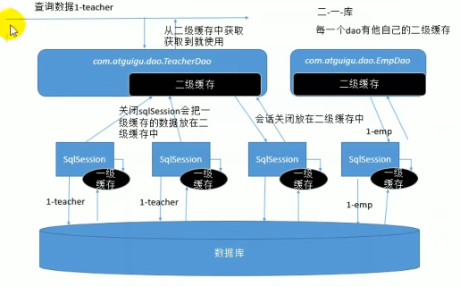

## 介绍

```java 
介绍
    暂时存储一些数据，加快系统的查询速度
    MyBatis 包含一个非常强大的查询缓存特性,它可以非常方便地配置和定制。
    MyBatis 3 中的缓存实现的很多改进都已经实现了,使得它更加强大而且易于配置。
```

## 默认缓存

```java
介绍
    MyBatis系统中默认定义了两级缓存
    只有一级缓存（SqlSession级别的缓存，也称为本地缓存）开启。
    二级缓存需要手动开启和配置，他是基于namespace级别的缓存
一级缓存
	// 线程级别的缓存
     即本地缓存, 作用域默认为sqlSession；
    
二级缓存    
    // 全局范围的缓存
    除过当前线程， selSession 能用外， 其他也可以使用
 
缓存执行顺序
    1. 不会出现一级缓存和二级缓存中有同一个数据
    	二级缓存中： 一级缓存关闭了就有了
    	一级缓存中： 
    		二级缓存中没有数据，就会查询一级缓存
    		一级缓存中没有数据，就会去查数据库
    		数据库查找放到一级缓存中
    2. 任何时候都是 ： 二 一 数据库
```

### 一级缓存

```java
介绍
	// 线程级别的缓存
     即本地缓存, 作用域默认为 sqlSession；
    
特点    
    1. 当 Session flush 或 close 后, 该 Session 中的所有 Cache 将被清空。
    2. 本地缓存不能被关闭, 但可以调用 clearCache() 来清空本地缓存, 或者改变缓存的作用域
    3. 3.1 版本之后，可以配置本地缓存
作用
    同一次会话期间只要查询过的数据都会保存在当前SqlSession的一个Map中    
    key:hashCode+查询的SqlId+编写的sql查询语句+参数
        
SqlSession 失效情况
    // 只有同一个 sqlSessoion 期间查询到的数据才会保存在这个缓存中，下次使用才会从缓存中那
    1、不同的SqlSession对应不同的一级缓存    	
	2、// 同一个SqlSession但是查询条件不同
	    同一个方法，不同的参数，由于可能之前没有查询过，所以还会发新的 sql	
	3、同一个SqlSession两次查询期间执行了任何一次增删改操作
	4、同一个SqlSession两次查询期间手动清空了缓存
```


### 二级缓存

```java
介绍
    (second level cache)，全局作用域缓存
特点
	默认不开启，需要手动配置
    // 一级缓存关闭，数据才会转移到二级缓存中
    二级缓存在 SqlSession 关闭或提交之后才会生效
使用步骤
    1. 全局配置文件中开启二级缓存
		<setting name="cacheEnabled" value="true"/>
	2、需要使用二级缓存的映射文件处使用cache配置缓存
		<cache/>
	3、注意：POJO需要实现Serializable接口
```

## 相关设置

```java
1、全局setting的cacheEnable： – 配置二级缓存的开关。一级缓存一直是打开的。 
2、select标签的useCache属性：配置这个select是否使用二级缓存。
    一级缓存一直是使用的 
3、sql标签的flushCache属性：增删改默认flushCache=true。
    sql执行以后，会同时清空一级和二级缓存, 	查询默认flushCache=false。 
4、sqlSession.clearCache()：只是用来清除一级缓存。 
5、当在某一个作用域 (一级缓存Session/二级缓存Namespaces) 
    进行了 C/U/D 操作后，默认该作用域下所 有 select 中的缓存将被clear。
```

## 缓存原理




## 使用

### 开启

```sql
介绍
	默认情况下是没有开启缓存的,除了局部的 session 缓存,可以增强变现而且处理循环 依赖也是必须的
	要开启二级缓存,你需要在你的 SQL 映射文件中添加一行
		<cache />
效果
	# 这些都可以通过修改属性值进行修改
	映射语句文件中的所有 select 语句将会被缓存。
    映射语句文件中的所有 insert,update 和 delete 语句会刷新缓存。
    缓存会使用 Least Recently Used(LRU,最近最少使用的)算法来收回。
    根据时间表(比如 no Flush Interval,没有刷新间隔), 缓存不会以任何时间顺序 来刷新。
    缓存会存储列表集合或对象(无论查询方法返回什么)的 1024 个引用。
    缓存会被视为是 read/write(可读/可写)的缓存,意味着对象检索不是共享的,而 且可以安全地被调用者修改,而不干扰其他调用者或线程所做的潜在修改
```

### 属性修改

```sql
<cache
  eviction="FIFO" 			 # 创建了一个 FIFO 缓存
  flushInterval="60000"       # 每隔 60 秒刷新
  size="512"				# 存数结果对象或列表的 512 个引用 
  readOnly="true"/>          # 返回的对象被认为是只读的
  
注意
	这个更高级的配置
		创建了一个 FIFO 缓存,
		并每隔 60 秒刷新,
		存数结果对象或列表的 512 个引用,
		而且返回的对象被认为是只读的,
	因此在不同线程中的调用者之间修改它们会 导致冲突。
	
eviction -- 回收策略
	# 默认 LRU
    LRU – 最近最少使用的:移除最长时间不被使用的对象。
    FIFO – 先进先出:按对象进入缓存的顺序来移除它们。
    SOFT – 软引用:移除基于垃圾回收器状态和软引用规则的对象。
    WEAK – 弱引用:更积极地移除基于垃圾收集器状态和弱引用规则的对象。
    
flushInterval (刷新间隔)
	可以被设置为任意的正整数,而且它们代表一个合理的毫秒 形式的时间段。
	默认情况是不设置,也就是没有刷新间隔,缓存仅仅调用语句时刷新。

size(引用数目)
	可以被设置为任意正整数，要记住你缓存的对象数目和你运行环境的 可用内存资源数目。
	默认值是 1024。

readOnly (只读)
	属性可以被设置为 true 或 false。
	只读的缓存会给所有调用者返回缓 存对象的相同实例。因此这些对象不能被修改。这提供了很重要的性能优势。
	可读写的缓存 会返回缓存对象的拷贝(通过序列化) 。这会慢一些,但是安全,
	因此默认是 false。
```

### 自定义缓存

```java
介绍
    // 实现 Cahe 接口，重写三个方法
    可以通过实现你自己的缓存或为其他第三方缓存方案 创建适配器来完全覆盖缓存行为。
    
```

#### 例子

```java
    // 该接口需要被实现
    // 自定义缓存的实现， type 属性指定的类必须实现 org.mybatis.cache.Cache 接口        
    public interface Cache {
      String getId();
      int getSize();
      void putObject(Object key, Object value);
      Object getObject(Object key);
      boolean hasKey(Object key);
      Object removeObject(Object key);
      void clear();
    }   

	// 使用自定义的缓存
	<cache type="com.domain.something.MyCustomCache"/>
      
   // 要配置你的缓存, 简单和公有的 JavaBeans 属性来配置你的缓存实现, 而且是通过 cache 元素来传递属性,
   // 可以使用所有简单类型作为 JavaBeans 的属性,MyBatis 会进行转换        
   // 在你的缓存实现中调用一个称为 "setCacheFile(String file)" 的方法:
    <cache type="com.domain.something.MyCustomCache">
      <property name="cacheFile" value="/tmp/my-custom-cache.tmp"/>
    </cache>
        
使用
	记得缓存配置和缓存实例是绑定在 SQL 映射文件的命名空间是很重要的。
     因此,所有 在相同命名空间的语句正如绑定的缓存一样。
     语句可以修改和缓存交互的方式, 或在语句的 语句的基础上使用两种简单的属性来完全排除它们        
        
    // 因为那些是默认的,你明显不能明确地以这种方式来配置一条语句。
    // 相反,如果你想改 变默认的行为,只能设置 flushCache 和 useCache 属性        
	<select ... flushCache="false" useCache="true"/>
    <insert ... flushCache="true"/>
    <update ... flushCache="true"/>
    <delete ... flushCache="true"/>   
        
使用场景
	比如,在一些情况下你也许想排除 从缓存中查询特定语句结果,
	或者你也许想要一个查询语句来刷新缓存。
     相似地,你也许有 一些更新语句依靠执行而不需要刷新缓存。        	
```

### 参照缓存

```java
介绍
    你会想在命名空间中共享相同的缓存配置和实例。
    在这样的 情况下你可以使用 cache-ref 元素来引用另外一个缓存。
    
例子
    <cache-ref namespace="com.someone.application.data.SomeMapper"/>
```


## 缓存整

### 三方缓存

```java
介绍
    // 具体再百度吧
    EhCache 是一个纯Java的进程内缓存框架，具有快速、精干等特点，是Hibernate中默认的CacheProvider
步骤
   1.导入ehcache包，以及整合包，日志包
		ehcache-core-2.6.8.jar、	核心包
    	mybatis-ehcache-1.0.3.jar	整合包
		slf4j-api-1.6.1.jar、	 日志包
    	slf4j-log4j12-1.6.2.jar
	2、编写ehcache.xml配置文件
	3、配置cache标签
    	<cache type="org.mybatis.caches.ehcache.EhcacheCache"></cache>
```


# 