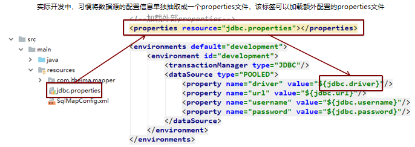
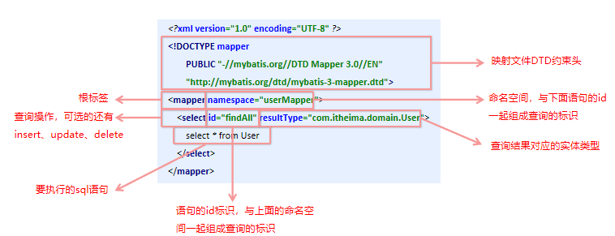
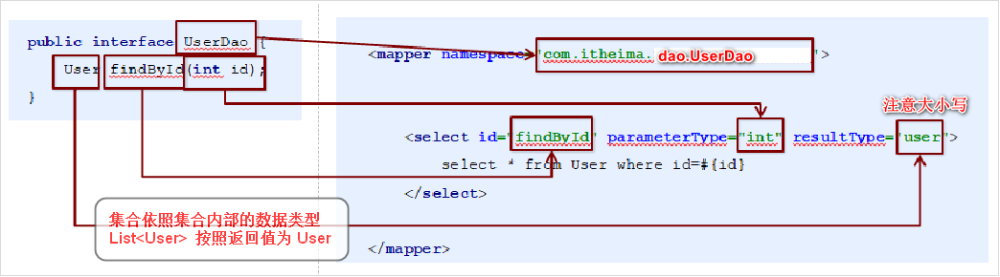

## 介绍

* 基于java的持久层框架，
    * 它内部封装了jdbc，sql和java编码分开，功能边界清晰，一个专注业务、一个专注数据
    * 核心sql还是需要自己优化
* 一个半自动化的持久化层框架。
    * 无需处理加载驱动、创建连接、创建statement等繁杂的过程
    * 并通过java对象和statement中sql的动态参数进行映射生成最终执行的sql语句。
* 简单的XML或注解用于配置和原始映射
    * 将接口和Java的POJO（Plain Old Java Objects，普通的Java对象）映射成数据库中的记录
* 执行sql并将结果映射为java对象并返回
    * 采用ORM思想解决了实体和数据库映射的问题


## ORM

* Object Relational Mapping 对象关系映射
* 把数据库表和实体类以及实体类的属性对应起来，操作实体类就实现操作数据库表

## 官网

```java
MyBatis官网地址：<http://www.mybatis.org/mybatis-3/> 
```


## 快速入门

### 使用步骤

```java
添加MyBatis的坐标
创建user数据表
编写User实体类 
编写映射文件
    UserMapper.xml，  --> mapper,select
    mybatis的映射配置文件位置必须和dao接口的包结构相同
编写核心文件
    SqlMapConfig.xml，  --> 数据库配置文件
    
编写测试类

    
// 开发中不用写实现类
1.  
2.  映射配置文件的mapper标签name space属性的取值必须是dao接口的全限定类名
3. 映射配置文件的操作配置(select)，id属性的取值必须是dao接口的方法名

    
文件结构
src    
    main
    	java
    		com/.../dao.java
    	resource
    		configuration.xml
    		com/.../dao.xml
 pom.xml   
```

### 导包 pom.xml

```xml
<!--mybatis坐标-->
<dependency>
    <groupId>org.mybatis</groupId>
    <artifactId>mybatis</artifactId>
    <version>3.4.5</version>
</dependency>
<!--mysql驱动坐标-->
<dependency>
    <groupId>mysql</groupId>
    <artifactId>mysql-connector-java</artifactId>
    <version>5.1.6</version>
    <scope>runtime</scope>
</dependency>
<!-- 最好导入日志包 -->

```

### 全局配置文件.xml

#### 介绍

```dtd
全局配置文件，都是写在一个文件当中的

<?xml version="1.0" encoding="UTF-8" ?>
<!DOCTYPE 
  configuration
  PUBLIC "-//mybatis.org//DTD Config 3.0//EN"
  "http://mybatis.org/dtd/mybatis-3-config.dtd">    
<configuration>    
	<environments>  数据库配置文件
	<mappers>	dao 接口实现类
</configuration>    
    
configuration --
    连接哪一个操作数据库
    数据库连接，账号密码等，多使用数据连接池进行连接
    
```


#### 数据库连接(用不到)

```xml
  <!--引入外部文件-->
  <properties resource="jdbc.properties"></properties>
  <!--数据库连接 -->
 <!-- 
	以后只使用 spring 进行数据库配置、事务处理
	mybatis 只进行增删改查
  -->
  <environments default="development">
    <environment id="development">
      <transactionManager type="JDBC"/>
       <!--配置连接池，里面的值可以写死-->
      <dataSource type="POOLED">
        <property name="driver" value="${driver}"/>
        <property name="url" value="${url}"/>
        <property name="username" value="${username}"/>
        <property name="password" value="${password}"/>
      </dataSource>
    </environment>
  </environments>
```



#### dao接口实现类

```dtd
  <mappers>
	<!--引入我们编写的接口的实现类， 
		resource 
			是接口的实现类(配置的 sql_mapper执行.xml 文件)的路径，
			默认从类路径下开始找
 	-->      
    <mapper resource="org/mybatis/example/userMapper.xml"/>
  </mappers>
```


### sql _mapper执行.xml

```xml
介绍
	每个 mapper 标签，都是 dao  接口的实现类，采用 Mybatis 的代理开发方式实现 DAO 层的开发
	用来执行方法中的 sql 语句
	每个方法如何像数据库发送 sql 语句， 如何运行
    由Mybatis 框架根据接口定义创建接口的动态代理对象，代理对象的方法体同上边Dao接口实现类方法。
<!--
	类路径：com.itheima.domain.User
	public class User
-->
<?xml version="1.0" encoding="UTF-8" ?>
<!DOCTYPE mapper 
	PUBLIC 
	"-//mybatis.org//DTD Mapper 3.0//EN"
	"http://mybatis.org/dtd/mybatis-3-mapper.dtd">

<!-- 执行 userMapper.findAll 中的语句
	resultType 结果集
-->
<!--
	namespace 命名空间，写接口的全类名， 告诉 mybatis 这个配置文件是实现哪一个接口的
	select 一个查询操作
	id	接口的方法名，相当于这个配置是对于某个方法的实现
	parameterType  接口方法的入参的类型
	resultType 返回值类型，查询必须有

-->
<mapper namespace="IUserDaoMapper">
    <select id="findAll" resultType="com.itheima.domain.User">
        select * from User
    </select>
</mapper>

```






### java代码

#### java bean

```java
public class User {
    private Integer id;
    private String name;
    // 自动生成 set get 方法
}
```

#### dao 接口

```java
// 注意，这里直接是对 接口进行操作的，不用写实现类
// 编写UserDao 接口
public interface IUserDaoMapper {
    List<User> findAll() throws IOException;
}
```

#### 测试

```java
// 测试
@Test
public void test() throws IOException {
    // 加载核心配置文件
        // 第一中方式： 使用类的加载器， 他只能读取类路径的配置文件
        // 第二种方式：使用 ServletContext 对象的 getRealPath()
        InputStream resourceAsStream = 
            Resources.getResourceAsStream("全局配置文件.xml");
        //获得sqlSession工厂对象 (建造者模式)
        SqlSessionFactory sqlSessionFactory = 
            new SqlSessionFactoryBuilder().build(resourceAsStream);
        //获得sqlSession对象(工厂模式)，获取和数据库的一次会话,每次都要创建按一个新的
        SqlSession sqlSession = 
            sqlSessionFactory.openSession();
             
        // 执行sql语句, 可以参看下面的 CRUD
        //--方式一
            // 使用 selSession 创建 dao 接口的代理对象  代理模式
            IUserDao userDao = session.getMapper(IUserDaoMapper.class)  
            // 代理对象执行方法
            List<User> userList = userDao.findAll();
        //-----方式一结束 ----
        //--方式二
        	List<User> userList = 
                sqlSession.selectList("IUserDaoMapper.findAll");
        //-----方式二结束 ----
        
        //打印结果
        System.out.println(userList);
        //释放资源
    	sqlSession.commit();
        sqlSession.close();
        resourceAsStream.close();

}
```

#### CRUD

```java
// sqlSession 执行代码
// 查询
<select>
sqlSesson.selectList(...)
// 插入更新
// （"命名空间.id", 实体对象）
<insert>    
sqlSession.insert("....",user);
sqlSession.commit();    

// 修改更新
//（"命名空间.id", 实体对象）
<update>
sqlSession.update("....", user);
sqlSession.commit();  

// 删除
//（"命名空间.id", Object）
<delete>
sqlSession.delete("....", idInt);
sqlSession.commit();  
```


## 注解使用

```java
和 快速入门一样
    sql_mapper执行.xml  不用写
    java dao 接口
        public interface IUserDao {
            @Select("select * from user")
            List<User> findAll();
        }
```


### 数据库配置

```java
指定映射配置文件的位置，映射配置文件指的是每个dao独立的配置文件
如果是用注解来配置的话，此处应该使用class属性指定被注解的dao全限定类名
< mappers>
    <mapper class=" com.itheima.dao. IUserDao"/>
< /mappers>        
```


### 数据表映射

```java
删除
```

### 源码

```java


// 写实现类
需要 namespace.id
```

