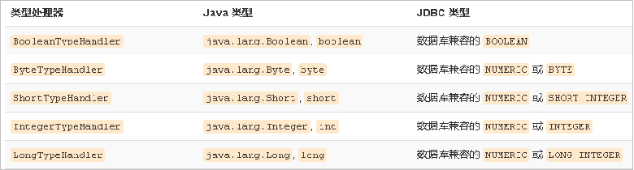

## 介绍

```java
crud
    create		创建
    Delete		删除      
    retrieve	查询
    update		更新
REST 风格的 crud
    就是 springMVC 的 restful 风格设置 
```

# 方法参数

## #{ } 获取参数值

```java
获取方法的参数
// public void update(Integer ID)
<update id="update">
    update User set id=#{ID} wh
</update>   
    
    
参数
    单个参数
    	基本类型： #{ 随便写 }， 都会默认取仅有的参数
    	pojo   :  #{ }
    多个参数
        // 自动封装 map
        方式一： 使用参数位置索引（0,1,2，...） 
        	#{0}
        方拾二： 使用第几个参数 paramN （param1, param2, ...） 
            #{param1}
	    方式三：参数中之指定封装的 map 的 key
             findAll(@Param("id")Integer id,@Param("name")String name);
		原因： 
            传入多个参数，mybatis 会自动将这些参数封装到一个map 中
            key 为参数的索引、参数的第几个表示， #{key} 即从  map 中取值
    传入 pojo
		#{pojo的属性名}     
	传入 map
        #{key}
复合多参数
    参数中具有 基本类型、map、pojo， mybatis 会自动封装为 map
    使用
    	// 使用索引、第几个参数找参数
    	map 位于第 n 个参数 #{paramN.key}
    参数
```

## 参数取值规范

```java
参数位置支持的属性
    // 都是自动的，除了 jdbcType 可能需要执行
    javaType、jdbcType、mode、numericScale、resultMap、typeHandler、jdbcTypeName、expression
语法例子
    id = #{id, jdbcType=INTEGER}
注意
    当传递的值为 null 对于所有可能为空的列，jdbcType 需要被设置
    mysql 插入 null 无问题
    oracle 不知道 null 是什么类型
```

## #{ } VS ${ }

```java
#{key}：
    参数预编译的方式，参数的位置都是用 ？ 代替， 参数都是后来预编译设置进去的
    获取参数的值，预编译到SQL中。安全。
${key}：
    直接拼接到SQL中
    获取参数的值，有SQL注入问题。ORDER BY ${name}
语法例子
    id=${id} and empname= #{empName}:
    select * from t_ employee where id=1 and empname= ?
    id=#{id} and empname=#{empName}:
    select * from t_ employee where id=? and empname= ?
使用
	sql 只有参数位置支持预编译，所以只能使用 ${ }        
```


# 联合查询

## 介绍

```java
介绍
    对于多表联合查询，要使用 resultType 进行自定义类型结果集
注意
    id 是主键， 
    方式一： 级联属性
    	使用级联属性进行封-装， property="a.属性"
    方拾二： association 标签
```


# 缓存

## 介绍

```java 
介绍
    暂时存储一些数据，加快系统的查询速度
    
```

## 默认缓存

```java
介绍
    MyBatis系统中默认定义了两级缓存
    只有一级缓存（SqlSession级别的缓存，也称为本地缓存）开启。
    二级缓存需要手动开启和配置，他是基于namespace级别的缓存
一级缓存
	// 线程级别的缓存
     即本地缓存, 作用域默认为sqlSession；
    
二级缓存    
    // 全局范围的缓存
    除过当前线程， selSession 能用外， 其他也可以使用
 
缓存执行顺序
    1. 不会出现一级缓存和二级缓存中有同一个数据
    	二级缓存中： 一级缓存关闭了就有了
    	一级缓存中： 
    		二级缓存中没有数据，就会查询一级缓存
    		一级缓存中没有数据，就会去查数据库
    		数据库查找放到一级缓存中
    2. 任何时候都是 ： 二 一 数据库
```

### 一级缓存

```java
介绍
	// 线程级别的缓存
     即本地缓存, 作用域默认为 sqlSession；
    
特点    
    1. 当 Session flush 或 close 后, 该 Session 中的所有 Cache 将被清空。
    2. 本地缓存不能被关闭, 但可以调用 clearCache() 来清空本地缓存, 或者改变缓存的作用域
    3. 3.1 版本之后，可以配置本地缓存
作用
    同一次会话期间只要查询过的数据都会保存在当前SqlSession的一个Map中    
    key:hashCode+查询的SqlId+编写的sql查询语句+参数
        
SqlSession 失效情况
    // 只有同一个 sqlSessoion 期间查询到的数据才会保存在这个缓存中，下次使用才会从缓存中那
    1、不同的SqlSession对应不同的一级缓存    	
	2、// 同一个SqlSession但是查询条件不同
	    同一个方法，不同的参数，由于可能之前没有查询过，所以还会发新的 sql	
	3、同一个SqlSession两次查询期间执行了任何一次增删改操作
	4、同一个SqlSession两次查询期间手动清空了缓存
```


### 二级缓存

```java
介绍
    (second level cache)，全局作用域缓存
特点
	默认不开启，需要手动配置
    // 一级缓存关闭，数据才会转移到二级缓存中
    二级缓存在 SqlSession 关闭或提交之后才会生效
使用步骤
    1. 全局配置文件中开启二级缓存
		<setting name="cacheEnabled" value="true"/>
	2、需要使用二级缓存的映射文件处使用cache配置缓存
		<cache/>
	3、注意：POJO需要实现Serializable接口
```

## 相关设置

```java
1、全局setting的cacheEnable： – 配置二级缓存的开关。一级缓存一直是打开的。 
2、select标签的useCache属性：配置这个select是否使用二级缓存。
    一级缓存一直是使用的 
3、sql标签的flushCache属性：增删改默认flushCache=true。
    sql执行以后，会同时清空一级和二级缓存, 	查询默认flushCache=false。 
4、sqlSession.clearCache()：只是用来清除一级缓存。 
5、当在某一个作用域 (一级缓存Session/二级缓存Namespaces) 
    进行了 C/U/D 操作后，默认该作用域下所 有 select 中的缓存将被clear。
```

## 缓存原理


## 缓存整合

### 自定义缓存

```java
介绍
    实现 Cahe 接口，重写三个方法
```


### 三方缓存

```java
介绍
    // 具体再百度吧
    EhCache 是一个纯Java的进程内缓存框架，具有快速、精干等特点，是Hibernate中默认的CacheProvider
步骤
   1.导入ehcache包，以及整合包，日志包
		ehcache-core-2.6.8.jar、	核心包
    	mybatis-ehcache-1.0.3.jar	整合包
		slf4j-api-1.6.1.jar、	 日志包
    	slf4j-log4j12-1.6.2.jar
	2、编写ehcache.xml配置文件
	3、配置cache标签
    	<cache type="org.mybatis.caches.ehcache.EhcacheCache"></cache>
```


# 心配置文件

## typeHandler

```java

```


